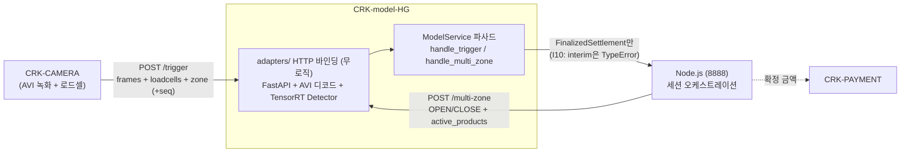
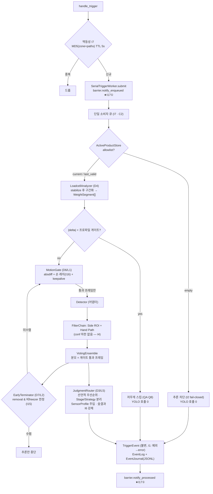
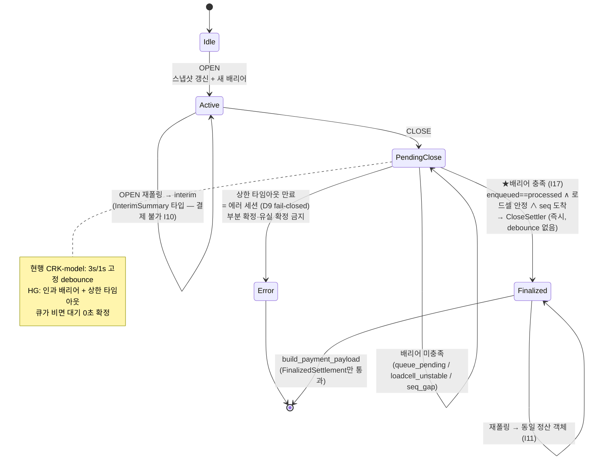
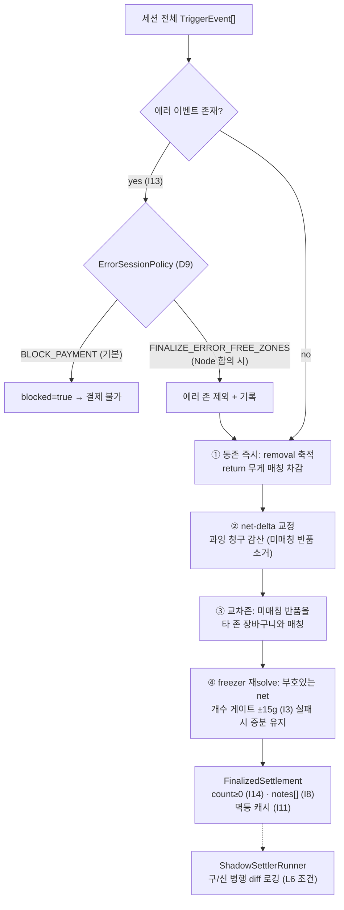

# CRK-model-HG — Model Service (Greenfield Redesign)

Last reviewed: 2026-07-08

AI 스마트 자판기 모델 서비스의 백지 재설계 구현. 레거시/참조 서비스인
[CRK-model](https://github.com/CHAI-Student/CRK-model)(FastAPI + TensorRT)의
외부 계약을 유지하면서, 설계 문서 3종의 결론을 코드로 옮겼다:

- `CRK-model/docs/GREENFIELD_DESIGN_GUIDE.md` — 결정 **D1~D10 전부 권장안** 채택
- `CRK-model/docs/REDESIGN_RATIONALE_QA.md` — 불변식 **I1~I17**을 타입·인터페이스·탐색 공간 제약으로 표현
- `CRK-model/docs/OPTIMIZED_ARCHITECTURE.md` — 레버 L1(모션 게이트)·L2(조기 종료)·L5(전략 라우터)·L6(단일 정산기) 반영, L3(배치)는 설계만·기본 OFF

순수 파이썬, 런타임 의존성 0. YOLO TensorRT·NVDEC 등 장치 결합 요소는
프로토콜(`perception.Detector`) 뒤의 어댑터로 주입한다. Jetson 실기 검증(G4)
전까지 이 레포의 통과 상태는 설계·계약 수준의 증명이다.

## Current Status

- 로컬 검증 게이트 (2026-07-08): `pytest tests -q` → **84 passed**
- G0(정적/단위) 수준 커버: 불변식 I1~I17 전건, E2E(OPEN→trigger→CLOSE→결제 페이로드), HTTP 어댑터 E2E, G2.5 훅(저널 replay 등가성)
- 장치 어댑터(`crk_model/adapters/`) 포함: TensorRT Detector, AVI lazy 디코드, FastAPI 바인딩, `model-service-hg` 진입점 — **Jetson 실기 검증(G4)은 미수행**. TensorRT 로딩·NVDEC·CUDA 가시성은 Jetson 트리거 런으로만 증명된다.
- 미커버 (착수 전 확보물 P1~P5 대기): 게이트/조기종료 임계값 실측(P1 코퍼스), 세션 아카이브 replay(P2), interim 의미론·에러 정책 Node 합의(P3·P4), 카메라 seq 펌웨어(P5)

## Jetson Quick Start

Jetson Orin Nano(JetPack, Ubuntu 22.04)에서 1회 준비 후 실행:

```bash
git clone https://github.com/CHAI-Student/CRK-model-HG.git
cd CRK-model-HG

chmod +x scripts/setup_jetson.sh
./scripts/setup_jetson.sh          # system-site venv + 어댑터 의존성

source .venv/bin/activate
MODEL__VISION__YOLO_MODEL_PATH=models/siyeon_best.engine model-service-hg
```

`.engine` 파일은 이 레포에 없다 — CRK-model에서 쓰던 엔진 파일을 `models/`에
복사하거나 절대경로로 지정한다. 기동 시 startup probe가 엔진을 1회 실행하므로
**로드 실패·CUDA 불가면 서비스가 즉시 죽는다** (무증상 기동 금지, 이관 리뷰 #1).

헬스 체크:

```bash
curl http://localhost:8002/api/health
# {"status":"ok","door_state":"idle","queue_pending":0,"barrier_satisfied":true,...}
```

CRK-model의 CUDA/TensorRT 경로 부트스트랩(`scripts/jetson_env.sh`)이 필요한
환경이면 먼저 그것을 source한 뒤 실행한다. 기존 CRK-model `.venv`를 재사용하는
방법도 있다: 그 venv를 활성화한 채 `uv pip install --no-deps -e /path/to/CRK-model-HG`
`uv pip install fastapi "uvicorn[standard]"` 후 `model-service-hg`.

## Manual Setup

```bash
uv venv --system-site-packages --python python3.10 .venv
source .venv/bin/activate
uv pip install --no-deps -e .
uv pip install "fastapi>=0.100.0" "uvicorn[standard]>=0.23.0"
# ultralytics가 system-site에 없을 때만 (CPU torch 오염 방지를 위해 --no-deps):
uv pip install --no-deps "ultralytics>=8.0.0,<9.0.0" "ultralytics-thop>=2.0.18"

cp ../CRK-model/.env.example .env 2>/dev/null || touch .env
echo "MODEL__VISION__YOLO_MODEL_PATH=models/siyeon_best.engine" >> .env
```

원칙은 CRK-model과 동일: venv는 반드시 `--system-site-packages`(JetPack의
CUDA/TensorRT/torch/OpenCV/numpy<2 사용), ultralytics는 `--no-deps`로만 설치,
일상 실행에 plain `uv run`/`uv sync` 금지 (환경 재동기화로 CUDA torch가
CPU wheel로 덮일 수 있음).

## Live Engine Preview

카메라 입력과 TensorRT 추론의 시각 확인은 CRK-model의 스크립트를 그대로 쓴다
(엔진·카메라 검증은 서비스와 독립이므로 중복 구현하지 않는다):

```bash
python ../CRK-model/scripts/live_engine_preview.py \
  --model models/siyeon_best.engine --source 0 --imgsz 480 --display-backend ffplay
```

Jetson 전용 운영 체크다 — 개발 PC 실행으로 TensorRT/CUDA 준비 상태를 판단하지 않는다.

## Quick Start (개발 PC — 도메인 코어)

```bash
git clone https://github.com/CHAI-Student/CRK-model-HG.git
cd CRK-model-HG
pytest tests -q        # 코어는 런타임 의존성 0 (fastapi 있으면 HTTP E2E도 실행)
```

서비스 사용은 파사드 직접 호출 (HTTP 어댑터는 이 파사드를 감싸기만 한다):

```python
from crk_model.service import ModelService
from crk_model.core.config import Settings

svc = ModelService(detector=MyTensorRTDetector(),        # Detector 프로토콜 구현
                   settings=Settings.from_env(),
                   startup_probe_frame=probe)            # 로드 실패 = 기동 실패 (fail-fast)

svc.handle_multi_zone({"session_id": s, "state": "OPEN", "active_products": [...]})
svc.handle_trigger({"zone": 1, "frames": {...}, "loadcells": [...], "video_paths": {...}})
svc.process_pending()                                    # 전용 스레드에서 주기 호출
svc.handle_multi_zone({"session_id": s, "state": "CLOSE"})   # 배리어 충족 시 결제 페이로드
```

## Architecture

### 1. 시스템 컨텍스트 — 외부 계약 (C4/C5)



### 2. 트리거 파이프라인 — 데이터 평면 (unpaced · event-driven)



### 3. 세션 확정 — 제어 평면 (time-paced → causal barrier로 승격, I17)



### 4. close-time 단일 정산기 (D5/L6) — 반품 복구 4층의 통합



## Module Map

모듈 경계 = 테스트 경계 (D10). 화살표 방향으로만 의존한다.

| 모듈 | 책임 | 상태성 | 원본 대응 | 테스트 |
|------|------|--------|-----------|--------|
| `core/` | 타입(I10 분리), SensorProfile(D3), 에러 정책(D9), env 설정 | 무상태 | core/config.py | (전역) |
| `ingest/` | 멱등성(I7), 로드셀 분석 → WeightSegment[] (D4) | 무상태 | trigger.py 일부 | test_ingest |
| `frames/` | 모션 게이트 + 손 래치(D6/I16), 배치 수집(D8·기본 OFF) | 트리거 내 | frame_extractor | test_frames |
| `perception/` | Detector 프로토콜, 필터 체인, 투표, 조기 종료(D7/I15) | 트리거 내 | yolo_wrapper, video_processor | test_perception |
| `judgment/` | Stage/Strategy 라우터(D3), strict 매처(I5·I6·I12) | 무상태 (순수) | decision_engine (10.4k줄 해체) | test_judgment |
| `ledger/` | 이벤트 소싱, 인과 배리어(D1/I17), 단일 정산기(D5), 저널, shadow | 영속 | session/* 통합 | test_ledger |
| `gateway/` | OPEN/CLOSE 상태기계, 결제 페이로드(I10 타입 강제) | 상태기계 | multi_zone.py | test_gateway |
| `service/` | 파이프라인 오케스트레이션, 직렬 워커, 스냅샷(I2), 파사드 | 조립 | trigger_service, api/routes | test_service |
| `adapters/` | 장치 결합: TensorRT Detector, AVI lazy 디코드, FastAPI, 진입점 (전부 lazy import) | I/O 경계 | yolo_wrapper, frame_extractor, main.py | test_adapters |

## Design Decision Map (D1~D10 → 구현)

| 결정 | 권장안 | 구현 위치 |
|------|--------|-----------|
| D1 확정 모델 | 인과 배리어(I17), debounce → 상한 타임아웃 강등, 만료 시 에러 세션 | `ledger/barrier.py`, `gateway/state_machine.py` |
| D2 공통 시간축 | 카메라 seq watermark (선택 — 없어도 동작) | `barrier.set_close_watermark`, `TriggerEvent.seq` |
| D3 판정 구조 | Stage/Strategy 분리 + 선언적 순서(다이어그램5 보존) + SensorProfile + 텔레메트리 | `judgment/` |
| D4 구간화 위치 | ingest 소속, stabilize 후 순서 고정, plateau 평균 드리프트 흡수 | `ingest/loadcell.py` |
| D5 정산 구조 | 이벤트 소싱 + close 단일 정산기 + shadow 병행 | `ledger/settler.py`, `shadow.py`, `journal.py` |
| D6 프레임 공급 | 모션 게이트 + 손 래치 + keepalive + freezer 별도 임계 | `frames/motion_gate.py` |
| D7 조기 종료 | removal·비freezer 한정, judge()와 tolerance 단일 소스 | `perception/early_termination.py` |
| D8 배치 | 설계만, 기본 OFF, 고정 배치+패딩, 카메라 분리 | `frames/batch.py` |
| D9 에러 세션 | 계약 enum, 기본 fail-closed | `core/policy.py` |
| D10 모듈 경계 | 경계 = 테스트 경계 | 패키지 구조 |

## Invariant Coverage (I1~I17)

전부 실제 사고(오과금·매출 누락)의 재발 방지책이며, 예외 처리가 아니라 구조로 표현했다:

- **I1** 처리 실패 → `status="error"` 이벤트 (`pipeline.process` except 절) · **I2** 빈 allowlist fail-closed + last_valid (`service/snapshot.py`)
- **I3** freezer ±15g 게이트 — 판정·정산 양쪽 · **I4** conf 하한은 투표 결합 후에만 · **I5/I12** 매처 탐색 공간에서 원천 배제
- **I6** `enforce_full_delta_match` 라우터 전건 적용 · **I7** 멱등 TTL + 단일 소비자 큐
- **I8** reason/notes/pending/trace 사유 코드 · **I9** 시나리오 계약은 G1에서 인수 (P1·P2 후)
- **I10** Interim/Finalized 타입 분리 — 결제 빌더가 TypeError로 거부 · **I11** 정산 멱등 캐시 + 확정 후 이벤트 거부
- **I13** 에러 세션 무성 확정 금지 (D9) · **I14** `_Basket.remove_one`이 음수 차단
- **I15** 조기 종료 removal·비freezer 한정 · **I16** 손 래치 활성 중 스킵 금지 · **I17** 인과 배리어 확정

## Configuration

| 환경변수 | 기본값 | 의미 |
|----------|--------|------|
| `MODEL__CLOSE__BARRIER_TIMEOUT_S` | 10.0 | I17 상한 타임아웃 (정상 경로 아님) |
| `MODEL__VISION__BATCH_SIZE` | 1 | D8 배치 (1 = OFF) |
| `MODEL__ZONES__FREEZER` | (없음) | freezer 프로파일 존 목록 (예: `9,10`) |
| `MODEL__SESSION__ERROR_POLICY` | `block_payment` | D9 (변경은 Node 합의 P4 필요) |
| `MODEL__TRIGGER__IDEMPOTENCY_TTL_S` | 5.0 | I7 멱등 TTL |

게이트·tolerance·구간화 임계는 env가 아니라 `SensorProfile`(코드) 소속 —
존 타입별 물리 특성이므로 배포 설정으로 흔들리지 않게 한다 (C3).

## Verification Gates

| 게이트 | 상태 | 내용 |
|--------|------|------|
| G0 정적/단위 | ✅ 80 passed | 불변식 전건 + E2E + 필터/게이트/정산 |
| G1 판정 등가성 | ⏳ P1·P2 대기 | 924 시나리오 계약 인수 |
| G2 게이팅 검증 | ⏳ P1 대기 | 현장 AVI 코퍼스 전체 파이프라인 재실행 diff |
| G2.5 정산 등가성 | 훅 완성 (`EventJournal.replay`) | 세션 아카이브(P2) replay |
| G3 프로토콜 계약 | 파사드 계약 고정 | interim 의미론 Node 합의(P3) 별도 |
| G4 장치 검증 | ⏳ Jetson 반입 | 파워모드·스로틀링·OOM·24h soak |
