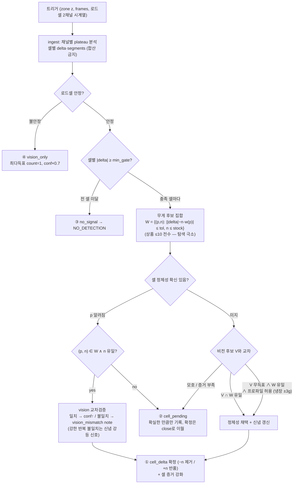
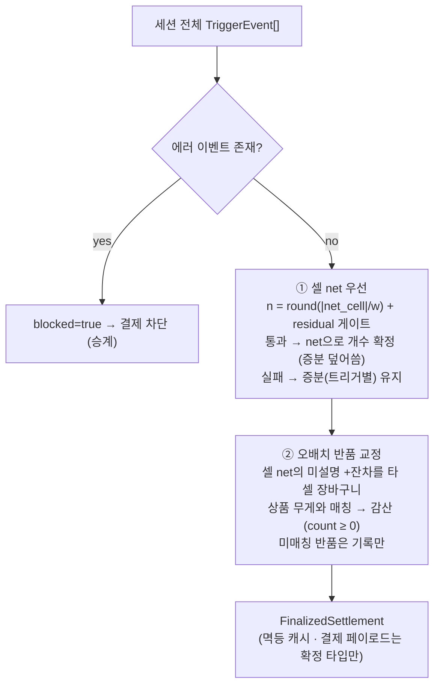
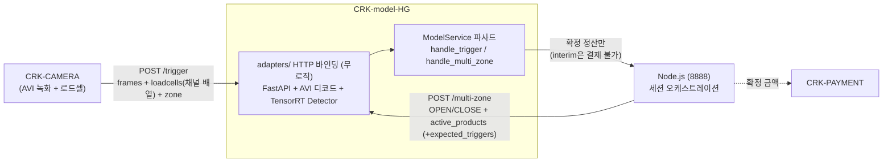
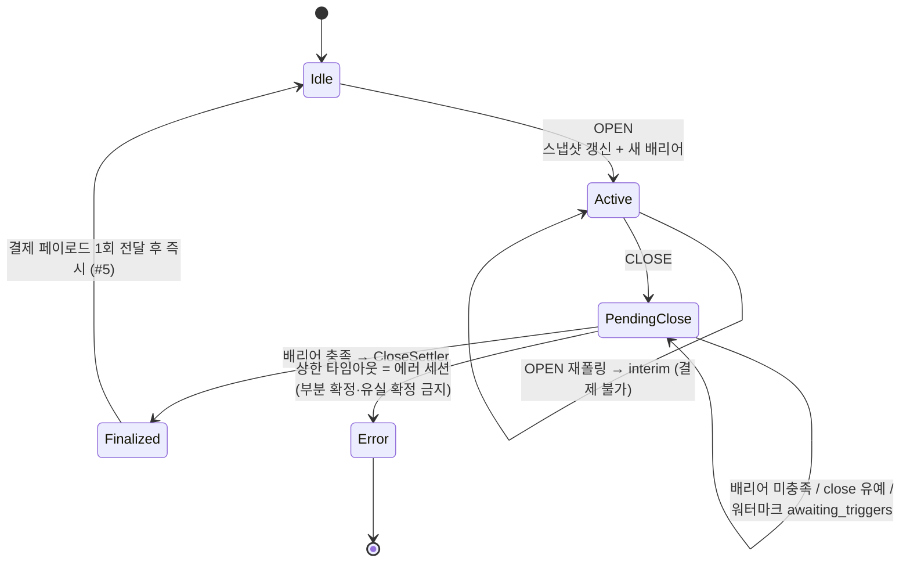

# CRK-model-HG — Model Service

Last reviewed: 2026-07-10

AI 스마트 자판기 모델 서비스. 원본 [CRK-model](https://github.com/CHAI-Student/CRK-model)의
외부 wire 계약(Node/카메라)은 유지하되, 추론 로직은 독자 설계한다.

> **2026-07-10 재설계 방침**: `docs/`의 기존 설계 체계(D1~D10 결정, I1~I17 불변식,
> L1~L6 레버, G0~G4 게이트)는 **아카이브로 격하 — 더 이상 필수 방침이 아니다.**
> 실기 사고로 검증된 항목만 아래 "보존 계약"으로 선별 승계한다. 추론 로직의 유일한
> 기준은 이 문서의 **"추론 설계 v2 (셀 단위 모델)"** 이며, 설계 전제는 하드웨어
> 제약 3개뿐이다.

## Current Status

- **v2 구현 완료 (2026-07-10, `redesign/v2-cell-model` 브랜치)** — 아래 "추론 설계 v2"
  전체 구현: 셀 단위 ingest·판정 4경로·정산 2단계·CellBeliefStore. 전략 15종과
  StrictWeightMatcher 삭제. **Jetson 실기 재검증 대기** (v1의 실기 E2E는 2026-07-09
  검증 완료 — 이슈 #6 전 과정: OPEN → 트리거 추론 → CLOSE 정산 → Node 결제 연동)
- 로컬 검증: `pytest tests -q` → **198 passed (2026-07-10)**, `ruff check .` clean, CI 구동
- 실기 이슈로 확정·수정된 wire 계약 (상세 `docs/fix_logs.md`): 확정 결과 1회 전달 후 즉시
  idle(#5), 결제 페이로드 원본 finalize 형식(#6 4차), CLOSE 유예 3s + 엣지 워터마크(#8),
  `MODEL__MACHINE__CABINET_TYPE` 필수, 상품→YOLO 이름 매핑(#6), 투표 진입 컷 env 튜닝(#6 3차)
- 잔여 실기 항목: 24h+ soak, side 카메라 ROI 튜닝(`SIDE_ROI_MAX_CENTER_X`), 엣지 워터마크
  실기 관찰(Edge_Environment `feature/edge-watermark` 브랜치)

## 설계 전제 — 유일하게 허용된 제약 (2026-07-10)

1. 상품 종류는 최대 **10개**. hand까지 포함하면 YOLO class_id는 최대 **11개**.
2. 냉장/냉동고에는 **5개의 칸(zone)** 이 있고, 존마다 **좌/우 로드셀이 각각 1개**
   존재한다 (기기 전체 로드셀 10개).
3. **하나의 로드셀에는 하나의 상품 종류만 올라간다.**

**이외의 임의 가정·제한을 코드나 테스트에 추가해 테스트를 통과시키는 것은 금지한다.**
(예: "상품 무게는 서로 다르다", "한 트리거에 한 품목만 움직인다" 같은 가정 금지.)

## 추론 설계 v2 — 셀 단위 모델

### 용어

- **셀(cell)** = (zone, channel). 존 z의 좌/우 로드셀 하나. 5존 × 2채널 = 10셀.
  wire의 로드셀 샘플 `filtered_value: [ch0, ch1]` 배열 인덱스가 채널 식별자다
  (Edge/IOBoard가 채널 순서를 고정 배열로 전달 — 좌/우 이름 대신 인덱스로 다룬다).
- **셀 정체성(cell identity)** = 그 셀에 올라가 있는 상품 종류. 전제 3에 의해
  셀마다 정확히 하나 존재한다. **설정으로 입력받지 않는다** — 사람이 배치표를
  등록해야 한다면 비전·로드셀 추론 자체가 무의미해진다. 대신 시스템이 비전×무게
  증거로 스스로 추정·누적하는 **상태**다 (아래 "셀 정체성 추정"). 상품 DB·OPEN
  payload에 배치 필드가 없음을 확인했으므로(Edge_Environment 조사, 2026-07-10)
  외부에서 받아올 곳도 없다.

### 핵심 관찰 — 제약이 문제를 붕괴시킨다

전제 3에 의해 셀 delta는 항상 **그 셀 상품 하나의 정수배**다:

```text
|delta_cell| ≈ n × unit_weight(identity(cell)),  n = 0, 1, 2, …
```

따라서:

- **셀 delta는 항상 단일 품종의 정수배다.** "이 무게 조합이 어떤 상품들의 합인가"라는
  부분집합 합 문제가 소멸한다 → strict 백트래킹·동일무게 충돌 가드·weight_only
  모호성 처리 전부 불필요. 정체성 추정도 "10개 상품 중 이 delta를 n×w로 설명하는
  것은 누구인가"라는 극히 작은 탐색이 된다.
- **셀 정체성은 시간이 지나도 변하지 않는 학습 대상이다.** 트리거마다 새로 푸는
  문제가 아니라, 한 번 확신하면 이후 트리거들이 재사용하는 상태다. 비전이 실패하는
  트리거(김서림·가림)도 이미 알려진 셀이면 무게만으로 판정된다.
- **freezer 특수 경로가 소멸한다.** "무게가 정체성 판별자 자격이 없다"(로드셀 오차
  5~15g)는 문제였는데, v2에서 무게의 정체성 역할은 "±tol 내 n×w 후보 집합 산출"로
  한정되고 확정은 비전×무게 교차 증거가 한다. freezer는 tolerance 파라미터(±15g)만
  다른 동일 경로가 된다.
- 현행 v1 코드는 채널 배열을 `sum()`으로 합산해 존 총량만 사용 — **좌/우 정보를
  버리는 것이 v1 복잡도의 근원**이었다. 합산하면 두 상품이 한 delta에 섞여
  조합 탐색이 필요해진다. v2는 채널을 분리 유지한다.

### 판정 (트리거 단위) — 전략 15종 → 4경로



| # | 경로 | 조건 | 출력 |
| --- | --- | --- | --- |
| ① | `cell_delta` (주 경로) | 셀 delta가 정체성 p의 n×w로 설명됨 | p n개, COMPLETE + 셀 증거 강화 |
| ② | `cell_pending` | 정체성 모호(미지 셀 V∩W 비유일) 또는 개수 모호(residual 실패, w ≤ 2·tol) | 확실한 부분만 PARTIAL, 확정은 close 이월 |
| ③ | `no_signal` | 전 셀 게이트 미달 | NO_DETECTION (fail-closed) |
| ④ | `vision_only` | 로드셀 불안정 (실기 실재 상황 — v1 유지) | 최다득표 count=1, conf×0.7 |

- 한 트리거에 좌/우 셀이 동시에 움직이면 셀마다 독립 판정 — v1의 "다품종 조합"이
  자연 분해된다.
- 셀 내 시계열 segments는 개수 검증 보조로만 사용 (같은 상품 n개를 나눠 꺼낸 흔적).
- **vision의 역할 재정의**: (a) 미지 셀의 정체성 판별에서 무게 후보 집합 W와
  교차되는 공동 증거, (b) 알려진 셀 판정의 교차검증(오배치·YOLO 매핑 오류·재배치의
  조기 탐지), (c) 로드셀 불안정 시 폴백, (d) hand 검출(모션 게이트·필터). 알려진
  셀에서 1회성 vision 불일치는 판정을 뒤집지 않고 note만 남긴다 — 반복되면 신념
  강등(아래).

### 정산 (CLOSE) — 4계층 → 2단계



- **① 셀 net 우선**: 세션 순변화가 트리거별 증분보다 정확하다 — v1
  `freezer_close_resolve`의 원리를 전 셀로 일반화. "꺼냈다 되돌림", 트리거 단위
  오판, `cell_pending` 이월분이 전부 여기서 자기 교정된다. 정체성이 미지인 셀의
  net은 close 시점 신념 또는 세션 내 V∩W 재판별로 해석하고, 그래도 미지면 청구하지
  않는다 (fail-closed). 게이트 실패 시
  증분 유지(fail-closed)는 v1 `keep_incremental` 승계.
- **② 오배치 반품 교정**: 고객이 상품을 다른 셀/존에 되돌려놓은 경우, 그 셀 net에
  상품 무게만큼 미설명 +잔차가 남는다 → 타 셀 장바구니의 상품 무게와 최근접 매칭해
  감산 (v1 `cross_zone_return`의 셀 단위 정밀화). 복수 상품이 동률 매칭이면 고가
  상품을 감산하지 않고 무게 최근접 우선, 완전 동률은 감산 보류 + note (과금 오류
  방지 우선). 어느 장바구니와도 안 맞으면 기록만 (감산 없음 — 과소청구 방향 안전).
- v1의 1층(동존 즉시 매칭)·2층(net-delta 교정)은 ①이 흡수한다.
- **개수 모호 규칙**: n과 n±1이 모두 tolerance 이내(w ≤ 2·tol인 저중량 상품)면
  **작은 n을 채택** + note — 보수 청구(과금 오류 < 매출 누락) 방향.

### 셀 정체성 추정 — 배치는 입력이 아니라 추론 결과

배치표를 사람이 등록하는 방식은 채택하지 않는다 — 배치를 이미 알고 있다면
비전·로드셀 추론이 무의미하다. 셀 정체성은 시스템이 스스로 추정한다:

- **증거 축적**: 정체성이 채택된 확정 트리거마다 (셀 → 상품 p) 관측을 누적한다.
  제거(−delta)는 강한 증거(셀에 있던 것만 꺼낼 수 있음), 반품(+delta)은 약한
  증거(고객이 엉뚱한 셀에 되돌려놓을 수 있음)로 가중을 달리한다.
- **확신 승격**: 모순 없는 독립 관측이 임계 이상 쌓이면 "알려진 셀"로 승격 —
  이후 트리거는 비전이 실패해도(김서림·가림) 무게만으로 판정된다. 임계값은
  실기 데이터로 정한다 (임의 상수를 테스트에 맞추지 않는다).
- **모순과 재배치**: 알려진 셀에서 비전이 반복적으로 다른 상품 q를 지목하고
  delta도 q의 n×w로 설명되면 신념을 강등해 미지 상태로 되돌린다 — 재고 보충으로
  배치가 바뀌어도 자기 교정된다. 1회성 불일치(오배치 반품 등)는 note만 남긴다.
- **무효화**: OPEN allowlist에서 상품이 사라지면 그 상품을 정체성으로 갖던 셀
  신념을 무효화한다. 신념은 세션 간 파일로 영속(재기동 유지).
- **cold start**: 미지 셀은 그 트리거의 V∩W(비전 후보 × 무게 후보)로 즉석 판별
  한다 — 셀 단위·단일 품종이라 v1의 존 합산 조합 탐색보다 훨씬 좁다. 유일하게
  판별되지 않으면 `cell_pending`으로 close에 이월하고, close에서도 증거가
  부족하면 청구하지 않는다 (fail-closed: 추측 과금 금지).
- Node가 언젠가 배치 정보를 계약에 실어주면(재고 보충 UI 등) **시드/검증 신호**로
  활용할 수는 있으나, 설계는 그것 없이 완결된다.

### SensorProfile — 경로 분기에서 파라미터로

| 파라미터 | 냉장 | 냉동 | 용도 |
| --- | --- | --- | --- |
| tolerance_grams | 3.0 | 15.0 | 개수 residual 게이트 |
| min_weight_change_grams | 5.0 | 5.0 | 셀 delta 최소 게이트 |
| segment_step_grams | 4.0 | 20.0 | 셀 내 구간화 (드리프트/컴프레서 노이즈) |
| motion_gate_threshold 등 | (유지) | (유지) | 프레임 공급 |

`weight_is_discriminative`는 경로 분기가 아니라 **한 지점의 파라미터로 축소**된다:
미지 셀에서 비전 무득표·무게 후보 유일일 때 무게 단독으로 정체성을 채택할지 여부
(냉장 ±3g 허용 / 냉동 ±15g 보류 — 178g 사건·이슈 #6의 교훈 유지). freezer 전용
판정 "경로"는 없다.

### v1 → v2 대응표 (가지치기)

| v1 전략 (15종 + 1 stage) | v2 |
| --- | --- |
| vision_only | **유지** (④ 로드셀 불안정 폴백) |
| freezer_vision_first | 소멸 — 미지 셀 V∩W 판별 + 셀 신념이 대체 |
| augment_stage_weight_gate / segment_weight_matching / stage_count_combo ×2 | 소멸 — 셀 분리가 시계열 분해를 대체 (segments는 보조) |
| no_candidate_fallback (weight_only + freezer 억제) | "V 무득표 ∧ W 유일" 규칙으로 축소 — 냉장 채택 / 냉동 보류 (억제 원리 유지) |
| min_weight_gate | ingest 셀 게이트로 이동 (③) |
| same_weight_collision_guard / strict / same_product_count / relaxed / relaxed_loadcell_only / detected_single_item_fallback / relaxed_partial | 소멸 — 조합 탐색 자체가 불필요 |
| vision_first_identity_partial (freezer) | 소멸 — ② cell_pending이 대체 |
| forced_final | ③ no_signal로 흡수 |
| StrictWeightMatcher (백트래킹 조합 탐색) | 소멸 |
| 정산 4계층 (동존→net→교차존→freezer) | 2단계 (셀 net 우선 → 오배치 반품 교정) |
| enforce_full_delta_match (I6) | residual 게이트에 내장 (셀 delta 전량 설명이 ①의 정의) |
| early_termination | 조건 단순화: "모든 활성 셀 delta가 비전 후보로 설명 + 손 퇴장" (removal·비freezer 한정 유지) |

### 마이그레이션 (v1 → v2) — 완료 (2026-07-10)

1. ✅ **셀 정체성 추정기**: `ledger/cells.py` `CellBeliefStore`(증거 누적·승격·
   강등·무효화·JSON 영속), OPEN allowlist 대조 무효화 (`ModelService`).
2. ✅ **ingest 셀 분리**: `LoadcellAnalyzer.analyze_cells()` — 채널별 plateau
   분석 (합산 `analyze()`는 배리어 등 총량 소비자용으로 유지). wire 변경 없음.
3. ✅ **judgment 교체**: `judgment/router.py` 4경로, `CellOutcome` 셀별 판정.
   전략 12종(`strategies.py`)·`StrictWeightMatcher`(`strict.py`) 삭제.
   조기 종료는 "모든 활성 셀 delta 설명"으로 단순화 (removal·비freezer 한정 유지).
4. ✅ **settler 교체**: 셀 net 2단계 (게이트웨이·배리어·결제 페이로드 불변).
   `TriggerEvent.cells` 신설 — 저널/아카이브에 셀별 판정 기록.
5. ✅ **테스트 재작성**: 전제 3개만 사용 (`test_judgment`/`test_ledger` 전면 재작성,
   `test_cells` 신설, 로드셀 픽스처를 "변화는 한 채널에만"으로 물리 정합화).

**변경하지 않은 것**: gateway 상태기계·인과 배리어·CLOSE 유예/워터마크·결제 페이로드
wire 형식·멱등성·perception(모션 게이트, 투표, 진입 컷, 필터)·adapters·세션 아카이브.

**실기 재검증 항목**: 셀 정체성 학습 수렴 관찰(신규 기기 cold start), 채널↔실물
좌우 대응 확인, freezer 셀에서 known-identity 무게 판정 정확도, `data/cells.json`
상태 파일 운영.

## 보존 계약 — 실기 사고로 검증된 것들

문서 체계(I1~I17)와 무관하게, 실기 이슈에서 비싸게 배운 계약이므로 v2에서도 유지한다
(근거는 `docs/fix_logs.md`):

- **세션/게이트웨이 (#5, #8)**: 확정 결과는 정확히 1회 전달 후 즉시 IDLE — 이후
  CLOSE에는 "No active door session to close"(에지 device busy 해제). CLOSE 유예
  3s(`MODEL__CLOSE__GRACE_S`) + 엣지 워터마크(`expected_triggers`)로 late trigger
  매출 누락 방어. 인과 배리어(큐 정합) + 상한 타임아웃 시 에러 세션.
- **결제 wire (#6 4차)**: 원본 finalize 형식 — `success`/`status:"success"`/평탄화
  `products`/`productIdx`·`price` 키. Node PaymentStore가 이 키로 소비한다.
- **상품→YOLO 매핑 (#6)**: 숫자 별칭 → 이름 매칭 폴백, 미매핑은 0(hand 충돌)이
  아니라 **-1 센티널**. OPEN마다 `mapped=n/total` 로그.
- **투표 앙상블 (#6 3차)**: 노이즈 방어는 결합 후 하한이 아니라 **카메라별 진입 컷**
  (`MODEL__VISION__TOP/SIDE_CONFIDENCE_THRESHOLD`). 진입 컷 없이 저신뢰 투표를
  평균에 섞으면 후보 전멸.
- **fail-closed 원칙**: 빈 allowlist 추론 차단, 처리 실패는 무검출이 아니라 에러,
  에러 세션 결제 차단, 확정 못 하면 청구하지 않음 (과금 오류가 매출 누락보다 나쁨).
- **멱등성**: 트리거 멱등 TTL + 단일 소비자 큐, 정산 세션 키 멱등 캐시 (이중 과금 불가).
- **잠정/확정 타입 분리**: 결제 페이로드 빌더는 확정 타입만 수용 (interim 결제 불가).
- **진단**: 세션 아카이브(YAML) + vote_summary + 정산 notes — 실기 오판정의 사후
  분석은 전부 이것으로 해결됐다 (#6 전 과정).

## Jetson Quick Start

Jetson Orin Nano(JetPack, Ubuntu 22.04)에서 1회 준비 후 실행:

```bash
git clone https://github.com/CHAI-Student/CRK-model-HG.git
cd CRK-model-HG

chmod +x scripts/setup_jetson.sh
chmod +x scripts/install_jetson_torch.sh
chmod +x scripts/jetson_env.sh
./scripts/setup_jetson.sh
       # system-site venv + 어댑터 의존성

source .venv/bin/activate
MODEL__VISION__YOLO_MODEL_PATH=models/set9_doorfas_0323_imbal.engine model-service-hg
```

기존 CRK-model을 가동 중이라면 중단 후 model-service-hg 실행.

`.engine` 파일은 이 레포에 없다 — CRK-model에서 쓰던 엔진 파일을 `models/`에
복사하거나 절대경로로 지정한다. 기동 시 startup probe가 엔진을 1회 실행하므로
**로드 실패·CUDA 불가면 서비스가 즉시 죽는다** (무증상 기동 금지).

코드 업데이트 후:

```bash
deactivate 2>/dev/null
git pull origin master

source .venv/bin/activate
MODEL__VISION__YOLO_MODEL_PATH=models/set9_doorfas_0323_imbal.engine model-service-hg
```

헬스 체크:

```bash
curl http://localhost:8002/api/health
# {"status":"ok","door_state":"idle","queue_pending":0,"barrier_satisfied":true,...}
```

CRK-model의 CUDA/TensorRT 경로 부트스트랩(`scripts/jetson_env.sh`)이 필요한
환경이면 먼저 그것을 source한 뒤 실행한다. 기존 CRK-model `.venv`를 재사용하는
방법도 있다: 그 venv를 활성화한 채 `uv pip install --no-deps -e /path/to/CRK-model-HG`
`uv pip install fastapi "uvicorn[standard]"` 후 `model-service-hg`.

## Operations & Diagnostics

운영 중 상태 확인·사후 분석용 로그와 아카이브. 정상 동작의 일부이며 별도 설정
없이도 남는다(아카이브·저널 경로만 env로 조정 가능).

### 운영 로그

- `[OPS][CLOSE]` — 세션 확정(finalize) 시 1회, 존별 분해를 포함한 확정 요약
  (`session_id`, 존별 `weight_delta`/`products`/`triggers`, 세션 전체
  `total_weight_delta`/`total_products`/`total_price`).
- `[OPS][CLOSE_ERROR]` — 에러 세션으로 확정될 때(`blocked=true` 등) 사유와 함께 기록.
- `[OPS][SESSION_ARCHIVE]` — 세션 아카이브 파일 기록 성공/실패 시 기록.
- `[MULTI-ZONE OPEN] mapped=n/total unmapped=[...]` — OPEN마다 상품→YOLO
  클래스 매핑 성공률. 매핑 실패 상품이 있으면 이름 목록과 함께 `warning`으로 기록.

### 상품 → YOLO 클래스 매핑 (issue #6)

Node가 보내는 상품(`active_products`)마다 YOLO `class_id`를 부여한다.
우선순위는 숫자 필드 별칭(`yolo_class_id`/`yoloClassId`/`trainingIdx`/
`training_idx`/`trainingidx`) → 실패 시 **엔진 `class_names`(TensorRT
어댑터의 `class_names` 프로퍼티) 기반 이름 매칭**(`product_eng_name` →
`product_name`/`productName`/`name` 순 폴백, 대소문자 무시). 어느 경로로도
못 찾으면 `class_id=0`(hand 클래스와 충돌)이 아니라 `-1`(미매핑 센티널)을
쓴다 — 매핑 실패 상품이 조용히 손(hand)으로 둔갑해 오청구로 이어지는 사고를
막기 위함이다.

### 세션 아카이브 (오판정 사후 분석용)

세션이 확정(finalize)될 때마다 트리거별 vision 후보·판정 전략·신뢰도·
`video_paths`까지 포함한 세션 전체 기록을 파일로 남긴다. 클래스별
`votes`/`ratio`/`conf`와 탈락 사유를 담은 `vote_summary`도 함께 기록해 "왜 그
후보가 채택/탈락됐는지"까지 아카이브만으로 재구성할 수 있다.

| 환경변수 | 기본값 | 의미 |
| --- | --- | --- |
| `MODEL__SESSION__ARCHIVE_DIR` | `data/sessions` | 아카이브 루트 디렉터리. 빈 문자열(`""`)이면 아카이브 비활성화 |
| `MODEL__SESSION__ARCHIVE_RETENTION_DAYS` | 14 | 일자별 디렉터리 보존 기간(일) |

파일 경로: `data/sessions/YYYY-MM-DD/<session_id>.yaml` (PyYAML이 없으면
`.json`으로 자동 폴백).

### 정산 notes 해석표 (v2 — 셀 단위)

`[OPS][CLOSE]`·세션 아카이브 YAML·`[GATEWAY] FINALIZED` 로그의 `notes=[...]`는
정산기가 **트리거 증분을 close 시점에 재해석한 흔적**이다 — 과금이 이상할 때
가장 먼저 볼 곳이다. `ch{c}`는 존 내 로드셀 채널(셀)이다.

| note | 의미 | 볼 것 |
| --- | --- | --- |
| `cell_net_resolve:zone{N}:ch{c}:{상품ID}={n}` | 셀 net을 n×w로 확정 (정상 경로 — 증분보다 net이 정확) | n이 실물과 맞는지 |
| `cell_net_clear:zone{N}:ch{c}` | 셀 순변화 ~0 — 전량 반품으로 청구 클리어 | 실제 반납 여부, 로드셀 드리프트 |
| `cell_net_gate_failed:zone{N}:ch{c}:keep_incremental` | net이 정체성 상품의 정수배로 설명 안 됨 — 증분 유지 (fail-closed) | net과 증분 청구의 차이 — 크면 무게 DB/드리프트 의심 |
| `cell_net_weight_unique:zone{N}:ch{c}:{상품ID}={n}` | 미지 셀을 무게 단독 유일 매칭으로 확정 (냉장만) | 무게 DB unit_weight 정확도 |
| `cell_identity_unknown:zone{N}:ch{c}:...` | 미지 셀 제거를 확정 못 함 — 추측 과금 금지 (매출 누락 방향) | 셀 학습 상태(`data/cells.json`), vision 후보 부재 원인 |
| `count_ambiguous_floor:zone{N}:ch{c}:{상품ID}={n}` | n과 n±1이 모두 게이트 이내 (w ≤ 2·tol) — 작은 n 채택 (보수 청구) | 저중량 상품 — n이 실물과 맞는지 |
| `surplus_return:zone{N}:ch{c}` | 제거보다 반품이 많음 — 청구 0 (count ≥ 0) | 이전 세션 이월/오배치 여부 |
| `cross_cell_return:zone{A}:ch{x}->zone{B}:{상품ID}-1` | 오배치 반납 — B존 청구에서 1개 감산 | 반품 무게와 상품 무게 일치 여부 |
| `cross_cell_return_ambiguous:zone{N}:ch{c}:{+X.Xg}` | 동일 무게 복수 상품 동률 — 감산 보류 | 수동 확인 (과금 오류 방지 우선) |
| `unmatched_return:zone{N}:ch{c}:{+X.Xg}` | 반품이 어느 장바구니와도 매칭 실패 — 기록만 | 무게 DB unit_weight와의 차이 |
| `error_zones_excluded:{존 목록}` | 에러 존만 제외 확정 (Node 합의 정책에서만) | 제외 존의 매출 누락 |

에러 세션(`[OPS][CLOSE_ERROR]`)의 `reason`은 차단 사유다:
`error_trigger_present:zones=[...]`, `all_zones_errored`, `barrier_timeout:...`.

### 이벤트 저널

`TriggerEvent` 시퀀스를 JSONL로 append하는 저널. 정산 replay와 장애 후 재구성에 쓰인다.

| 환경변수 | 기본값 | 의미 |
| --- | --- | --- |
| `MODEL__LEDGER__JOURNAL_PATH` | `logs/events.jsonl` | 저널 파일 경로. 일자별로 로테이션 |
| `MODEL__LEDGER__JOURNAL_RETENTION_DAYS` | 14 | 로테이션된 저널 파일 보존 기간(일) |

### 엣지 워터마크 (권장 — Node 측 구현 필요)

CLOSE가 카메라 AVI 업로드보다 먼저 도착하면 배리어가 자명하게 충족되어
0원 확정 + late trigger rejected가 날 수 있다 (이슈 #8). 기본 방어는 CLOSE
유예 3초(`MODEL__CLOSE__GRACE_S`)지만, **Node가 CLOSE payload에 존별 기대
트리거 수를 실으면** 시간 휴리스틱 없이 인과적으로 정확해진다:

```json
{ "session_id": "CLOSE", "expected_triggers": { "4": 2, "5": 1 } }
```

- Node는 녹화 디렉토리(`Edge_Environment/<세션>/inference/zone_N/…`)의
  소유자이므로 close 시점에 존별 녹화 디렉토리 수를 세기만 하면 된다.
- 워터마크가 있으면: 기대 수만큼 도착할 때까지 확정 보류
  (`awaiting_triggers`), 전부 도착하면 **유예 없이 즉시** 확정. 기대한
  트리거가 끝내 안 오면 `close_timeout`(10s)에서 에러 세션.
- 워터마크가 없으면: 기존 유예 3초 폴백 (하위호환 — Node 무변경으로도 동작).

### 비디오 디코더

| 환경변수 | 기본값 | 의미 |
| --- | --- | --- |
| `MODEL__VIDEO__DECODER` | `auto` | `auto`\|`ffmpeg`\|`opencv`. `auto`는 NVDEC(hwaccel cuda) 가용 + numpy 존재 시 ffmpeg 스트리밍 파이프를 쓰고, 아니면 cv2(CPU 디코드)로 폴백 |

## Manual Setup -> 꼭 해야한다면...

```bash
uv venv --system-site-packages --python python3.10 .venv
source .venv/bin/activate
uv pip install --no-deps -e .
uv pip install "fastapi>=0.100.0" "uvicorn[standard]>=0.23.0"
# ultralytics가 system-site에 없을 때만 (CPU torch 오염 방지를 위해 --no-deps):
uv pip install --no-deps "ultralytics>=8.0.0,<9.0.0" "ultralytics-thop>=2.0.18"

cp ../CRK-model/.env.example .env 2>/dev/null || touch .env
echo "MODEL__VISION__YOLO_MODEL_PATH=models/siyeon_best.engine" >> .env
```

원칙은 CRK-model과 동일: venv는 반드시 `--system-site-packages`(JetPack의
CUDA/TensorRT/torch/OpenCV/numpy<2 사용), ultralytics는 `--no-deps`로만 설치,
일상 실행에 plain `uv run`/`uv sync` 금지 (환경 재동기화로 CUDA torch가
CPU wheel로 덮일 수 있음).

## Live Engine Preview

카메라 입력과 TensorRT `.engine` 추론 출력을 실시간 bbox/라벨로 육안 검증하는
독립 유틸(`scripts/live_engine_preview.py`) — FastAPI 서비스(`model-service-hg`)와
완전 분리되어 있고 `crk_model` 패키지에도 의존하지 않는다:

```bash
python scripts/live_engine_preview.py --model models/set9_doorfas_0323_imbal.engine --source 0 --display-backend ffplay
```

자주 쓰는 옵션:

```bash
python scripts/live_engine_preview.py \
  --model models/set9_doorfas_0323_imbal.engine \
  --source 0 \
  --width 640 \
  --height 480 \
  --imgsz 480 \
  --conf 0.25 \
  --display-backend ffplay
```

- `--backend {auto,v4l2,gstreamer,ffmpeg}` — 캡처 백엔드 선택.
- `--source`는 카메라 인덱스(`0`), `/dev/videoN` 경로, 비디오 파일, RTSP URL,
  `csi:N`(Jetson CSI 카메라), `gst:<파이프라인>`(커스텀 GStreamer 파이프라인)을
  모두 지원한다.
- `--display-backend auto`는 OpenCV HighGUI가 가능하면 그것을, `GUI: NONE`으로
  빌드된 헤드리스 OpenCV라면 `ffplay`(rawvideo 파이프)로 자동 폴백한다.
- `--classes 0,2,5` 같은 콤마 목록으로 특정 YOLO 클래스만 필터링 가능.
- Jetson CUDA/TensorRT 런타임 경로가 필요하면 실행 전에
  `source scripts/jetson_env.sh`로 준비한다.
- 이 스크립트는 Jetson 전용 육안 검증 도구다 — cv2/ultralytics를 직접
  import하므로(코어의 "런타임 의존성 0" 원칙의 명시적 예외), 개발 PC에는 두
  패키지가 없어도 `--help`는 정상 동작한다.

### 트러블슈팅: 카메라를 열 수 없음 (Jetson)

`--source 0` / `--source 2` 등에서 `can't open camera by index` /
`camera/video source could not be opened`가 발생하면:

- **카메라 점유(V4L2 배타 오픈 충돌)**: CRK-CAMERA/Edge_Environment의 캡처
  서비스가 이미 카메라를 열어 AVI로 상시 녹화 중이면 V4L2는 배타적으로만
  열리므로 프리뷰가 실패한다. 프리뷰 전에 해당 캡처 서비스를 먼저 중지하거나,
  캡처 서비스가 쓰지 않는 다른 `/dev/videoN`을 지정한다.
- **CSI 카메라**: `/dev/video*`가 하나도 없거나 V4L2로 열리지 않는 Jetson 온보드
  카메라는 `--source csi:0` (nvarguscamerasrc 기반 GStreamer 파이프라인)으로
  연다. 커스텀 파이프라인은 `--source 'gst:<파이프라인>'`으로 직접 전달 가능.
- **진단**: `python scripts/live_engine_preview.py --list-devices`로 모델 로드
  없이 `/dev/video*` 목록, `v4l2-ctl --list-devices` 출력, 각 장치를 점유 중인
  프로세스(pid)를 확인할 수 있다. 카메라 열기 실패 시에도 이 진단이 자동
  실행된다. USB 카메라는 장치당 노드 2개(캡처+메타데이터)를 만드므로, 홀수
  번호 노드는 메타데이터용이라 캡처 소스로 열리지 않을 수 있다.

## Quick Start (개발 PC — 도메인 코어)

```bash
git clone https://github.com/CHAI-Student/CRK-model-HG.git
cd CRK-model-HG
pytest tests -q        # 코어는 런타임 의존성 0 (fastapi 있으면 HTTP E2E도 실행)
```

서비스 사용은 파사드 직접 호출 (HTTP 어댑터는 이 파사드를 감싸기만 한다):

```python
from crk_model.service import ModelService
from crk_model.core.config import Settings

svc = ModelService(detector=MyTensorRTDetector(),        # Detector 프로토콜 구현
                   settings=Settings.from_env(),
                   startup_probe_frame=probe)            # 로드 실패 = 기동 실패 (fail-fast)

svc.handle_multi_zone({"session_id": s, "state": "OPEN", "active_products": [...]})
svc.handle_trigger({"zone": 1, "frames": {...}, "loadcells": [...], "video_paths": {...}})
svc.process_pending()                                    # 전용 스레드에서 주기 호출
svc.handle_multi_zone({"session_id": s, "state": "CLOSE"})   # 배리어 충족 시 결제 페이로드
```

## Architecture — 시스템 경계 (v2에서도 불변)

### 1. 시스템 컨텍스트 — 외부 계약



### 2. 세션 확정 — 제어 평면 (인과 배리어)



## Module Map

모듈 경계 = 테스트 경계. 화살표 방향으로만 의존한다. "v2" 열은 마이그레이션 대상 여부.

| 모듈 | 책임 | v2 변경 |
| --- | --- | --- |
| `core/` | 타입, SensorProfile, 에러 정책, env 설정 | `CellOutcome` 타입, `cells_state_path` 설정 |
| `ingest/` | 트리거 멱등성, 로드셀 분석 | `analyze_cells()` — 채널(셀)별 분석 |
| `frames/` | 프레임 번들, 모션 게이트 + 손 래치 | 유지 |
| `perception/` | Detector 프로토콜, 필터, 투표, 조기 종료 | 조기 종료 조건만 셀 단위로 단순화 |
| `judgment/` | 판정 4경로 + 셀 정체성 판별 | **교체** — 전략 15종 → 4경로 |
| `ledger/` | 이벤트 소싱, close 정산기, 셀 신념, 인과 배리어, 저널, 아카이브 | 정산기 **교체**(4계층→2단계), `cells.py` 신설 |
| `gateway/` | OPEN/CLOSE 상태기계, 결제 페이로드 | 유지 (실기 검증 계약) |
| `service/` | 파이프라인 오케스트레이션, 워커, 스냅샷, 파사드 | 셀 판정·신념 배선 |
| `adapters/` | FastAPI, TensorRT Detector, AVI 디코드 | 유지 (loadcell 채널은 이미 배열로 수신) |

## Configuration

| 환경변수 | 기본값 | 의미 |
| --- | --- | --- |
| `MODEL__CELLS__STATE_PATH` | `data/cells.json` | 셀 정체성 신념의 영속 파일 (자동 추정 상태, 사람이 편집하는 배치표 아님). 빈 문자열이면 메모리 전용(재기동 시 재학습) |
| `MODEL__CLOSE__BARRIER_TIMEOUT_S` | 10.0 | 배리어 상한 타임아웃 (정상 경로 아님) |
| `MODEL__CLOSE__GRACE_S` | 3.0 | CLOSE 유예 창 — late trigger 유실 방지 (이슈 #8) |
| `MODEL__ZONES__FREEZER` | (없음) | freezer 프로파일 존 목록 (예: `9,10`) — cabinet_type 기본에 대한 존 단위 오버라이드 |
| `MODEL__MACHINE__CABINET_TYPE` | `refrigerated` | 기기 단위 기본 프로파일 `refrigerated`\|`freezer`. **냉동 기기는 반드시 `freezer`** (이슈 #6) |
| `MODEL__SESSION__ERROR_POLICY` | `block_payment` | 에러 세션 정책 (변경은 Node 합의 필요) |
| `MODEL__TRIGGER__IDEMPOTENCY_TTL_S` | 5.0 | 트리거 멱등 TTL |
| `MODEL__VIDEO__DECODER` | `auto` | 비디오 디코더 `auto`\|`ffmpeg`\|`opencv` |
| `MODEL__SESSION__ARCHIVE_DIR` | `data/sessions` | 세션 아카이브 루트, 빈 문자열이면 비활성 |
| `MODEL__SESSION__ARCHIVE_RETENTION_DAYS` | 14 | 세션 아카이브 보존 기간(일) |
| `MODEL__LEDGER__JOURNAL_PATH` | `logs/events.jsonl` | 이벤트 저널 경로, 일자 로테이션 |
| `MODEL__LEDGER__JOURNAL_RETENTION_DAYS` | 14 | 이벤트 저널 보존 기간(일) |
| `MODEL__VISION__TOP_CONFIDENCE_THRESHOLD` | 0.70 | top 카메라 투표 진입 conf 임계. 후보가 안 잡히면 0.50→0.35 순으로 낮춰 조정 |
| `MODEL__VISION__SIDE_CONFIDENCE_THRESHOLD` | 0.70 | side 카메라 투표 진입 conf 임계 |
| `MODEL__VISION__MIN_VOTE_RATIO` | 0.05 | 후보 채택 최소 투표율 (COUNT와 둘 중 하나 충족) |
| `MODEL__VISION__MIN_VOTE_COUNT` | 3 | 후보 채택 최소 절대 투표 수 |
| `MODEL__VISION__CONF_FLOOR` | 0.0 | 결합 후 weighted_conf 하한 (진입 컷을 0으로 낮출 때만 사용) |
| `MODEL__VISION__SIDE_ROI_MAX_CENTER_X` | 240 | side 카메라 ROI 경계 |
| `MODEL__VISION__BATCH_SIZE` | 1 | 배치 추론 (1 = OFF) |

전체 env 목록과 튜닝 가이드는 `.env.example` 참조 (`cp .env.example .env` 후 수정).
게이트·tolerance·구간화 임계는 env가 아니라 `SensorProfile`(코드) 소속 —
존 타입별 물리 특성이므로 배포 설정으로 흔들리지 않게 한다.

## 문서 지도

| 문서 | 상태 | 내용 |
| --- | --- | --- |
| `README.md` (이 문서) | **현행 기준** | 추론 설계 v2 + 보존 계약 + 운영 |
| `docs/fix_logs.md` | 현행 (계속 기록) | 실기 이슈별 증상/원인/해결 |
| `docs/ARCHITECTURE_DIAGRAMS.md` | 아카이브 | 원본 CRK-model 로직 시각화 (참고용) |
| `docs/OPTIMIZED_ARCHITECTURE.md` | 아카이브 | 구 설계의 레버/게이트 체계 (참고용) |
| `docs/REDESIGN_RATIONALE_QA.md` | 아카이브 | 구 설계 의도 Q&A·불변식 (참고용) |
