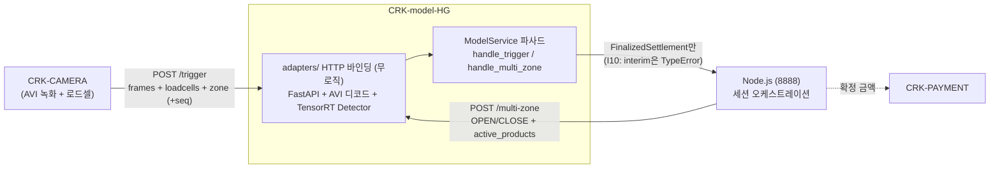
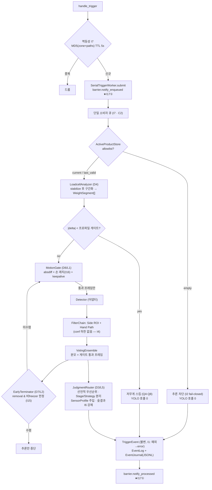
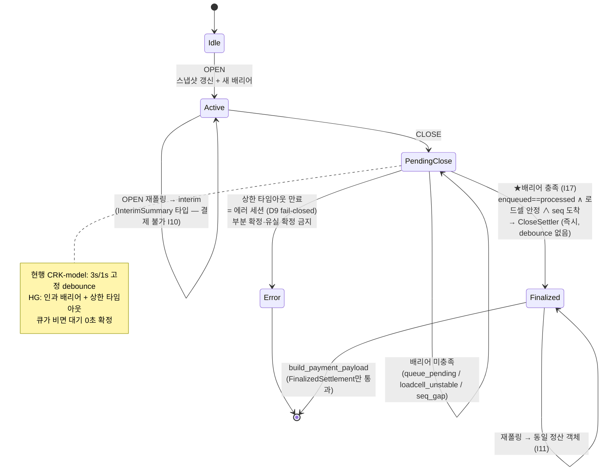
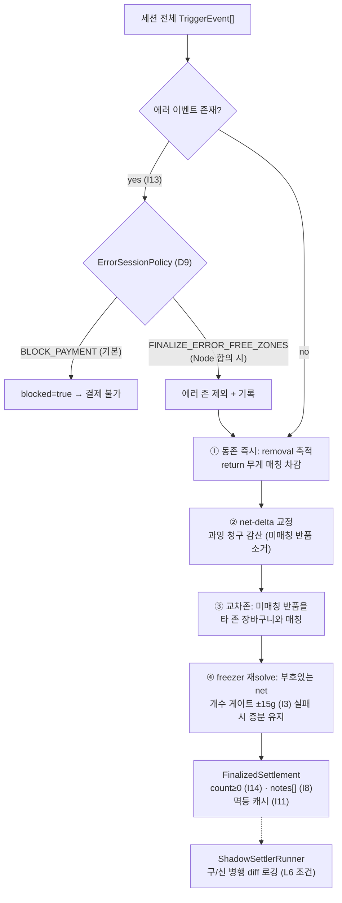
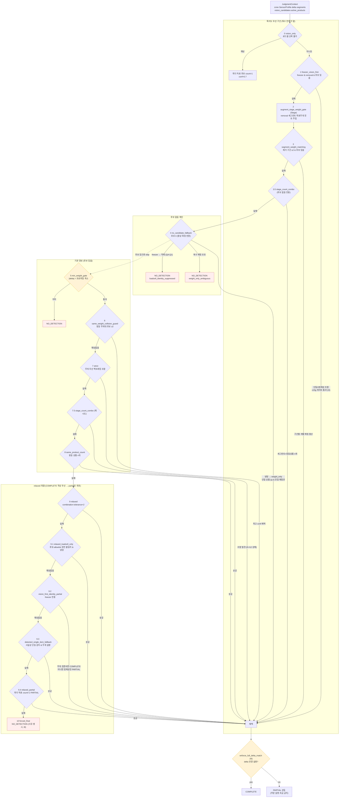

# CRK-model-HG — Model Service (Greenfield Redesign)

Last reviewed: 2026-07-09

AI 스마트 자판기 모델 서비스의 백지 재설계 구현. 레거시/참조 서비스인
[CRK-model](https://github.com/CHAI-Student/CRK-model)(FastAPI + TensorRT)의
외부 계약을 유지하면서, 설계 문서 3종의 결론을 코드로 옮겼다:

- `CRK-model/docs/GREENFIELD_DESIGN_GUIDE.md` — 결정 **D1~D10 전부 권장안** 채택
- `CRK-model/docs/REDESIGN_RATIONALE_QA.md` — 불변식 **I1~I17**을 타입·인터페이스·탐색 공간 제약으로 표현
- `CRK-model/docs/OPTIMIZED_ARCHITECTURE.md` — 레버 L1(모션 게이트)·L2(조기 종료)·L5(전략 라우터)·L6(단일 정산기) 반영, L3(배치)는 설계만·기본 OFF

순수 파이썬, 런타임 의존성 0. YOLO TensorRT·NVDEC 등 장치 결합 요소는
프로토콜(`perception.Detector`) 뒤의 어댑터로 주입한다. Jetson 실기 검증(G4)
전까지 이 레포의 통과 상태는 설계·계약 수준의 증명이다.

## Current Status

- 로컬 검증 게이트: `pytest tests -q` → **188 passed (2026-07-09)** (numpy/ffmpeg/fastapi 미설치 환경은 해당 테스트 skip), `ruff check .` clean, CI(GitHub Actions) 구동
- **Jetson 실기 E2E 검증 완료 (2026-07-09)**: 냉동 실기에서 OPEN → 트리거 추론(freezer_vision_first) → CLOSE 정산 → Node 결제 연동까지 통과 (이슈 #6 전 과정). 잔여 실기 항목: 24h+ soak(G4), 원본 정합 웨이브(left-crop·classes·max-conf, `docs/fix_logs.md` 2026-07-22) 실기 재검증 — side ROI는 crop 좌표계 400으로 재정렬됨(과거 "side 검출 대부분 제거" 문제의 원인이던 squash 좌표계 240은 폐기), 엣지 워터마크 실기 관찰(Edge_Environment `feature/edge-watermark` 브랜치)
- G0(정적/단위) 커버: 불변식 I1~I17 전건, E2E(OPEN→trigger→CLOSE→결제 페이로드), HTTP 어댑터 E2E, G2.5 훅(저널 replay 등가성)
- 실기 이슈로 확정·수정된 계약 (상세는 `docs/fix_logs.md`): 확정 결과 1회 전달 후 즉시 idle(에지 device busy 해제), 결제 페이로드 원본 finalize 형식(평탄화 `products`·`productIdx`/`price` 키), CLOSE 유예 3s + 엣지 워터마크(`expected_triggers`) 이중 방어, `MODEL__MACHINE__CABINET_TYPE` 필수(냉동 기기), 상품→YOLO 이름 기반 매핑, 투표 진입 컷 env 튜닝(`.env.example`)
- 미커버 (착수 전 확보물 대기): 게이트/조기종료 임계값 실측(P1 코퍼스), 세션 아카이브 replay(P2), interim 의미론·에러 정책 Node 합의(P3·P4). 카메라 seq 펌웨어(P5)는 엣지 워터마크로 대체됨

## Jetson Quick Start

Jetson Orin Nano(JetPack, Ubuntu 22.04)에서 1회 준비 후 실행:

```bash
git clone https://github.com/CHAI-Student/CRK-model-HG.git
cd CRK-model-HG

chmod +x scripts/setup_jetson.sh
chmod +x scripts/install_jetson_torch.sh
chmod +x scripts/jetson_env.sh
./scripts/setup_jetson.sh
       # system-site venv + 어댑터 의존성

source .venv/bin/activate
MODEL__VISION__YOLO_MODEL_PATH=models/set9_doorfas_0323_imbal.engine model-service-hg
```
기존 CRK-model을 가동 중이라면 중단 후 model-service-hg 실행. 

`.engine` 파일은 이 레포에 없다 — CRK-model에서 쓰던 엔진 파일을 `models/`에
복사하거나 절대경로로 지정한다. 기동 시 startup probe가 엔진을 1회 실행하므로
**로드 실패·CUDA 불가면 서비스가 즉시 죽는다** (무증상 기동 금지, 이관 리뷰 #1).

`.engine`이 없고 `.pt`만 있으면(Jetson 리셋/JetPack 재플래시 후 등) **그 Jetson
위에서** 직접 빌드한다 — engine은 TensorRT 버전·GPU에 종속이라 다른 기기에서
빌드한 파일은 못 쓴다:

```bash
# .pt를 models/에 두고 실행 (어댑터 계약 FP16·imgsz=480은 스크립트가 맞춰준다)
PT_FILE=0204_morning.pt scripts/convert_engine.sh
```

스크립트가 NumPy 2.x(Jetson torch 비호환)를 사전 검사하고, 실행 중 의존성
auto-install이 NumPy를 올리는 것도 차단한다(`YOLO_AUTOINSTALL=false`). export
의존성(onnx/onnxslim)은 setup_jetson.sh가 NumPy 핀과 함께 미리 설치한다.

코드 업데이트 후. 
```bash
deactivate 2>/dev/null
git pull origin master

source .venv/bin/activate
MODEL__VISION__YOLO_MODEL_PATH=models/set9_doorfas_0323_imbal.engine model-service-hg

```


헬스 체크:

```bash
curl http://localhost:8002/api/health
# {"status":"ok","door_state":"idle","queue_pending":0,"barrier_satisfied":true,...}
```

CRK-model의 CUDA/TensorRT 경로 부트스트랩(`scripts/jetson_env.sh`)이 필요한
환경이면 먼저 그것을 source한 뒤 실행한다. 기존 CRK-model `.venv`를 재사용하는
방법도 있다: 그 venv를 활성화한 채 `uv pip install --no-deps -e /path/to/CRK-model-HG`
`uv pip install fastapi "uvicorn[standard]"` 후 `model-service-hg`.

## Operations & Diagnostics

운영 중 상태 확인·사후 분석용 로그와 아카이브. 정상 동작의 일부이며 별도 설정
없이도 남는다(아카이브·저널 경로만 env로 조정 가능).

### 운영 로그

- `[OPS][CLOSE]` — 세션 확정(finalize) 시 1회, 존별 분해를 포함한 확정 요약
  (`session_id`, 존별 `weight_delta`/`products`/`triggers`, 세션 전체
  `total_weight_delta`/`total_products`/`total_price`).
- `[OPS][CLOSE_ERROR]` — 에러 세션으로 확정될 때(I13, `blocked=true` 등) 사유와
  함께 기록.
- `[OPS][SESSION_ARCHIVE]` — 세션 아카이브 파일 기록 성공/실패 시 기록.
- `[MULTI-ZONE OPEN] mapped=n/total unmapped=[...]` — OPEN마다 상품→YOLO
  클래스 매핑 성공률. 매핑 실패 상품이 있으면 이름 목록과 함께 `warning`으로
  기록(상세는 아래 "상품 → YOLO 클래스 매핑" 참고).

### 상품 → YOLO 클래스 매핑 (issue #6)

Node가 보내는 상품(`active_products`)마다 YOLO `class_id`를 부여한다.
우선순위는 숫자 필드 별칭(`yolo_class_id`/`yoloClassId`/`trainingIdx`/
`training_idx`/`trainingidx`) → 실패 시 **엔진 `class_names`(TensorRT
어댑터의 `class_names` 프로퍼티) 기반 이름 매칭**(`product_eng_name` →
`product_name`/`productName`/`name` 순 폴백, 대소문자 무시). 어느 경로로도
못 찾으면 `class_id=0`(hand 클래스와 충돌)이 아니라 `-1`(미매핑 센티널)을
쓴다 — 매핑 실패 상품이 조용히 손(hand)으로 둔갑해 오청구로 이어지는 사고를
막기 위함이다. 매핑 결과는 `handle_multi_zone(state="OPEN")`마다
`[MULTI-ZONE OPEN] mapped=n/total unmapped=[...]` 경고로 남는다.

### weight_only 의미론 (fail-closed)

vision 후보가 0개일 때(`NoCandidateFallbackStrategy`)의 폴백 규칙: freezer
존(무게가 정체성 판별자 자격이 없음)은 애초에 품목 식별을 포기하고
`loadcell_identity_suppressed`로 `NO_DETECTION`을 반환한다. 그 외 존은
전 재고 대상 **단일 품목·유일 매칭만** 시도한다(다품목 조합 탐색은 하지
않음 — 우연한 무게 합 일치로 인한 오청구 재발 방지). 허용오차 내에 서로
다른 품목이 2개 이상 그럴듯하면 모호하다고 보고 `weight_only_ambiguous`
사유로 `NO_DETECTION`을 반환한다(과청구가 미청구보다 나쁘다는 I13/D9
fail-closed 원칙).

### 세션 아카이브 (오판정 사후 분석용)

세션이 확정(finalize)될 때마다 트리거별 vision 후보·판정 전략·신뢰도·
`video_paths`까지 포함한 세션 전체 기록을 파일로 남긴다. "왜 이렇게
과금됐는가"를 로그만으로 재구성하기 위한 것으로, 정산 로직 자체에는
영향을 주지 않는다. 클래스별 `votes`/`ratio`/`conf`와 탈락 사유
(`ratio`/`conf_floor` 게이트)를 담은 `vote_summary`도 함께 기록해 "왜 그
후보가 채택/탈락됐는지"까지 아카이브만으로 재구성할 수 있다.

| 환경변수 | 기본값 | 의미 |
| --- | --- | --- |
| `MODEL__SESSION__ARCHIVE_DIR` | `data/sessions` | 아카이브 루트 디렉터리. 빈 문자열(`""`)이면 아카이브 비활성화 |
| `MODEL__SESSION__ARCHIVE_RETENTION_DAYS` | 14 | 일자별 디렉터리 보존 기간(일) |

파일 경로: `data/sessions/YYYY-MM-DD/<session_id>.yaml` (PyYAML이 없으면
`.json`으로 자동 폴백).

**정답 라벨 (`ground_truth`)**: 실험 시 실제 취출 품목/수량을 아카이브에
구조화해 기입한다 — 임계 보정(conformal)·확률화 shadow 정오 판정의 데이터
소스다 (이슈 코멘트 수기 기록의 대체). 실험 직후 Jetson에서:

```bash
label-session --latest --zone 2 --take 27x5 --note "1.6s 간격 연속 취출"
label-session ses-10-1784698526 --take 2:27x1 --take 3:30x1
```

`--take [존:]<class_id|이름>x<개수>` 반복 지정, 재실행 시 기존 라벨 대체
(오기입 정정). 미라벨 세션은 `ground_truth: null`로 남는다.

### 정산 notes 해석표

`[OPS][CLOSE]`·세션 아카이브 YAML·`[GATEWAY] FINALIZED` 로그의 `notes=[...]`는
정산기(4층, Architecture §4)가 **증분 집계를 교정한 흔적**이다 — note가 있다는
것은 "트리거별 판정 그대로가 아니라 close 시점에 재해석했다"는 뜻이므로,
과금이 이상할 때 가장 먼저 볼 곳이다.

| note | 발생층 | 의미 | 볼 것 |
| --- | --- | --- | --- |
| `net_delta_correction:zone{N}:{상품ID}-1` | ② net-delta | 존 청구 합계가 로드셀 순변화보다 무거워 가장 근접한 상품 1개를 감산 — "꺼냈다 되돌림"이 트리거 판정에 잡히지 않았을 때의 교정 | 감산이 정당한지: 해당 존 트리거들의 delta 부호와 반품 세그먼트 |
| `cross_zone_return:zone{A}->zone{B}:{상품ID}-1` | ③ 교차존 | A존에서 미매칭 반품(+delta)이 B존 장바구니의 상품 무게와 일치 — 존 착오 반납으로 보고 B존에서 1개 감산 | A존 반품 무게와 B존 상품 무게가 실제로 같은 상품인지 |
| `unmatched_return:zone{N}:{+X.Xg}` | ③ 교차존 | 반품(+delta)이 어느 존 장바구니와도 매칭 실패 — 감산 없이 기록만 (과소 청구 방향으로 안전) | 반품 무게가 상품 DB unit_weight와 얼마나 어긋나는지 (무게 DB 문제 신호) |
| `freezer_close_resolve:zone{N}:{상품ID}={n}` | ④ freezer | 냉동 존을 close 시점 순변화(net)로 재해석 — 단일 품목 n개로 개수 확정 (±15g 게이트 통과, I3) | n이 실물과 맞는지 — 이 note가 정상 경로다 (증분 판정보다 net이 정확) |
| `freezer_close_resolve:zone{N}:net~0->clear` | ④ freezer | 냉동 존 순변화가 게이트 이내(사실상 0) — 전량 반품으로 보고 청구 클리어 | 실제로 되돌려놨는지. 아니라면 로드셀 드리프트 의심 |
| `freezer_close_gate_failed:zone{N}:keep_incremental` | ④ freezer | net 재solve가 ±15g 게이트를 통과하지 못함 — 안전하게 증분(트리거별) 결과 유지 (I3: 게이트 실패 시 재solve 확정 금지) | net과 증분 청구 합의 차이 — 크면 무게 DB/드리프트 문제 |
| `freezer_close_multi_kind:zone{N}:keep_incremental` | ④ freezer | 냉동 존에 2품목 이상 — 단일 품목 재solve 불가라 증분 유지 (178g 사건 방지: 조합 재solve 금지) | 다품목 청구가 vision 근거(아카이브 judgment)와 일치하는지 |
| `error_zones_excluded:{존 목록}` | 에러 정책 | `FINALIZE_ERROR_FREE_ZONES` 정책(Node 합의 시)에서 에러 존만 제외하고 확정 | 제외된 존의 매출 누락 — 기본 정책(BLOCK_PAYMENT)에서는 발생 안 함 |

에러 세션(`[OPS][CLOSE_ERROR]`)의 `reason`은 notes가 아니라 차단 사유다:
`error_trigger_present:zones=[...]`(I13 — 에러 트리거 포함, 결제 차단),
`all_zones_errored`, `barrier_timeout:...`(I17 — 배리어 미충족 상한 초과,
카메라/워커 무응답 의심).

### 이벤트 저널

`TriggerEvent` 시퀀스를 JSONL로 append하는 저널. G2.5(정산 등가성) replay와
장애 후 재구성에 쓰인다.

| 환경변수 | 기본값 | 의미 |
| --- | --- | --- |
| `MODEL__LEDGER__JOURNAL_PATH` | `logs/events.jsonl` | 저널 파일 경로. 일자별로 로테이션 |
| `MODEL__LEDGER__JOURNAL_RETENTION_DAYS` | 14 | 로테이션된 저널 파일 보존 기간(일) |

### 엣지 워터마크 (권장 — Node 측 구현 필요)

CLOSE가 카메라 AVI 업로드보다 먼저 도착하면 배리어(I17)가 자명하게 충족되어
0원 확정 + late trigger rejected가 날 수 있다 (이슈 #8). 기본 방어는 CLOSE
유예 3초(`MODEL__CLOSE__GRACE_S`)지만, **Node가 CLOSE payload에 존별 기대
트리거 수를 실으면** 시간 휴리스틱 없이 인과적으로 정확해진다:

```json
{ "session_id": "CLOSE", "expected_triggers": { "4": 2, "5": 1 } }
```

- Node는 녹화 디렉토리(`Edge_Environment/<세션>/inference/zone_N/…`)의
  소유자이므로 close 시점에 존별 녹화 디렉토리 수를 세기만 하면 된다 —
  카메라 펌웨어(seq, P5) 변경 불필요.
- 워터마크가 있으면: 기대 수만큼 도착할 때까지 확정 보류
  (`awaiting_triggers`), 전부 도착하면 **유예 없이 즉시** 확정. 기대한
  트리거가 끝내 안 오면 `close_timeout`(10s)에서 에러 세션 (D9 fail-closed).
- 워터마크가 없으면: 기존 유예 3초 폴백 (하위호환 — Node 무변경으로도 동작).

### 비디오 디코더

| 환경변수 | 기본값 | 의미 |
| --- | --- | --- |
| `MODEL__VIDEO__DECODER` | `auto` | `auto`\|`ffmpeg`\|`opencv`. `auto`는 NVDEC(hwaccel cuda) 가용 + numpy 존재 시 ffmpeg 스트리밍 파이프를 쓰고, 아니면 cv2(CPU 디코드)로 폴백 |

## Manual Setup -> 꼭 해야한다면... 

```bash
uv venv --system-site-packages --python python3.10 .venv
source .venv/bin/activate
uv pip install --no-deps -e .
uv pip install "fastapi>=0.100.0" "uvicorn[standard]>=0.23.0"
# ultralytics가 system-site에 없을 때만 (CPU torch 오염 방지를 위해 --no-deps):
uv pip install --no-deps "ultralytics>=8.0.0,<9.0.0" "ultralytics-thop>=2.0.18"

cp ../CRK-model/.env.example .env 2>/dev/null || touch .env
echo "MODEL__VISION__YOLO_MODEL_PATH=models/siyeon_best.engine" >> .env
```

원칙은 CRK-model과 동일: venv는 반드시 `--system-site-packages`(JetPack의
CUDA/TensorRT/torch/OpenCV/numpy<2 사용), ultralytics는 `--no-deps`로만 설치,
일상 실행에 plain `uv run`/`uv sync` 금지 (환경 재동기화로 CUDA torch가
CPU wheel로 덮일 수 있음).

## Live Engine Preview

카메라 입력과 TensorRT `.engine` 추론 출력을 실시간 bbox/라벨로 육안 검증하는
독립 유틸(`scripts/live_engine_preview.py`) — FastAPI 서비스(`model-service-hg`)와
완전 분리되어 있고 `crk_model` 패키지에도 의존하지 않는다:

```bash
python scripts/live_engine_preview.py --model models/set9_doorfas_0323_imbal.engine --source 0 --display-backend ffplay
```

자주 쓰는 옵션:

```bash
python scripts/live_engine_preview.py \
  --model models/set9_doorfas_0323_imbal.engine \
  --source 0 \
  --width 640 \
  --height 480 \
  --imgsz 480 \
  --conf 0.25 \
  --display-backend ffplay
```

- `--backend {auto,v4l2,gstreamer,ffmpeg}` — 캡처 백엔드 선택.
- `--source`는 카메라 인덱스(`0`), `/dev/videoN` 경로, 비디오 파일, RTSP URL,
  `csi:N`(Jetson CSI 카메라), `gst:<파이프라인>`(커스텀 GStreamer 파이프라인)을
  모두 지원한다.
- `--display-backend auto`는 OpenCV HighGUI가 가능하면 그것을, `GUI: NONE`으로
  빌드된 헤드리스 OpenCV라면 `ffplay`(rawvideo 파이프)로 자동 폴백한다.
- `--classes 0,2,5` 같은 콤마 목록으로 특정 YOLO 클래스만 필터링 가능.
- Jetson CUDA/TensorRT 런타임 경로가 필요하면 실행 전에
  `source scripts/jetson_env.sh`로 준비한다 (스크립트 자체는 이제 이 부트스트랩을
  자동으로 재실행하지 않는다 — `model_service.core.runtime_env` 같은 서비스
  전용 모듈에 의존하지 않는 완전 독립 스크립트이기 때문).
- 이 스크립트는 Jetson 전용 육안 검증 도구다 — 개발 PC 실행으로 TensorRT/CUDA
  준비 상태를 판단하지 않는다. cv2/ultralytics를 직접 import하므로(코어의
  "런타임 의존성 0" 원칙의 명시적 예외), 개발 PC에는 두 패키지가 없어도
  `--help`는 정상 동작한다.

### 트러블슈팅: 카메라를 열 수 없음 (Jetson)

`--source 0` / `--source 2` 등에서 `can't open camera by index` /
`camera/video source could not be opened`가 발생하면:

- **카메라 점유(V4L2 배타 오픈 충돌)**: CRK-CAMERA/Edge_Environment의 캡처
  서비스가 이미 카메라를 열어 AVI로 상시 녹화 중이면 V4L2는 배타적으로만
  열리므로 프리뷰가 실패한다. 프리뷰 전에 해당 캡처 서비스를 먼저 중지하거나,
  캡처 서비스가 쓰지 않는 다른 `/dev/videoN`을 지정한다.
- **CSI 카메라**: `/dev/video*`가 하나도 없거나 V4L2로 열리지 않는 Jetson 온보드
  카메라는 `--source csi:0` (nvarguscamerasrc 기반 GStreamer 파이프라인)으로
  연다. 커스텀 파이프라인은 `--source 'gst:<파이프라인>'`으로 직접 전달 가능.
- **진단**: `python scripts/live_engine_preview.py --list-devices`로 모델 로드
  없이 `/dev/video*` 목록, `v4l2-ctl --list-devices` 출력, 각 장치를 점유 중인
  프로세스(pid)를 확인할 수 있다. 카메라 열기 실패 시에도 이 진단이 자동
  실행된다. USB 카메라는 장치당 노드 2개(캡처+메타데이터)를 만드므로, 홀수
  번호 노드는 메타데이터용이라 캡처 소스로 열리지 않을 수 있다.

## Quick Start (개발 PC — 도메인 코어)

```bash
git clone https://github.com/CHAI-Student/CRK-model-HG.git
cd CRK-model-HG
pytest tests -q        # 코어는 런타임 의존성 0 (fastapi 있으면 HTTP E2E도 실행)
```

서비스 사용은 파사드 직접 호출 (HTTP 어댑터는 이 파사드를 감싸기만 한다):

```python
from crk_model.service import ModelService
from crk_model.core.config import Settings

svc = ModelService(detector=MyTensorRTDetector(),        # Detector 프로토콜 구현
                   settings=Settings.from_env(),
                   startup_probe_frame=probe)            # 로드 실패 = 기동 실패 (fail-fast)

svc.handle_multi_zone({"session_id": s, "state": "OPEN", "active_products": [...]})
svc.handle_trigger({"zone": 1, "frames": {...}, "loadcells": [...], "video_paths": {...}})
svc.process_pending()                                    # 전용 스레드에서 주기 호출
svc.handle_multi_zone({"session_id": s, "state": "CLOSE"})   # 배리어 충족 시 결제 페이로드
```

## Architecture

### 1. 시스템 컨텍스트 — 외부 계약 (C4/C5)



### 2. 트리거 파이프라인 — 데이터 평면 (unpaced · event-driven)



### 3. 세션 확정 — 제어 평면 (time-paced → causal barrier로 승격, I17)



### 4. close-time 단일 정산기 (D5/L6) — 반품 복구 4층의 통합



### 5. 판정 전략 라우터 (L5) — 전략 관계도

`judgment/router.py`의 `default_pipeline()` — 위에서 아래로 **첫 non-None이 즉시
반환**된다 ("누적 + 특이도 우선", QA Q2). Stage는 판정하지 않고 컨텍스트만
변형한다. 모든 COMPLETE는 라우터에서 `enforce_full_delta_match`(I6: delta 전량
설명 못 하면 PARTIAL 강등)를 거친다. 세션 아카이브 YAML의
`judgment.strategy/reason`과 `[OPS][CLOSE]`의 `judgments=`가 이 이름들이다.



원본(다이어그램 5)과 의도적으로 다른 지점: relaxed 하위 순서(9.1~9.4)는 원본에서
자체 partial이 먼저 반환돼 도달 불가능하던 폴백들을 "무게로 뒷받침된 count 격상 >
무검증 count=1" 원칙으로 재배치한 것 (`router.py` docstring에 근거 기록).
freezer(weight_is_discriminative=False)에서는 무게만으로 정체성을 판정하는 경로
전부(weight_only·relaxed_loadcell_only)가 억제된다 — 로드셀 오차 5~15g (QA Q1).

## Module Map

모듈 경계 = 테스트 경계 (D10). 화살표 방향으로만 의존한다.

요청 흐름 한 줄 요약: `trigger → queue → pipeline(decode→gate→YOLO→filter→vote→judge)
→ event → close 정산 → 결제 페이로드`.

| 모듈 | 책임 | 주요 파일 | 상태성 | 원본 대응 | 테스트 |
| --- | --- | --- | --- | --- | --- |
| `core/` | 타입(I10 분리), SensorProfile(D3), 에러 정책(D9), env 설정 | `types.py`, `profiles.py`(SensorProfile), `config.py`, `policy.py` | 무상태 | core/config.py | (전역) |
| `ingest/` | 트리거 멱등성(I7), 로드셀 구간화 → WeightSegment[] (D4) | `loadcell.py`, `idempotency.py` | 무상태 | trigger.py 일부 | test_ingest |
| `frames/` | 프레임 번들, 모션 게이트(L1) + 손 래치(D6/I16), 배치 수집(D8·기본 OFF) | `bundle.py`, `motion_gate.py`(L1), `batch.py` | 트리거 내 | frame_extractor | test_frames |
| `perception/` | Detector 프로토콜, 필터 체인, 투표, 조기 종료(L2) | `detector.py`(Detector 프로토콜), `filters.py`, `voting.py`, `early_termination.py`(L2) | 트리거 내 | yolo_wrapper, video_processor | test_perception |
| `judgment/` | Stage/Strategy 분리, 선언적 우선순위 라우터(L5), 다이어그램5 분기 전략, strict 매처 | `interfaces.py`(Stage\|Strategy), `router.py`(L5), `strategies.py`(다이어그램5 분기), `strict.py`(strict 매처) | 무상태 (순수) | decision_engine (10.4k줄 해체) | test_judgment |
| `ledger/` | 이벤트 소싱, close-time 단일 정산기(L6), 인과 배리어(I17), 저널, 세션 아카이브, shadow | `events.py`, `settler.py`(L6 단일 정산기), `barrier.py`(I17), `journal.py`(일자 로테이션), `archive.py`(세션 YAML), `shadow.py` | 영속 | session/* 통합 | test_ledger |
| `gateway/` | OPEN/CLOSE 상태기계, 결제 페이로드(I10 타입 강제) | `state_machine.py`(OPEN/CLOSE 상태기계, 결제 페이로드) | 상태기계 | multi_zone.py | test_gateway |
| `service/` | 파이프라인 7단계 오케스트레이션, 단일 소비자 워커, 스냅샷(I2), 파사드 | `model_service.py`(파사드), `pipeline.py`(7단계), `worker.py`(단일 소비자), `snapshot.py`(I2) | 조립 | trigger_service, api/routes | test_service |
| `adapters/` | 장치 결합: FastAPI, TensorRT Detector, AVI 스트리밍 디코드, 진입점 (전부 lazy import) | `http_app.py`(FastAPI), `yolo_detector.py`(TensorRT), `avi_frames.py`(스트리밍 디코드), `serve.py`(진입점) | I/O 경계 | yolo_wrapper, frame_extractor, main.py | test_adapters |
| `scripts/` | 개발/운영 보조 스크립트 (패키지 외부, `crk_model` 비의존) | `live_engine_preview.py`, `setup_jetson.sh` 등 | — | — | — |

## Design Decision Map (D1~D10 → 구현)

| 결정 | 권장안 | 구현 위치 |
| --- | --- | --- |
| D1 확정 모델 | 인과 배리어(I17), debounce → 상한 타임아웃 강등, 만료 시 에러 세션 | `ledger/barrier.py`, `gateway/state_machine.py` |
| D2 공통 시간축 | 카메라 seq watermark (선택 — 없어도 동작) | `barrier.set_close_watermark`, `TriggerEvent.seq` |
| D3 판정 구조 | Stage/Strategy 분리 + 선언적 순서(다이어그램5 보존) + SensorProfile + 텔레메트리 | `judgment/` |
| D4 구간화 위치 | ingest 소속, stabilize 후 순서 고정, plateau 평균 드리프트 흡수 | `ingest/loadcell.py` |
| D5 정산 구조 | 이벤트 소싱 + close 단일 정산기 + shadow 병행 | `ledger/settler.py`, `shadow.py`, `journal.py` |
| D6 프레임 공급 | 모션 게이트 + 손 래치 + keepalive + freezer 별도 임계 | `frames/motion_gate.py` |
| D7 조기 종료 | removal·비freezer 한정, judge()와 tolerance 단일 소스 | `perception/early_termination.py` |
| D8 배치 | 설계만, 기본 OFF, 고정 배치+패딩, 카메라 분리 | `frames/batch.py` |
| D9 에러 세션 | 계약 enum, 기본 fail-closed | `core/policy.py` |
| D10 모듈 경계 | 경계 = 테스트 경계 | 패키지 구조 |

## Invariant Coverage (I1~I17)

전부 실제 사고(오과금·매출 누락)의 재발 방지책이며, 예외 처리가 아니라 구조로 표현했다:

- **I1** 처리 실패 → `status="error"` 이벤트 (`pipeline.process` except 절) · **I2** 빈 allowlist fail-closed + last_valid (`service/snapshot.py`)
- **I3** freezer ±15g 게이트 — 판정·정산 양쪽 · **I4** conf 하한은 투표 결합 후에만 · **I5/I12** 매처 탐색 공간에서 원천 배제
- **I6** `enforce_full_delta_match` 라우터 전건 적용 · **I7** 멱등 TTL + 단일 소비자 큐
- **I8** reason/notes/pending/trace 사유 코드 · **I9** 시나리오 계약은 G1에서 인수 (P1·P2 후)
- **I10** Interim/Finalized 타입 분리 — 결제 빌더가 TypeError로 거부 · **I11** 정산 멱등 캐시 + 확정 후 이벤트 거부
- **I13** 에러 세션 무성 확정 금지 (D9) · **I14** `_Basket.remove_one`이 음수 차단
- **I15** 조기 종료 removal·비freezer 한정 · **I16** 손 래치 활성 중 스킵 금지 · **I17** 인과 배리어 확정

## Configuration

| 환경변수 | 기본값 | 의미 |
| --- | --- | --- |
| `MODEL__CLOSE__BARRIER_TIMEOUT_S` | 10.0 | I17 상한 타임아웃 (정상 경로 아님) |
| `MODEL__CLOSE__GRACE_S` | 3.0 | CLOSE 유예 창 — 문 닫힘/마지막 트리거 후 이 시간 동안 확정 보류 (카메라가 쓰는 중인 AVI의 late trigger 유실 방지, 이슈 #8) |
| `MODEL__VISION__BATCH_SIZE` | 1 | D8 배치 (1 = OFF) |
| `MODEL__ZONES__FREEZER` | (없음) | freezer 프로파일 존 목록 (예: `9,10`) — cabinet_type 기본 프로파일에 대한 존 단위 오버라이드 |
| `MODEL__MACHINE__CABINET_TYPE` | `refrigerated` | 기기 단위 기본 프로파일 `refrigerated`\|`freezer`. **냉동 기기는 반드시 `freezer`로 설정할 것** — 미설정 시 전 존이 냉장(±3g) 프로파일로 판정되어 이슈 #6과 같은 오판정이 재발한다 |
| `MODEL__SESSION__ERROR_POLICY` | `block_payment` | D9 (변경은 Node 합의 P4 필요) |
| `MODEL__TRIGGER__IDEMPOTENCY_TTL_S` | 5.0 | I7 멱등 TTL |
| `MODEL__VIDEO__DECODER` | `auto` | 비디오 디코더 `auto`\|`ffmpeg`\|`opencv` (상세: Operations & Diagnostics) |
| `MODEL__SESSION__ARCHIVE_DIR` | `data/sessions` | 세션 확정 YAML/JSON 아카이브 루트, 빈 문자열이면 비활성 (상세: Operations & Diagnostics) |
| `MODEL__SESSION__ARCHIVE_RETENTION_DAYS` | 14 | 세션 아카이브 보존 기간(일) |
| `MODEL__LEDGER__JOURNAL_PATH` | `logs/events.jsonl` | 이벤트 저널 경로, 일자 로테이션 |
| `MODEL__LEDGER__JOURNAL_RETENTION_DAYS` | 14 | 이벤트 저널 보존 기간(일) |
| `MODEL__VISION__TOP_CONFIDENCE_THRESHOLD` | 0.70 | top 카메라 투표 진입 conf 임계 (원본 동명 설정). 후보가 안 잡히면 0.50→0.35 순으로 낮춰 조정 — `.env.example`의 vote_summary 튜닝 가이드 참조 |
| `MODEL__VISION__SIDE_CONFIDENCE_THRESHOLD` | 0.70 | side 카메라 투표 진입 conf 임계 |
| `MODEL__VISION__MIN_VOTE_RATIO` | 0.05 | 후보 채택 최소 투표율 (COUNT와 둘 중 하나만 충족하면 유지) |
| `MODEL__VISION__MIN_VOTE_COUNT` | 3 | 후보 채택 최소 절대 투표 수 |
| `MODEL__VISION__CONF_FLOOR` | 0.0 | 결합 후 weighted_conf 하한 (원본에 없는 안전판 — 진입 컷을 0으로 낮출 때만 사용) |
| `MODEL__VISION__SIDE_ROI_MAX_CENTER_X` | 400 | side 카메라 ROI 경계 (center_x ≥ 값이면 존 바깥으로 제거, left-crop 480 좌표계 — 원본 side_roi_x_max 정합) |
| `MODEL__VISION__MOTION_EVIDENCE` | 1 | 모션 변위 증거 — 변위 없는 카메라×클래스 표를 결합에서 몰수 (원본 변위 필터 이식, 진열/배경 오투표 차단) |
| `MODEL__VISION__MOTION_EVIDENCE_FLOOR_PX` | (프로파일) | 변위 하한 px — 미설정 시 냉장 10 / 냉동 12 (원본 운영값) |
| `MODEL__JUDGMENT__LIKELIHOOD_SHADOW` | 1 | 무게 우도 score shadow (Phase 1, 판정 무변경) — 냉동 이벤트별 score 순위와 현행 판정의 diff를 아카이브 `trace.likelihood_shadow`에 기록 (`docs/0722_weight_likelihood_design.md`) |
| `MODEL__JUDGMENT__LIKELIHOOD_K` | 20.0 | 무게 우도비 상한(clamp) — 1이면 무게 무력(거부권만). conformal 보정 대상 |
| `MODEL__JUDGMENT__LIKELIHOOD_SIGMA_DB` | 5.0 | DB unit_weight 개당 편차(g) — 아카이브 잔차 실측으로 보정 |

전체 env 목록과 튜닝 가이드는 `.env.example` 참조 (`cp .env.example .env` 후 수정).
게이트·tolerance·구간화 임계는 env가 아니라 `SensorProfile`(코드) 소속 —
존 타입별 물리 특성이므로 배포 설정으로 흔들리지 않게 한다 (C3).

## Verification Gates

| 게이트 | 상태 | 내용 |
| --- | --- | --- |
| G0 정적/단위 | ✅ 165 passed (2026-07-09) | 불변식 전건 + E2E + 필터/게이트/정산 + CI(ruff+pytest) |
| G1 판정 등가성 | ⏳ P1·P2 대기 | 924 시나리오 계약 인수 |
| G2 게이팅 검증 | ⏳ P1 대기 | 현장 AVI 코퍼스 전체 파이프라인 재실행 diff |
| G2.5 정산 등가성 | 훅 완성 (`EventJournal.replay`) | 세션 아카이브(P2) replay |
| G3 프로토콜 계약 | 파사드 계약 고정 | interim 의미론 Node 합의(P3) 별도 |
| G4 장치 검증 | ⏳ Jetson 반입 | 파워모드·스로틀링·OOM·24h soak |
