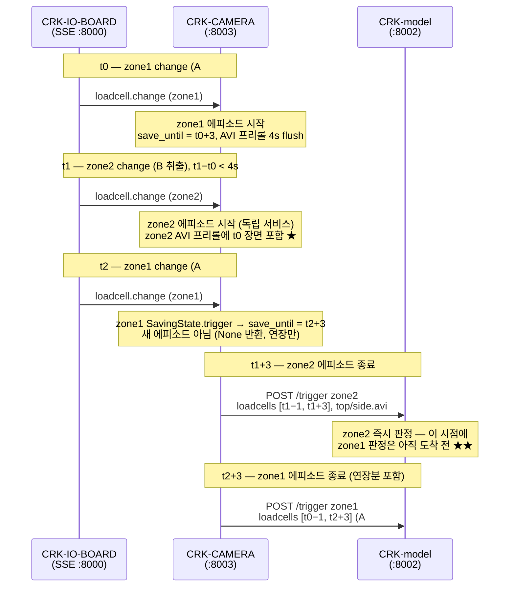
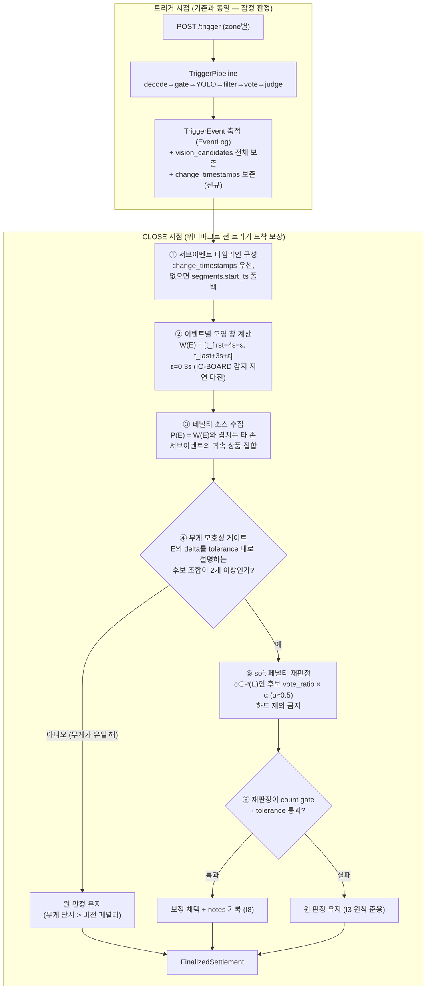

# 0711 아이디어 — 교차존 비전 오염과 cross-zone minus-weight 판정

> 2026-07-11. 기준 구조는 **master** (redesign/v2-cell-model 아님).
> 관련 레포: CRK-IO-BOARD, CRK-CAMERA, CRK-model(master), Edge_Environment(freeze).
> 결론 요약: **통신적·기기적으로 가능. 카메라에 연장 타임스탬프 flag 1건 +
> 모델에 CLOSE 2차 패스 1건이면 되고, IO-BOARD·Edge는 무변경.**
> 단, "앞선 이벤트에 페널티"가 아니라 **"영상 창이 겹치는 타 존 서브이벤트에
> 페널티"** 로 한 단계 일반화해야 함 (§4.3 순서 역전 참고).
>
> **구현 완료 (2026-07-13)** — CRK-CAMERA `feat/change-timestamps`,
> CRK-model-HG `feat/cross-zone-vision-penalty`. 구현 중 확정된 세부
> (설계와 달라진 지점 포함)는 §4.2의 `구현:` 주석과 **§8 구현 기록** 참고.

---

## 1. 문제 시나리오

zone 1에서 A 취출 → zone 1 세션 유지 중 zone 2에서 B 취출 → zone 1
연장 세션 내에 A 재취출. 이때 zone 2의 판별용 AVI에 A 취출 장면이 섞여
들어가 A가 vision candidate로 진입, **B가 A로 오판**될 수 있다.

### 1.1 타임라인 (CRK-CAMERA 동작 기준, 코드로 확인된 사실)



★ = 오염 지점, ★★ = 도착 순서 역전 지점.

### 1.2 코드로 확정된 전제 사실

| # | 사실 | 근거 |
|---|---|---|
| F1 | zone별 `TriggerSaveService`가 독립. 세션 유지 중 동존 change는 `save_until = max(기존, now+3)`으로 **연장만** 하고 새 이벤트를 만들지 않음 (`None` 반환) | CRK-CAMERA `trigger_save.py:134-137` |
| F2 | 한 에피소드 = POST 1건. 연장 병합 시에도 loadcell은 `[최초 change−1s, 마지막 change+3s]` 한 덩어리로 전송, **연장 시각(t2)은 페이로드에 없음** | `loadcell.py:106-161` |
| F3 | zone2 AVI는 프리롤 4초(`replay_duration`, 120프레임) + 라이브 3초+. 즉 영상 커버리지 ≈ `[t1−4s, t1+3s+]` — **t0(4초 이내)과 t2(라이브 구간)의 zone1 취출 장면이 물리적으로 포함될 수 있음** | `trigger_save.py:171-174`, `main.py` |
| F4 | zone2의 **loadcell 페이로드는 오염되지 않음** — 존별 2채널만 슬라이스(`zone_index=(zone-1)*2`). 오염 경로는 vision뿐 | `loadcell.py:130-140` |
| F5 | **도착 순서 ≠ 인과 순서**: zone1 POST(t2+3)가 zone2 POST(t1+3)보다 늦게 도착. "먼저 일어난 취출을 먼저 판정"은 온라인으로는 불가능한 케이스가 존재 | F1+F2 귀결 |
| F6 | AVI duration은 벽시계가 아니라 프레임수/30 — 프레임 인덱스→시각 환산은 신뢰 불가. 시간 정렬은 loadcell/change 타임스탬프로만 해야 함 | `ffmpeg.py` (image2pipe, `-framerate 30`, `-codec copy`) |
| F7 | 모든 loadcell·change 타임스탬프는 IO-BOARD 단일 클럭에서 유래 (SSE 이벤트의 `timestamp`) — **존 간 시각 비교에 기기 간 클럭 스큐 문제 없음** | CRK-IO-BOARD `sse.py`, CRK-CAMERA `loadcell.py:76-77` |
| F8 | master 모델은 트리거당 즉시 판정(pipeline) 후 **CLOSE에서 단일 글로벌 정산기(`CloseSettler`)가 세션 전체 `TriggerEvent[]`를 재검토**하는 2단 구조. 엣지 워터마크(`expected_triggers`)가 "모든 트리거 도착 후 확정"을 보장 | `ledger/settler.py`, `ledger/barrier.py`, 이슈 #8 |
| F9 | `TriggerEvent`가 **채택되지 않은 후보까지 포함한 `vision_candidates` 전체**를 보존 (이슈 #6 진단용) — CLOSE 시점 재판정에 YOLO 재실행 불필요 | `ledger/events.py:22-24` |
| F10 | Edge 워터마크는 존별 **녹화 디렉토리 수** 기반 — 에피소드(=디렉토리=POST) 단위라서 연장 flag를 추가해도 카운트 계약 불변 | Edge `Payments.js countZoneRecordings()` |

---

## 2. 제안 아이디어 (원안 → 일반화)

**원안**: zone1 첫 취출의 판정 결과 X를 먼저 확정하고, 시계열상 다음
이벤트인 zone2 판정에서 X에 minus weight(후보 강등)를 줘서 B의 오판을 방지.

**일반화가 필요한 이유 (F3, F5)**: zone2 영상에는 t0(앞선 취출)뿐 아니라
**t1 이후의 t2(A#2)도 라이브 구간에 찍힐 수 있다.** 따라서 페널티 소스는
"시간적으로 앞선 이벤트"가 아니라:

> **"판정 대상 이벤트의 영상 커버리지 창과 시간이 겹치는, 타 존
> 서브이벤트들의 귀속 상품 집합"**

으로 정의한다. 또한 F5 때문에 "X를 먼저 판정하고 나서 zone2를 판정"하는
온라인 순차 처리는 성립하지 않으므로, **확정 페널티는 CLOSE 2차 패스에서**
적용한다 (트리거 시점의 잠정 판정은 그대로 두고, `FinalizedSettlement`만
보정 — I10과 정합).

---

## 3. 레포별 실현 가능성 판정

### 3.1 CRK-IO-BOARD — 변경 불필요 ✅

- 이미 `loadcell.change`가 `changed_indices`(→ `zone = idx//2+1`)와
  타임스탬프를 제공. 서브이벤트 시각의 원천 데이터로 충분.
- 단일 클럭 소스(F7)라서 존 간 시각 비교가 그대로 성립.
- **한계 (로직 설계 시 반영)**: change 시각은 필터(exponential α=0.8)·
  threshold(2) 통과 시점이라 물리 변화보다 폴링 주기(0.099s)+필터 지연만큼
  늦다. 창 겹침 판정에 ±0.3s 마진을 둘 것. threshold 미만의 느린 변화는
  change 자체가 없다 — 이 경우 해당 서브이벤트는 페널티 소스에서 누락되는데,
  loadcell segment(plateau 스텝)로 보완 가능 (§4.2 폴백).

### 3.2 CRK-CAMERA — 소규모 패치 1건 필요 ⚠️ → 구현 완료 (`feat/change-timestamps`)

**연장 타임스탬프 flag (`change_timestamps`)**. F2 때문에 지금은 zone1
에피소드 내부의 서브이벤트 시각(t0, t2)이 페이로드에 명시되지 않는다.
loadcell 샘플의 ISO 타임스탬프에서 plateau로 역추정할 수는 있으나(§4.2),
change 앵커를 명시하면 견고해진다.

```python
@dataclass
class TriggerEvent:                     # trigger_save.py
    event: asyncio.Event
    paths: dict[str, Path]
    change_timestamps: list[float]      # 추가 — 벽시계(IO-BOARD 클럭) 값

# BaseState.trigger(duration) → trigger(duration, ts)로 시그니처 확장
# ListeningState.trigger: TriggerEvent(..., change_timestamps=[ts]) 시드
# SavingState.trigger:    save_until 연장 + self.change_timestamps.append(ts)
#                         (state lock 안이므로 shutdown과의 레이스 없음)
# loadcell.py _wait_event_and_submit: POST body에 "change_timestamps" 포함
```

- 호출부는 `loadcell.py:89` 한 곳, 이미 `data["timestamp_float"]` 보유 —
  변경 비용 낮음.
- `save_until`은 monotonic(`loop.time()`), flag는 벽시계 — **혼용 금지**.
- 통신: POST에 optional 필드 추가라 하위호환 유지 (모델 구버전은 무시).
- 기기: 파일 I/O·ffmpeg 경로 무변경, AVI 계약 불변.

**구현**: 위 스케치 그대로 반영 (커밋 `afae290` "Add change_timestamps to
trigger payload"). 한 가지 구현 세부 — `ListeningState.trigger`가 만든
`change_timestamps` 리스트를 `SavingState`와 `TriggerEvent`가 **같은 객체로
공유**한다. 연장 change가 SavingState에서 append하면 에피소드 종료 후
`_wait_event_and_submit`이 읽는 TriggerEvent에 그대로 보인다 (이벤트 대기
후에만 읽으므로 안전).

### 3.3 CRK-model (master) — 핵심 변경, 구조적으로 수용 가능 ✅ → 구현 완료 (`feat/cross-zone-vision-penalty`)

master의 기존 구조가 이 아이디어의 전제조건을 이미 갖추고 있다:

1. **모든 트리거 도착 보장**: 워터마크(F8, F10) 덕분에 CLOSE 확정 시점에는
   zone1 POST(늦게 도착)까지 `EventLog`에 있다 → 인과 재정렬 가능.
2. **재판정 비용 zero-GPU**: `TriggerEvent.vision_candidates`가 전체 후보를
   보존(F9) → CLOSE 2차 패스는 순수 CPU 재계산.
3. **보정 훅 존재**: `CloseSettler`가 이미 세션 전체 이벤트를 받아 반품
   3계층+freezer resolver를 돌리는 자리 — cross-zone vision penalty를
   같은 층에 추가하는 것은 설계 방향(D5/L6)과 일치.
4. **점진 배포 장치 존재**: `ShadowSettlerRunner`(L6 승인 조건 ②)로
   페널티 on/off 정산기를 병행시켜 diff만 기록하는 검증 단계를 밟을 수 있다.

필요한 변경 (전부 구현됨 — 파일 대응은 §8.2):

- wire: `TriggerRequest`(pipeline.py) + HTTP 어댑터에
  `change_timestamps: Sequence[float] | None` 선택 필드.
- `TriggerEvent`(ledger/events.py)에 `change_timestamps` 보존
  (+ 저널 JSONL·세션 아카이브 YAML 직렬화 — Phase 1 계측).
- `CloseSettler`에 cross-zone vision penalty 단계 추가 (§4) —
  실제 로직은 신규 모듈 `ledger/cross_zone.py`로 분리.
- 모든 보정은 `notes`에 사유 코드 기록 (I8), 구현된 포맷:
  `zone2:cross_zone_vision_penalty:demoted=P178:adopted=P170x1:source=zone1@100.000`
  (게이트 실패 유지 시: `zone2:cross_zone_penalty_gate_failed:keep_original:source=...`).

### 3.4 Edge_Environment (freeze) — 변경 불필요 ✅

- 워터마크는 디렉토리 수 기반(F10) — 연장 flag와 무관하게 카운트 유지.
- 결제 페이로드 계약(평탄화 products/productIdx/price) 불변 — 페널티는
  `FinalizedSettlement` 내용만 바꾸지 형식은 그대로.

---

## 4. 세부 로직 설계 (CRK-model CLOSE 2차 패스)

### 4.1 구조



### 4.2 단계별 규칙

**① 타임라인 구성** — 이벤트 E의 서브이벤트 시각:
`change_timestamps`가 있으면 그대로. 없으면(구버전 카메라 폴백)
`E.segments`의 `start_ts` 목록으로 근사. 최후 폴백은 `E.ts` 단일 앵커.
세 경우 모두 IO-BOARD 클럭 축(F7)이므로 존 간 비교 가능.
> 구현: `cross_zone.sub_event_anchors()` — 설계 그대로.

**② 오염 창** — `W(E) = [min(anchors)−REPLAY_S−ε, max(anchors)+TRIGGER_S+ε]`.
`REPLAY_S=4.0`, `TRIGGER_S=3.0`은 카메라 계약 상수 — env로 두고 카메라
설정과 단일 소스 유지. F6 때문에 **프레임 인덱스 기반 창 계산은 금지**.
> 구현: `cross_zone.contamination_window()` — 설계 그대로.
> env는 `MODEL__CROSS_ZONE__REPLAY_S / TRIGGER_S / EPSILON_S`.

**③ 페널티 소스** — 타 존 이벤트 E'의 서브이벤트 anchor가 W(E)에 들어오면,
E'의 잠정 판정 상품(`E'.judgment.products`)을 P(E)에 넣는다.
E'가 아직 무판정/저신뢰(`confidence < θ`)면 **그 상품은 소스에서 제외**
(오판 전파 차단, §5 R1).
> 구현: `cross_zone._penalty_sources()` — P(E)는 `{class_id: (product_id,
> source_zone, source_anchor)}` 맵 (notes 기록용 메타 포함). 소스 판정은
> 항상 **페널티 적용 전 원본 judgment** 기준 — 상호 오염 시 적용 순서에
> 따라 결과가 달라지는 것을 방지. `class_id <= 0`(hand/미매핑 센티널) 제외.

**④ 무게 모호성 게이트 (핵심 안전장치)** — 페널티는
`|w_A − w_B| ≤ tolerance`처럼 **무게만으로 후보를 가릴 수 없을 때만** 발동.
무게가 유일 해를 지지하면 비전 페널티가 개입할 이유가 없다 — 기존
무게 매칭(전략들의 `explained_weight vs |delta| ≤ tol`)이 이미 방어한다.
> 구현: `cross_zone._weight_ambiguous()` — 조작적 정의를 좁혔다:
> **vision 후보로 잡힌 상품별 "단일 종 n개" 설명**(n=1..min(stock,6),
> `|target − n×unit_weight| ≤ gate`)이 서로 다른 상품 2종 이상에서 성립하면
> 모호. 다품종 혼합 조합까지 세면 조합 폭발이고, 오염 시나리오의 전형
> (w_A ≈ w_B 동률)은 단일 종 비교로 충분히 잡힌다. gate는 냉장
> `tolerance_grams`(±3g) / 냉동 `count_gate`(±15g) — **냉동에서 주로 발동**
> (170g vs 178g은 냉장에서는 무게로 갈리고 냉동에서는 모호).

**⑤ soft 페널티** — `vote_ratio' = vote_ratio × α` (α 기본 0.5, env 튜닝).
하드 제외를 금지하는 이유: 인접 존에서 실제로 같은 상품을 파는 배치가
가능하고(P(E) 상품 = 진짜 정답인 케이스), 비전 외 단서가 그 후보를
지지할 수 있기 때문. 페널티 후에도 P(E) 후보가 이기면 그대로 인정한다.
> 구현 (설계에서 확장): `vote_ratio`만 강등하면 **무효**다 — master의 판정
> 전략들이 후보 순위를 `(-vote_count, -confidence)`로 매기고
> `StrictWeightMatcher._score`도 confidence를 쓰기 때문. 그래서
> `cross_zone._penalize_candidates()`는 **confidence·vote_count·vote_ratio
> 세 필드를 함께 × α** 강등한다 (`vote_count`는 int 내림). 하드 제외 금지는
> 유지 — 후보를 목록에서 빼지 않는다.

**⑥ 게이트** — 재판정 결과가 count gate·tolerance를 통과하지 못하면
원 판정 유지. "보정하려다 더 나빠지는" 경로를 차단 (freezer close
re-solve의 I3 원칙과 동일한 태도).
> 구현: 재판정은 기존 `JudgmentRouter`를 그대로 재사용하므로 통과 판정도
> 라우터에 위임된다 — 라우터가 I6(`enforce_full_delta_match`)로 전량 설명을
> 강제하니 **재판정 결과 `status == COMPLETE`가 곧 게이트 통과**다.
> COMPLETE가 아니면(NO_DETECTION/PARTIAL 강등 포함) 원 판정 유지 +
> `cross_zone_penalty_gate_failed` note. 재판정 결과가 원 판정과 같은
> 상품·수량이면 교체·note 없이 그대로 둔다 (⑤의 "이기면 인정").

### 4.3 원안과의 차이 정리

| 원안 | 채택안 | 이유 |
|---|---|---|
| zone1 X를 **먼저** 판정 후 zone2에 반영 (온라인 순차) | CLOSE 2차 패스에서 일괄 재정렬 | F5: zone1 POST가 zone2보다 **늦게** 도착하는 역전이 구조적으로 존재 |
| "시계열상 앞선 이벤트"가 페널티 소스 | "영상 창 W(E)와 겹치는 타 존 서브이벤트" | F3: t1 **이후**의 t2(A#2)도 zone2 라이브 영상에 찍힘 |
| X에 minus weight | vote_ratio soft 강등 + 무게 모호성 게이트 | 물리 무게(loadcell)는 존별 분리라 오염 없음(F4) — 조정 대상은 비전 점수뿐 |

---

## 5. 리스크와 엣지 케이스

| # | 리스크 | 완화 |
|---|---|---|
| R1 | X 오판이 zone2로 전파 (error cascade) | 소스 신뢰도 게이트(③) + soft 페널티(⑤) + 무게 모호성 게이트(④) 삼중 방어. 페널티는 "동률 깨기"로만 작동 |
| R2 | 페널티로 후보 전멸 → NO_DETECTION 전락 | ⑥ 게이트에서 원 판정 유지 |
| R3 | threshold 미만 변화는 change가 없어 서브이벤트 누락 | ① segments 폴백. 그래도 누락되면 페널티 미적용일 뿐 — 기존 동작과 동일 (악화 없음) |
| R4 | 카메라 프레임 드롭으로 영상 실제 커버리지가 W(E)보다 좁음 | W(E)는 보수적(넓은) 창이라 안전 방향. 좁게 잡는 실수만 피하면 됨 |
| R5 | 3존+ 동시 취출 조합 폭발 | P(E)는 상품 집합이라 존 수와 무관하게 선형. 재판정도 존당 1회 |
| R6 | 연장 flag 없는 구버전 카메라와의 혼용 | 필드 optional + segments 폴백으로 판정 로직 자체는 동작. flag는 정밀도 향상분 |
| R7 | 프리롤 프레임을 아예 잘라내는 대안(모델측 프레임 필터)의 유혹 | F6(프레임-시각 매핑 불신뢰) + B 취출 순간이 프리롤에 걸치는 경우 존재 → 주 방어로는 기각, 향후 카메라가 프레임 타임스탬프 사이드카를 제공하면 보조로 재검토 |

---

## 6. 단계별 실행 제안 → 코드 배선 완료, 배포는 env로 단계 전환

세 Phase의 **코드는 전부 구현되어 있고**, 어느 단계로 동작할지는 env 둘로
정한다 (기본값 = Phase 1):

1. **Phase 1 — 계측 (판정 영향 0)** ← **현재 기본값 (둘 다 0)**
   CRK-CAMERA `change_timestamps` 패치 + 모델 optional 수용·저널(JSONL)·
   세션 아카이브(YAML) 기록. 실기에서 "타 존 오염 창 겹침"이 실제로 얼마나
   발생하는지, 그때 vision candidates에 타 존 상품이 실제로 등장하는지
   빈도를 정량화.
2. **Phase 2 — shadow 검증**: `MODEL__CROSS_ZONE__SHADOW=1`
   ModelService가 페널티 OFF primary + 페널티 ON shadow를
   `ShadowSettlerRunner`로 병행 배선한다. diff는 메모리(`runner.diffs`)와
   ops 로그 `[OPS][SHADOW_DIFF]` 양쪽에 기록 — 실기 로그에서 바로 수집.
   G2.5 저널 replay로 과거 세션 재생 검증 병행 (저널에 change_timestamps
   포함되므로 replay 재현 가능).
3. **Phase 3 — 전환**: `MODEL__CROSS_ZONE__PENALTY_ENABLED=1`
   diff가 개선 방향임을 확인 후 primary 승격. PENALTY_ENABLED가 켜지면
   SHADOW는 무의미하므로 배선이 자동 생략된다.

## 7. 미결정 사항 (원안의 "아직 미정" 부분)

- zone1 X의 잠정 판정을 zone2 **잠정** 판정에도 반영할지 (트리거 시점
  best-effort) — F5 역전 케이스에서는 어차피 불가능하므로, 잠정은 손대지
  않고 확정만 보정하는 현재 안이 단순하다. 실기에서 잠정 판정이 UI 등에
  노출되어 혼란을 준다면 재검토. **구현도 이 안 그대로** — 페널티 패스는
  `CloseSettler.settle()` 안에서만 돌고 interim 경로는 건드리지 않는다.
- α(페널티 계수)·θ(소스 신뢰도 컷)의 초기값 — Phase 1 계측 데이터로 결정.
  **구현 기본값은 α=0.5, θ=0.35** (θ=0.35는 `weight_only` 판정의 고정
  confidence 0.3을 소스에서 배제하는 위치 — vision 근거 없는 소스의 오판
  전파 차단). 둘 다 env로 즉시 조정 가능, 계측 후 보정 예정.
- v2(cell-model) 구조로 옮길 때의 대응물 — v2는 셀 단위 판정이라 P(E)의
  귀속 단위가 상품이 아니라 셀이 될 수 있음. 본 문서는 master 기준이며
  v2 이식은 별도 검토.

---

## 8. 구현 기록 (2026-07-13)

### 8.1 브랜치·커밋

| 레포 | 브랜치 | 커밋 |
|---|---|---|
| CRK-CAMERA | `feat/change-timestamps` | `afae290` Add change_timestamps to trigger payload |
| CRK-model-HG | `feat/cross-zone-vision-penalty` | `26968b9` Accept and preserve change_timestamps from camera → `fcc468a` Add cross-zone vision penalty pass to CloseSettler → `1297675` Test change_timestamps end-to-end over /trigger |
| CRK-IO-BOARD / Edge_Environment | — | 무변경 (§3.1·§3.4 판정대로) |

### 8.2 파일 대응 (CRK-model-HG)

| 파일 | 역할 |
|---|---|
| `crk_model/ledger/cross_zone.py` (신규) | §4 로직 전체: `CrossZonePenaltyConfig`, `sub_event_anchors`(①), `contamination_window`(②), `_penalty_sources`(③), `_weight_ambiguous`(④), `_penalize_candidates`(⑤), `apply_cross_zone_penalty`(⑥+오케스트레이션) |
| `crk_model/ledger/settler.py` | `CloseSettler.settle()`이 basket 축적 **전에** ok 이벤트에 패스 적용. 생성자에 `cross_zone=` config + `active_products_provider=` 주입점 추가 (기본 None = 패스 비활성, 기존 사용처 하위호환) |
| `crk_model/ledger/events.py` | `TriggerEvent.change_timestamps: tuple[float, ...] = ()` |
| `crk_model/service/pipeline.py` | `TriggerRequest.change_timestamps` + 정상/에러 이벤트 모두에 보존 |
| `crk_model/adapters/http_app.py` | `/trigger` payload의 optional `change_timestamps` 수용 (`_parse_ts` 정규화) |
| `crk_model/service/model_service.py` | Settings→config 배선, allowlist provider 주입, Phase 2 shadow 배선, prune 경로 정리 |
| `crk_model/ledger/journal.py` / `archive.py` | change_timestamps 직렬화 (Phase 1 계측). 구버전 저널 라인은 `dict.get` 폴백으로 파싱 호환 |
| `crk_model/ledger/shadow.py` | `ShadowSettlerRunner`에 `prune()` 위임(캐시 누수 방지) + `[OPS][SHADOW_DIFF]` 로깅 |
| `crk_model/core/config.py` | `MODEL__CROSS_ZONE__*` env 7종 (아래) |
| `.env.example` | Phase 1→2→3 전환 절차 문서화 |
| `tests/test_cross_zone.py` (신규) | §1 타임라인 재현(냉동 170g/178g 오판→보정), 삼중 안전장치(③θ/④모호성/⑥게이트), "이기면 인정", 냉장 미발동, 저널 왕복 — 15건 |
| `tests/test_wire_contract.py` | `/trigger` → 워커 → 이벤트 보존 E2E 1건 |

### 8.3 env 노브

| env | 기본 | 의미 |
|---|---|---|
| `MODEL__CROSS_ZONE__PENALTY_ENABLED` | 0 | Phase 3 — primary 정산기에 페널티 적용 |
| `MODEL__CROSS_ZONE__SHADOW` | 0 | Phase 2 — 페널티 ON 정산기를 shadow 병행, diff만 기록 |
| `MODEL__CROSS_ZONE__REPLAY_S` | 4.0 | 카메라 프리롤 (CRK-CAMERA `replay_duration`과 단일 소스) |
| `MODEL__CROSS_ZONE__TRIGGER_S` | 3.0 | change 후 저장 지속 (카메라 trigger duration) |
| `MODEL__CROSS_ZONE__EPSILON_S` | 0.3 | IO-BOARD 감지 지연 마진 (ε) |
| `MODEL__CROSS_ZONE__ALPHA` | 0.5 | soft 페널티 계수 (α) |
| `MODEL__CROSS_ZONE__SOURCE_CONF_MIN` | 0.35 | 페널티 소스 최소 신뢰도 (θ) |

### 8.4 설계 대비 확정/변경 사항 요약

1. **⑤ 강등 대상 확장** — vote_ratio 단독 강등은 이 코드베이스에서 무효
   (전략 순위 키가 vote_count·confidence) → 세 필드 동시 × α (§4.2 ⑤ 구현 주석).
2. **④ 조작적 정의** — "후보 조합 2개 이상"을 "단일 종 n개 설명이 2상품
   이상"으로 좁힘 (조합 폭발 회피, 동률 시나리오에는 충분).
3. **allowlist 공급** — 재판정(④~⑥)에 필요한 상품 목록을 `TriggerEvent`에
   복제하지 않고 CLOSE 시점 스냅샷 provider 주입으로 해결. 스냅샷 갱신
   경로는 OPEN뿐이라 같은 세션의 CLOSE에서는 동일 목록이며, 이벤트·저널
   크기가 트리거 수 × 상품 수로 불어나는 것을 피한다. 가정이 깨져도
   최악은 "보정 안 함"(⑥ 게이트)으로 떨어진다.
4. **재판정 = 기존 라우터 재사용** — 별도 재판정기를 만들지 않고
   `JudgmentRouter`를 그대로 호출. I6/I3/I12 등 기존 불변식이 재판정에도
   자동 적용되고, ⑥ 게이트는 "COMPLETE 여부"로 환원된다.
5. **상호 오염 시 순서 독립** — 페널티 소스는 항상 원본 judgment에서
   수집하므로 이벤트 적용 순서에 결과가 의존하지 않는다.
6. **Phase 2 배선을 코드에 포함** — 제안 단계에서는 "ShadowSettlerRunner로
   가능"이었으나, env 한 줄로 켤 수 있게 ModelService에 배선까지 구현.
