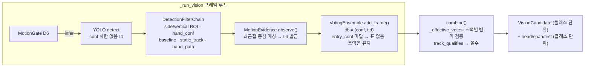
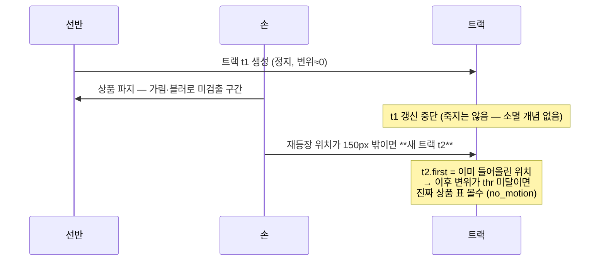
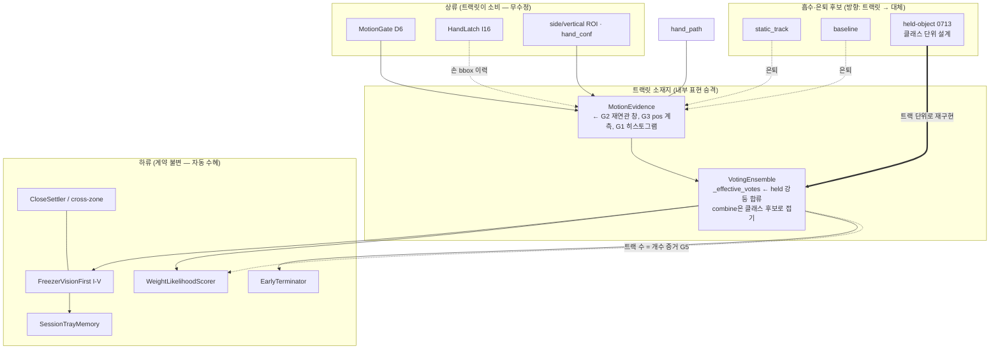

# 0723 — 트랙릿 반영의 비용·효과 심층 분석

> 2026-07-23. research 문서 §3("프레임 투표 → 트랙릿 투표")의 구체화 전 단계 분석.
> 상태: 분석 + **T1 계측 구현 완료** (motion_evidence.py track_detail — 같은 날 반영).
> T2 이후는 T1 실기 분포 확인 후. 결론은 §8 로드맵.

## 0. 결론 요약

1. **트랙릿의 절반은 이미 배포돼 있다.** `MotionEvidence`가 트랙 id를 발급하고
   (`observe()` → tid), `VotingEnsemble`이 표를 `(conf, tid)`로 트랙에 귀속시키며,
   combine 시점에 트랙 단위로 변위 검증해 몰수한다(`track_qualifies`). 심지어
   ByteTrack의 핵심 아이디어(저신뢰 검출로 트랙 연속성 유지)도 구조적으로 이미
   있다 — entry_conf(운영 0.70) 미달 검출은 **표는 못 얻지만 `observe()`에는
   들어가서 트랙을 잇는다** (I4: detector가 conf 하한을 안 걸기 때문).
2. 따라서 "트랙릿 반영"의 실질 의사결정은 **ByteTrack 도입 여부가 아니라,
   남은 격차 5개(§2) 중 무엇을 얼마에 사느냐**다. 칼만+헝가리안 풀셋은
   지금 필요 없다.
3. 최대 효과는 **held-object 강등(0713 A-2)을 클래스 단위가 아닌 트랙 단위로
   구현하는 것** — 0713 §7 S2가 "인스턴스 추적 없이는 원리적 한계"라고 명시한
   구멍을 정확히 메우고, ses-8의 share 분모 오염도 함께 해결한다.
4. 최대 리스크는 **집는 순간의 트랙 단절(fragmentation)** — 손 가림·모션 블러로
   검출이 끊겼다 재등장하면 새 트랙이 태어나고, 새 트랙은 변위가 부족해
   진짜 상품의 표가 몰수될 수 있다. 이건 트랙릿을 "더" 하면 생기는 리스크가
   아니라 **현행 트랙릿-lite에 이미 잠재된 리스크**라서, 계측(T1)으로 실측
   빈도를 먼저 재야 한다.
5. 판정층 계약(`VisionCandidate` = 클래스 단위)은 **바꾸지 않는다.** 트랙은
   perception 내부 표현으로만 승격하고, combine()이 클래스 후보로 접어서
   내보낸다 — 17개 전략·likelihood·tray memory·settler·archive 전부 무수정.

---

## 1. 현행 상태 — "트랙릿-lite"의 정확한 범위

이미 있는 것:

| 구성요소 | 구현 위치 | 트랙릿 관점 의미 |
|---|---|---|
| 트랙 생성·귀속 | `motion_evidence.py observe()` | 카메라×클래스별 최근접 중심 매칭 (max_jump 150px), 프레임당 1회 소비 |
| 표의 트랙 귀속 | `voting.py _votes[(conf, tid)]` | 트랙릿 투표의 자료구조는 완비 |
| 트랙 단위 몰수 | `_effective_votes → track_qualifies` | "진열 인스턴스 표 몰수, 움직인 트랙 표 생존" — 같은 클래스 진열+취출 공존 처리 |
| 저신뢰 연속성 | detector 무하한(I4) + entry_conf는 투표에만 | ByteTrack 2단계 연관의 정신 — 저신뢰 검출이 트랙을 잇되 표는 못 얻음 |
| share 분모 정화 | `_top_votes`가 유효 표 기준 | 몰수된 배경 1위가 min_vote_share 기준을 오염시키지 않음 |

**없는 것이 §2다.**

---

## 2. 격차 — "완전한 트랙릿 반영"까지 남은 5개

### G1. 클래스-조건 트래킹 → 클래스 히스토그램 부재

트랙이 `(camera, class_id)` 버킷 안에서만 이어진다. 한 물체가 프레임마다
유사 클래스 A/B로 깜빡이면(168G↔185g류 유사 상품) **트랙 2개**가 생기고
표가 갈라진다. ByteTrack식은 클래스 무관 IoU 연관 후 트랙이 클래스
분포(히스토그램)를 갖는다 — 물체 1개 = 트랙 1개 = 다수결 클래스 1개.

- 영향받는 현행 로직: `FreezerVisionFirst` ①의 single_share(top의 50%) —
  깜빡임으로 표가 55:45로 갈리면 둘 다 밴드에 들어와 ambiguous 방향으로
  기운다. 히스토그램 통합은 순위를 선명하게 만들어 I-V ①의 판별력을 올린다.
- 역방향 위험: 히스토그램 다수결이 틀리면(진짜 B를 A로 통합) 표가
  **틀린 쪽으로 전량** 이동한다. 프레임 투표는 틀려도 표가 갈라져
  ambiguous로 남지만(보수적), 통합은 확신에 찬 오판으로 바뀔 수 있다 —
  **fail-closed 방향이 아니다.** shadow 필수인 이유.

### G2. 트랙 수명·재연관 부재 — 집는 순간의 단절

현행 매칭은 "직전 위치에서 150px 이내"뿐이다. 손이 상품을 덮어 K프레임
미검출 후 다른 위치에서 재등장하면:

- 이건 신규 리스크가 아니라 **현행 잠재 결함**이다. `rejected_by:
  "no_motion"`으로 진짜 상품이 죽는 사고가 나면 이 경로를 의심해야 한다.
- 보완은 풀 칼만이 아니라 **재연관 창(track buffer)** 하나로 충분하다:
  갱신이 끊긴 트랙을 N프레임간 유지하고, 신규 검출을 "죽은 트랙의 마지막
  위치 기준 완화된 반경"과 먼저 대조 → 이으면 first를 승계해 변위가 이어진다.
- 계측 신호(T1): 트리거당 카메라×클래스별 **트랙 수** — 물리 인스턴스보다
  많으면 단절이 있었다는 뜻. `motion_evidence.summary()`에 `tracks` 필드가
  이미 있으므로 아카이브에서 바로 읽을 수 있다.

### G3. 위치 계측(head/span/first)이 클래스 단위 — held S2의 원리적 구멍

0713 실측으로 held 판별 신호(head_votes)는 실증됐지만, 집계가 클래스
단위라 "zone2에서 든 CJ + zone1에서 새로 집은 CJ"(S2)를 구분 못 한다.
트랙 단위 pos 계측이면:

- carried-in 트랙: first_pos ≈ 0, head_votes 높음 → 그 **트랙의 표만** 강등
- 새로 집은 트랙: first_pos가 세그먼트 부근 → 표 온전
- ses-8의 share 분모 오염(held 94표가 기준을 부풀려 정답 9표 제거)도
  트랙 단위 강등이 `_effective_votes`를 거쳐 `_top_votes`에 자동 반영되므로
  별도 처리 없이 해소된다 (변위 몰수와 같은 경로).

**이것이 트랙릿 반영의 최대 단일 효과다** — held는 "움직이는" 물체라
변위 몰수로는 원리적으로 못 잡고(변위 증거의 사각), 시간 구조 신호는
클래스 단위라 S2에서 무너진다. 트랙 귀속 + 시간 구조의 결합만이 잡는다.

### G4. 트랙 품질 가중 부재 — 표 무게가 전부 1

현행 표는 자격(qualify) 아니면 몰수의 이진이다. 트랙의 이동량·손 근접도·
평균 conf로 표를 연속 가중하면 "오래 보이는 것 = 표 많은 것" 편향이
표현 수준에서 완화된다. 다만:

- 현행 이진 몰수 + min_vote_share + held 강등(G3)으로 편향의 대부분이
  이미/곧 처리된다 — **한계 효용 낮음.**
- 가중 함수는 튜닝 파라미터를 3~4개 추가한다(이동량 스케일, 손 근접
  반경, 감쇠). production 튜닝 기준 수립 비용이 효과 대비 크다.
- 판단: **보류.** G1~G3 안착 후 vote_summary 실측에서 잔존 편향이
  보일 때만.

### G5. 트랙 수 = 개수 증거 — 미활용

클래스 c의 "자격 있는 동시 생존 트랙 수"는 취출 개수의 하한 증거다.
냉동에서 개수는 무게 전담(I12/count_gate)인데, 트랙 수는 **비전 측
독립 개수 증거**라 I-V에 저촉되지 않는다(금지된 건 무게의 정체성 선택).

- 용도: count_gate의 교차 검증(② near_gate에서 count 신뢰도 보강),
  likelihood shadow의 P(count) 항 후보.
- 한계: 겹쳐 집으면(2개를 한 손에) bbox가 합쳐져 트랙 1개 — **하한**이지
  추정치가 아니다. 게이트로 쓰면 안 되고 가산 증거로만.
- 판단: T1 계측에 트랙 수를 싣고, #15류(23×2) 세션에서 실제로 2가
  잡히는지 본 뒤 결정. 구현 0원(이미 summary에 있음), 분석만 필요.

---

## 3. 효과 — 사건·실측 케이스별 매핑

| 사건/케이스 | 현행(트랙릿-lite + 필터)으로 해결? | 완전 트랙릿의 추가 이득 |
|---|---|---|
| #10 돌출 진열 225표 인플레이션 | **해결됨** (변위 몰수 + min_vote_share + static_track) | 미미 — 방어층 정리(§5 은퇴)뿐 |
| #16 깜빡이는 정지 물체 4건 | **해결됨** (변위 몰수가 baseline 사각을 직접 커버) | 미미 |
| 0713 ses-2/-8 (27 들고 30 취출) | **미해결** — held는 움직여서 변위 몰수 무력. head_votes 27~33으로 계측만 됨 | **G3 트랙 단위 강등이 정면 해결.** S2(동일 상품 양존)까지 커버 |
| 0713 ses-3 (들고-반납 후 취출) | 미해결 (동일) | G3으로 해결 (반납 강등은 정답 방향, S6) |
| 0713 ses-5 (든 상품이 프리롤에 화면 밖) | 미해결 | **트랙릿도 못 잡는다** — 관측 자체가 없음. tray memory/cross-zone 소관 |
| 유사 클래스 깜빡임 (168G↔185g) | 미해결 — 표 분산으로 ambiguous 방향 | G1 히스토그램 통합. 단 fail-closed 역전 위험, shadow 필수 |
| #15 23×2 개수 판정 | 해결됨 (near_gate ②) | G5 트랙 수가 독립 교차 증거 (보강) |
| vote 상한 ~20 / gate_skipped 반감 | 무관 (게이트/필터 튜닝 이슈) | 없음 |
| #14 delta=0 고속 취출 | 무관 (로드셀) | 없음 |
| 5g 양자화·σ_db 7.87g | 무관 (로드셀) | 없음 |
| grab 순간 트랙 단절 (가설) | **현행의 잠재 결함** | G2 재연관 창이 해결. T1 계측으로 빈도 먼저 확인 |

정직한 요약: **배경/진열 오염은 이미 이겼다.** 완전 트랙릿의 신규 가치는
held 인스턴스 구분(G3) 하나가 크고, 히스토그램(G1)·재연관(G2)·개수(G5)는
중간, 품질 가중(G4)은 낮다.

---

## 4. 비용

### 4-1. 연산 (엣지, Jetson)

| 항목 | 비용 | 근거 |
|---|---|---|
| 트래커 자체 | **무시 가능** | observe()는 프레임당 O(검출 수 × 활성 트랙 수), 순수 CPU 산술. YOLO 1콜의 1% 미만. 재연관 창(G2)·히스토그램(G1)을 더해도 동일 자릿수 |
| 칼만 필터 | 도입 안 함 | 프레임 간격이 게이트 스킵으로 불규칙해 등속 모델의 이득이 불확실하고, 재연관 창만으로 목적 달성 |
| 메모리 | 무시 가능 | 트리거 단위 수명, 트랙 수십 개 × 수십 바이트 |
| **조기 종료 핫패스** | **주의 + 개선 기회** | 냉장 한정으로 `should_stop`이 추론 프레임마다 `combine()`을 부르고, `_effective_votes`가 매번 전체 표를 재스캔한다 — 트리거 전체로 O(표²). 트랙별 증분 카운터로 바꾸면 오히려 **현행보다 싸진다.** (냉동은 ET 금지라 무관) |

### 4-2. 엔지니어링

| 항목 | 규모 | 내용 |
|---|---|---|
| T1 계측 | 소 (1~2일) | 트랙별 pos 통계(first/last/head)를 `_Track`에 추가, `summary()` 확장, vote_summary/아카이브에 실기. 판정 영향 0 |
| T2 트랙 단위 held 강등 | 중 (3~5일 + 실기 라벨) | `_effective_votes`에 트랙 단위 held 판정 추가(변위 몰수와 동일 경로), 0713 A-2 임계(HEAD 단독 vs AND)를 트랙 기준으로 재확정, shadow(계수만) → active |
| T2' 클래스 히스토그램 | 중 | observe()의 버킷을 클래스 무관으로 바꾸고 트랙에 클래스 분포 보유. combine()에서 다수결 접기. **shadow 병행 필수** (G1 역전 위험) — vote_summary에 통합 전/후 순위 병기 |
| T3 방어층 은퇴 | 소 (조건부) | static_track·baseline 제거(§5), min_vote_share 완화 검토. 실측 조건 충족 시에만 |
| 검증 인프라 | 기존 재사용 | baseline/BOCPD/likelihood shadow와 동일 패턴 — 신규 인프라 불요. analyze-sessions에 트랙 섹션 추가 정도 |

### 4-3. 신규 실패 모드 (트랙릿을 "더" 하면 생기는 것)

| 실패 모드 | 발생 조건 | 완화 | 잔존 위험 |
|---|---|---|---|
| ID 스위치 | 같은 클래스 2개가 교차 이동 (진열 옆을 스치며 취출) | 탑뷰라 교차 드묾. 스위치돼도 몰수/생존이 뒤바뀌는 건 "둘 다 움직였을 때"뿐이라 표 총량 불변 | 낮음 |
| 히스토그램 오통합 (G1) | 유사 상품을 다수결이 틀린 쪽으로 접음 | shadow에서 통합 전/후 순위 diff 실측, mismatch 라벨 정오 확인 후 승격 | **중간 — T2'를 T2와 분리 배포하는 이유** |
| 재연관 오연결 (G2) | 죽은 진열 트랙에 새 취출 검출이 이어짐 → first 승계로 변위 과대 | 완화 반경을 보수적으로(1.5×max_jump), 승계는 같은 클래스 한정 | 낮음 — 오류 방향이 "표 생존"이라 fail-open(증거 보존)과 정렬 |
| held 오강등 | 0713 S1(느린 취출) 트랙판 | 트랙 단위라 S1 위험은 클래스 단위보다 **줄어든다** (프리롤 초반 선반 트랙과 취출 트랙이 분리됨) | 낮아짐 |

### 4-4. 튜닝 파라미터 증가

신규 env는 T2 기준 3개 이내로 억제 가능: 재연관 창 프레임 수, held 트랙
head 임계(0713 값 승계), 히스토그램 다수결 최소 비율. G4를 보류하는 주된
이유가 이 항목이다 — production 튜닝 기준 문서(§ env 감사)에 이미 24개가
있고, 각 파라미터는 실측 보정 절차를 요구한다.

---

## 5. 현존 로직들과의 관계 방향 지도

로직별 방향 (핵심 열: 트랙릿과의 관계가 어느 쪽을 향하는가):

| 현존 로직 | 관계 방향 | 상세 |
|---|---|---|
| **MotionGate (D6)** | 상류 입력, 무수정 | 게이트 스킵이 트랙 샘플링을 불규칙하게 만든다 — 긴 스킵 뒤 150px 초과 이동은 현행도 트랙이 끊긴다. G2 재연관 창이 이 경계도 함께 완화. 게이트 자체는 손대지 않음 |
| **HandLatch (I16)** | 무수정 + 잠재 공급자 | 손 이력은 이미 filters가 보유 — G4(손 근접 가중)를 하게 되면 입력이 되지만 G4는 보류 |
| **side/vertical ROI, hand_conf** | 상류 입력, 무수정 | 존 밖·유령 손 제거는 트래커 진입 전이 맞다 (타 존 물체를 추적할 이유가 없음) |
| **static_track** | **트랙릿이 흡수 (은퇴 후보)** | "연속 IoU 정지"는 변위 몰수의 취약한 대리 신호. 이미 중복 방어층. 은퇴 조건: T1 계측 N주간 `static_track` 드랍의 클래스가 전부 변위 몰수로도 죽는 것 확인 |
| **baseline** | **트랙릿이 흡수 (은퇴 후보)** | "손 등장 전 존재"는 트랙의 first_pos가 더 정확히 표현. 현재 shadow 모드라 은퇴 비용 0 — active 승격 대신 은퇴가 자연스러운 방향 |
| **hand_path** | **독립 존속** | 변위·시간 구조와 다른 축(손 궤적 교차)이라 트랙 속성으로 환원 안 됨. 움직이지만 손과 무관한 것(문 그림자, 옆 존 팔)은 hand_path만 잡는다 |
| **VotingEnsemble** | **소재지** | 자료구조는 완비 — combine()의 클래스 접기 유지가 판정층 계약 보존의 핵심. `_top_votes` 분모는 강등이 `_effective_votes`를 거치므로 자동 정화 |
| **min_vote_share** | 보완 → 장기 완화 후보 | 배경 표 인플레이션 대응으로 태어난 파라미터 — G3까지 안착하면 인플레이션 원인이 표현 수준에서 사라져 0.1→0.05 완화(진짜 소수 표 후보 구제) 검토 가능 |
| **entry_conf (0.70)** | **이미 정합** | 저신뢰 검출이 트랙은 잇고 표는 못 얻는 현행 구조가 ByteTrack 2단계 연관과 동형. 변경 불요 — 이 발견이 도입 비용을 크게 낮춘다 |
| **held-object 0713 (A-2 미구현)** | **트랙 단위로 재구현 (합류)** | 클래스 단위 설계를 그대로 켜지 말 것 — S2 구멍·share 분모 문제를 안고 감. A-2 = T2로 대체하는 것이 이 분석의 핵심 권고 |
| **EarlyTerminator** | 하류 수혜, 무수정 | 순위가 선명해지면 더 일찍 멈춤(냉장 한정). 트랙별 증분 카운터화 시 프레임당 combine 비용도 하락 |
| **FreezerVisionFirst / I-V** | 하류 수혜, 무수정 | ① single_share 판별력 상승(G1), ② near_gate에 G5 개수 교차 증거 (선택). I-V 비저촉 — 트랙은 전부 vision 증거 |
| **WeightLikelihoodScorer** | 하류 자동 수혜 + 선택 확장 | vote_count를 소비하므로 표 정화가 그대로 P_vision 개선. G5를 P(count) 항으로 넣는 건 Phase 2 이후 선택지 |
| **SessionTrayMemory** | 독립 + 선택적 신규 간선 | 트랙 중심 x좌표로 좌/우 트레이 힌트 → channel=None일 때 키 해상도 보강 **가능**. 단 카메라-트레이 기하 매핑이 필요 — 상품 배치 사전정보(금지)가 아니라 존 기하(고정 구조물)이지만, 경계 판단은 사용자 확인 후 진행 |
| **CloseSettler / cross-zone penalty** | 독립 | 상류 오염이 줄면 구조 횟수가 줄 뿐. ses-5(화면 밖 held)는 여전히 이쪽 소관 |
| **BOCPD / loadcell 계열** | 무관 | 다른 센서. 트랙 탄생 시각↔로드셀 change 정렬은 F6(벽시계 환산 불신뢰) 저촉이라 하지 않음 — 스트림 상대 위치만 사용 |

---

## 6. 층별 책임 관점 — 왜 "후보 = 트랙"으로 바꾸지 않는가

research §3 원안은 "후보 = 트랙"까지 열어뒀지만, 이번 분석의 결론은 반대다:

- 판정층 17개 전략, likelihood, tray memory, settler, archive, analyze-sessions
  전부가 `VisionCandidate(class_id, confidence, vote_count, ...)`를 소비한다.
  후보 타입 변경은 **전면 수정 + 전 사건 회귀 재검증**을 요구한다.
- 트랙이 주는 정보(인스턴스 구분, 시간 구조, 개수)는 전부 **combine()에서
  클래스 후보로 접기 전에 소진 가능**하다 — 몰수·강등·히스토그램 통합은
  접는 과정의 품질을 올리는 일이지 접힌 결과의 형태를 바꾸는 일이 아니다.
- 유일한 손실은 판정층이 트랙별 세부를 직접 못 보는 것인데, 판정층은
  "이미 걸러진 득표 순위를 신뢰한다"가 층별 책임 계약이다
  (motion_evidence.py docstring). 세부는 vote_summary로 아카이브에 남긴다.

## 7. 트랙릿이 못 하는 것 (정직한 한계)

- **화면 밖 held** (ses-5): 관측이 없으면 트랙도 없다 — tray memory·cross-zone 소관.
- **시각적 동일 상품의 정체성**: 트래킹은 "같은 물체"를 알려주지 "어떤
  상품"인지는 못 올린다 — 임베딩/재학습 소관 (research §7).
- **로드셀 전 계열**: delta=0 고속 취출(#14), 접촉 하중 오염, 양자화 —
  전부 무관.
- **votes 상한·게이트 스킵 반감**: 게이트/필터 튜닝 이슈 — 트랙릿과 무관.

## 8. 로드맵 (권고)

| 단계 | 내용 | 판정 영향 | 착수 조건 |
|---|---|---|---|
| **T1 계측** | `_Track`에 first/last/head pos + summary 확장 → vote_summary/아카이브. 트리거당 트랙 수(단절 지표) 포함 | 0 | **구현 완료** — `motion_evidence.py` track_detail(관측 상위 8트랙: first/last/obs/head_obs/passed). head_obs는 표가 아닌 관측 수 기준(저신뢰 검출도 트랙은 이으므로 held의 프리롤 존재를 더 빠짐없이 셈) |
| **T2 held 트랙 강등** | 0713 A-2를 트랙 단위로 — `_effective_votes` 합류, shadow 계수 → active | shadow 후 | T1에서 held 트랙의 pos 분포 분리 확인 (0713 §10과 동일 절차) |
| **T2' 클래스 히스토그램** | 클래스 무관 연관 + 다수결 접기, 통합 전/후 순위 shadow | shadow 후 | T2와 분리 배포 (G1 역전 위험 격리) |
| **G2 재연관 창** | T1 계측에서 단절률이 유의하면 T2에 동봉 | 낮음 (fail-open 방향) | T1 실측 |
| **T3 은퇴·완화** | static_track·baseline 제거, min_vote_share 완화 검토 | 정리 | T2 안착 + N주 실측 |
| 보류 | G4 품질 가중, G5 개수 항, tray-side 기하 힌트 | — | 각각 잔존 편향 실측 / #15류 트랙 수 실측 / 사용자 판단 |
