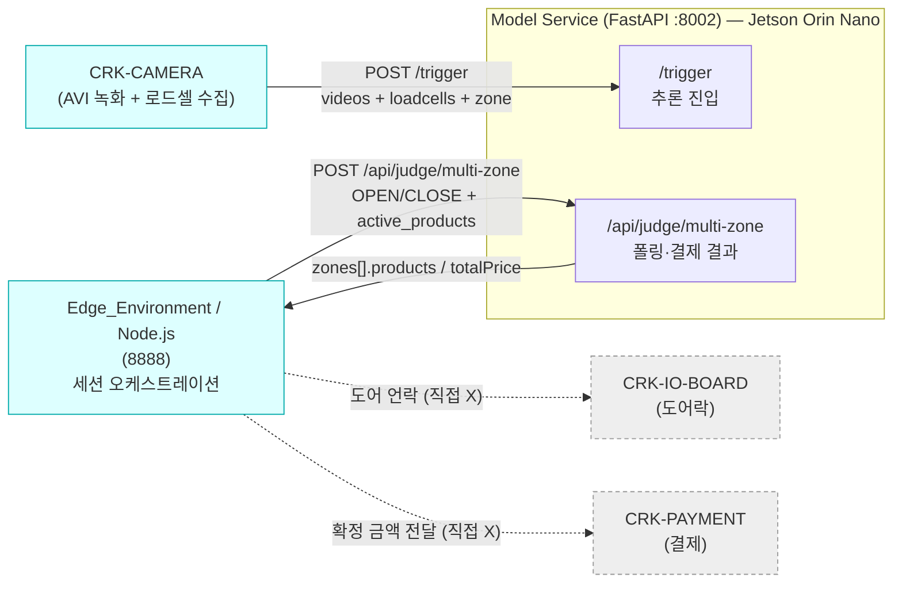
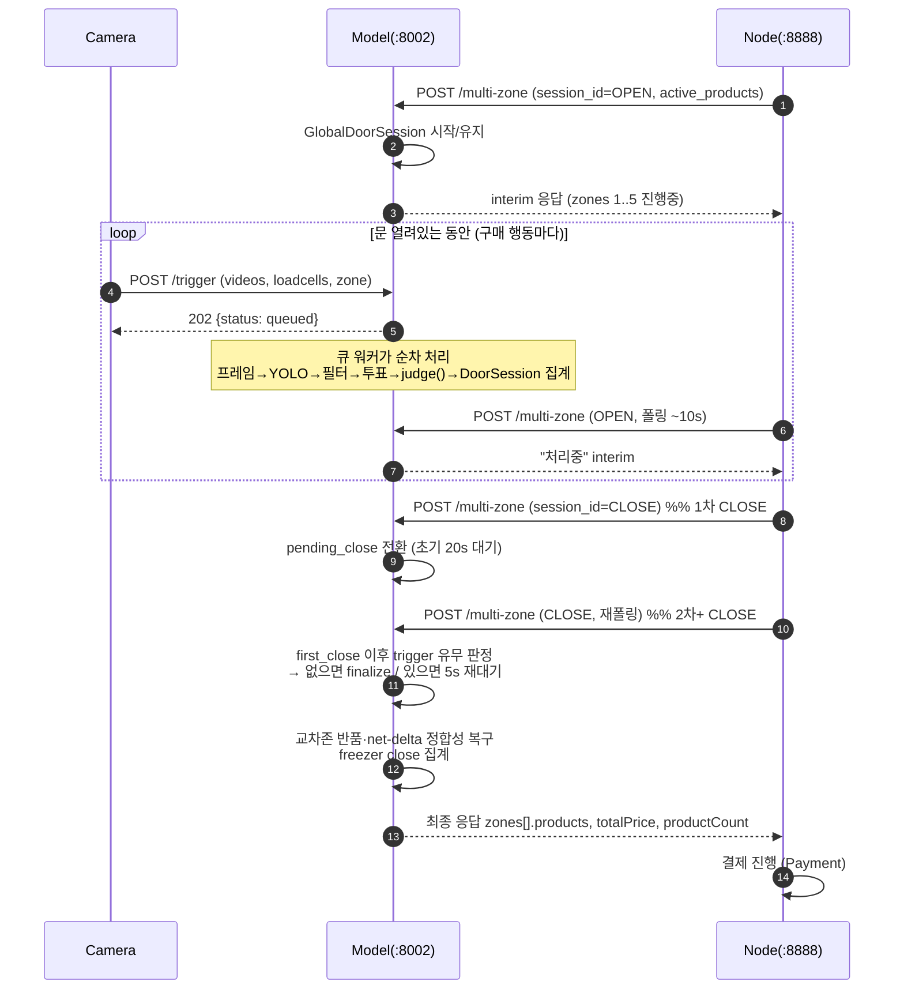
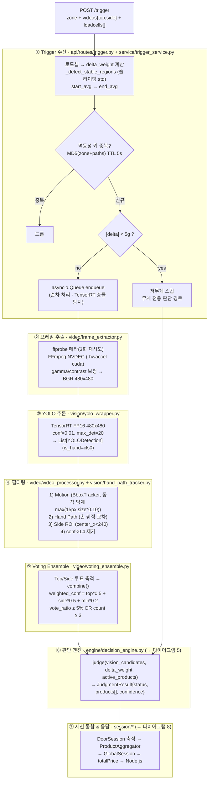
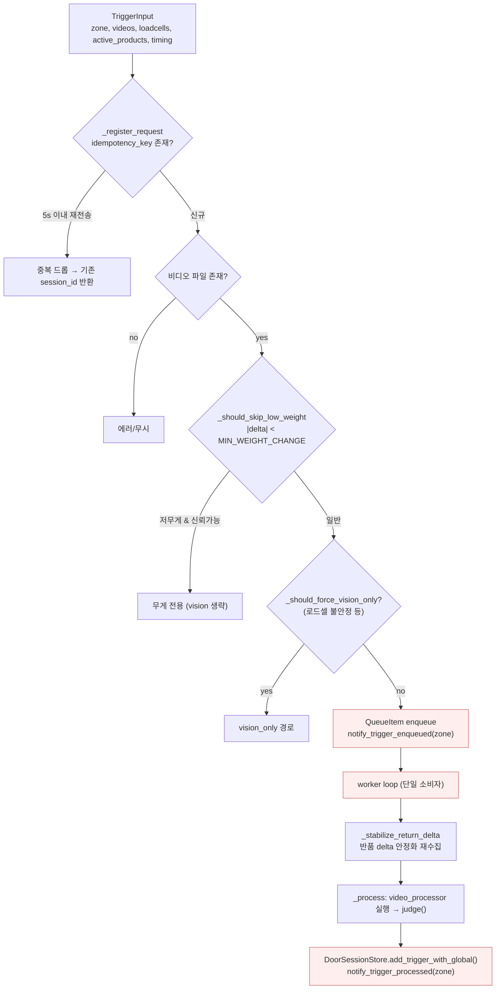
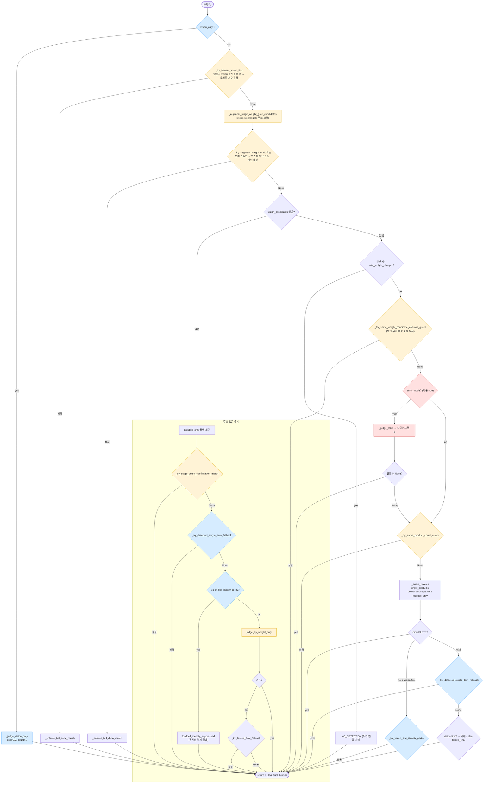
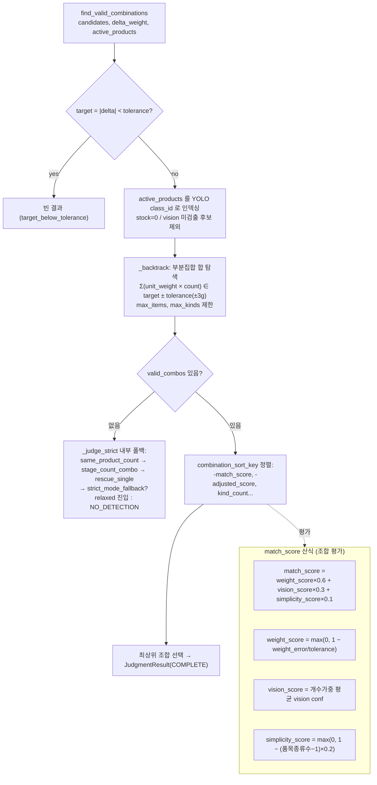
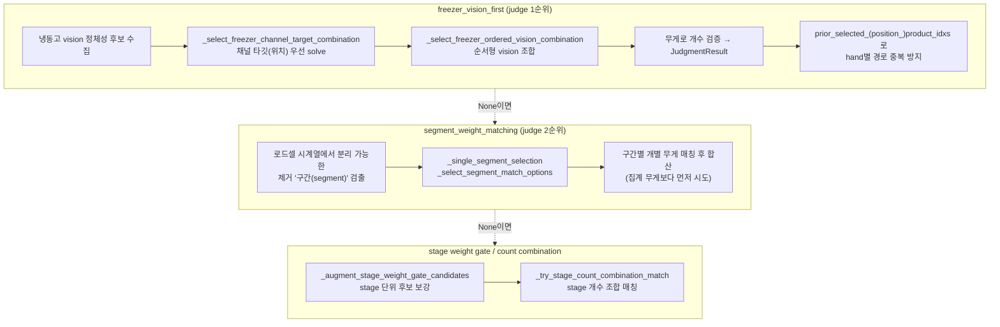
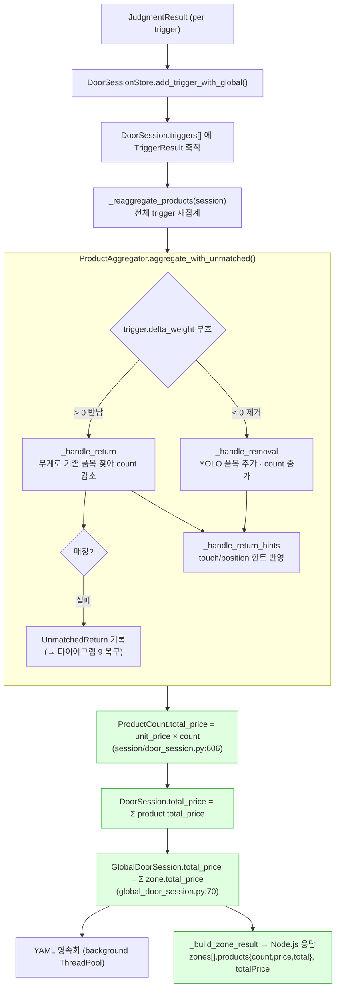
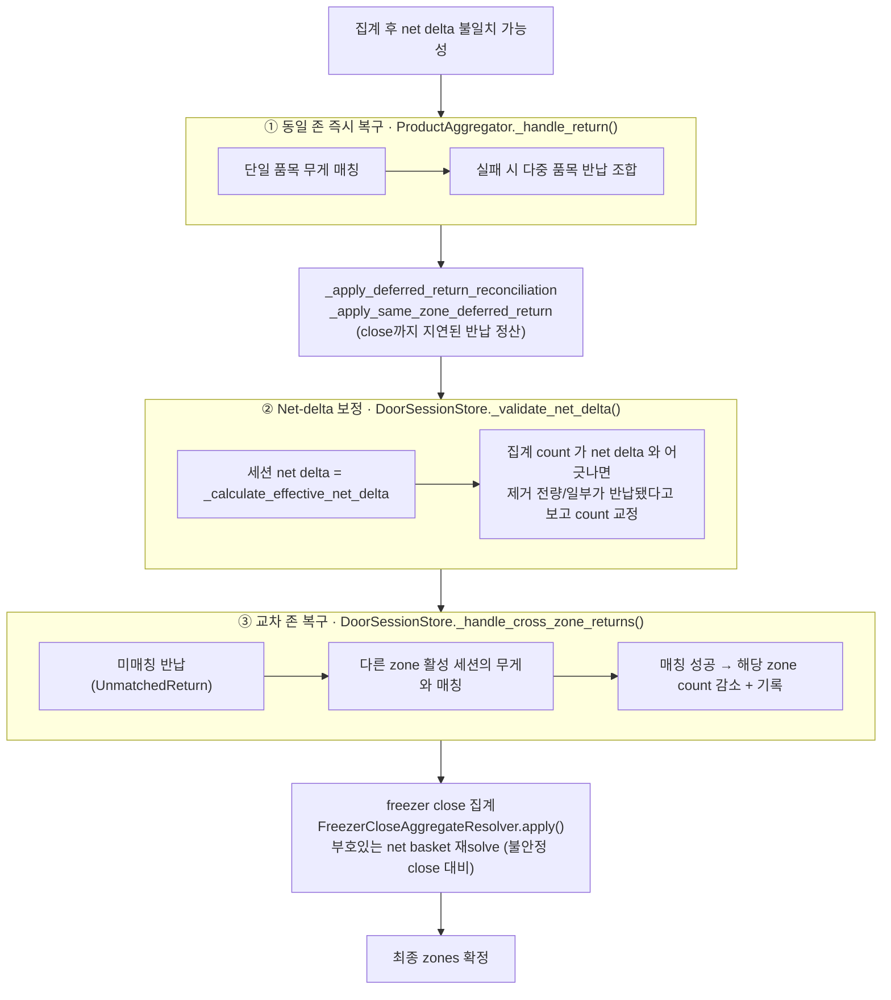
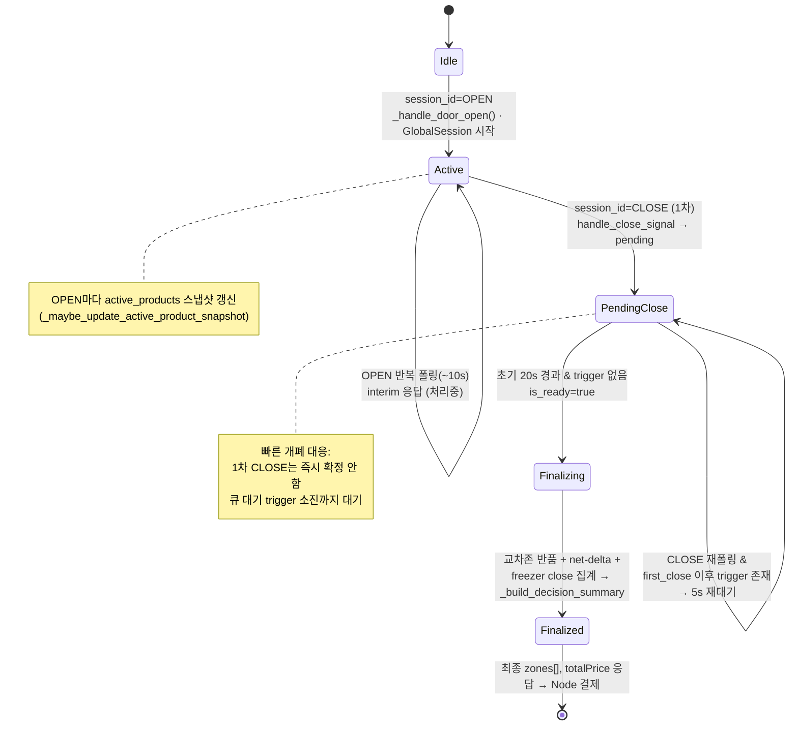

# ARCHITECTURE_DIAGRAMS

# CRK-Model 추론·결제 로직 시각화 (재작성용 참조 문서)

> **상태 (2026-07-24):** 원본 CRK-model 구조의 참조용 시각화 — 재설계의 설계 입력(2026-07-10).
> HG **현행** 구조를 서술하는 문서가 아니다. 현행 아키텍처는 README를 참조.

> 목적: `engine/decision_engine.py`(10.4k L) 와 `session/*`(집계·결제) 를 **처음부터 다시 짜기** 위해
현재 로직을 한눈에 파악하기 위한 다이어그램 모음.
모든 다이어그램은 **Mermaid** — GitHub / VS Code(Markdown Preview Mermaid) 에서 컴파일 없이 바로 렌더링됩니다.
> 
> 
> 기준 커밋: `d104bca` · 작성 시각 기준 소스 직접 확인 (문서가 아닌 코드가 진실).
> 

---

## 0. 문서 지도

| # | 다이어그램 | 대상 소스 | 재작성 관점 |
| --- | --- | --- | --- |
| 1 | 시스템 컨텍스트 | 전체 서비스 경계 | 외부 계약(무엇이 들어오고 나가는가) |
| 2 | 엔드투엔드 시퀀스 | OPEN→trigger→CLOSE | 세션 생명주기 |
| 3 | 7단계 추론 파이프라인 | `trigger`→`video`→`vision`→`engine` | **추론** 큰 그림 |
| 4 | Trigger 수신 & 큐 | `api/routes/trigger.py`, `service/trigger_service.py` | 입력 정규화·멱등성 |
| 5 | **`judge()` 결정 트리** | `engine/decision_engine.py:215` | **추론 핵심** — 실제 분기 순서 |
| 6 | StrictWeightMatcher | `weight/strict_weight_matcher.py` | 무게 조합 탐색 |
| 7 | Freezer / Segment / Stage 분기 | `decision_engine.py` 내부 | 냉동고 채널 특수 로직 |
| 8 | 세션 집계 & 가격 산정 | `session/door_session_store.py`, `product_aggregator.py` | **결제** 큰 그림 |
| 9 | 반품 복구 3계층 | `product_aggregator` + `door_session_store` | 제거→반납 정합성 |
| 10 | Multi-Zone OPEN/CLOSE 상태기계 | `api/routes/multi_zone.py` | 폴링·최종화 타이밍 |
| 11 | 데이터 계약 & 설정값 | 전역 | 상수·환경변수 |

---

## 1. 시스템 컨텍스트

모델 서비스(8002) 는 **Camera / Node 와 직접**, **IO-Board / Payment 와 간접**으로 통신합니다.
결제(Payment)는 모델이 직접 하지 않고, 모델이 산정한 **품목·수량·금액**을 Node 가 받아 결제로 넘깁니다.



**핵심 계약** (`docs/agent-guides/architecture.md`)
- `delta_weight < 0` → 자판기에서 **꺼냄(removal)**
- `delta_weight > 0` → 자판기로 **되돌림(return)**
- `active_products` → Node 가 넘기는 **현재 재고 스냅샷** = strict/loadcell 매칭의 유일한 권위 소스
- `stock_qty = 0` → 품절, strict 매칭에서 제외

---

## 2. 엔드투엔드 시퀀스 (한 번의 구매 트랜잭션)



---

## 3. 7단계 추론 파이프라인 (큰 그림)



---

## 4. Trigger 수신 & 큐 워커



> **재작성 주목점**: `notify_trigger_enqueued` / `notify_trigger_processed` 는 CLOSE 신호와의
race condition(문 빨리 닫힘) 방지용 카운터. 큐는 **단일 소비자**라 TensorRT 동시 추론이 없음.
> 

---

## 5. `judge()` 결정 트리 — 추론 핵심 (실제 코드 분기 순서)

> `engine/decision_engine.py:215`. 위에서 아래로 **먼저 매칭되는 분기가 즉시 return**.
모든 성공 결과는 마지막에 `_enforce_full_delta_match()` 로 “delta 전량 설명” 검증을 거침.
> 



**분기 요약 (재작성 시 이 순서가 핵심)**

| 순위 | 분기 | 조건/전략 |
| --- | --- | --- |
| 0 | `vision_only` | 로드셀 없음/강제 vision |
| 1 | `freezer_vision_first` | 냉동고: vision 정체성 우선 → 무게로 개수 검증 |
| 2 | `segment_weight_matching` | 로드셀 제거를 시간축 ’구간’으로 분리해 개별 매칭 |
| 3 | (후보 없음) `stage_count_combo` → `detected_single` → `weight_only` → `forced_final` | vision 후보 0일 때 |
| 4 | `min_weight_change` 게이트 | 무게 변화 미미 → NO_DETECTION |
| 5 | `same_weight_candidate_collision_guard` | 동일 무게 후보 모호성 방어 |
| 6 | **`strict`** | 무게 우선 백트래킹 조합 (기본 경로) |
| 7 | `same_product_count_match` | strict 실패 시 동일 품목 개수 조합 |
| 8 | **`relaxed`** | single→combination→partial→loadcell_only |
| 9 | vision-first partial / detected_single / forced_final | 최후 폴백 |

---

## 6. StrictWeightMatcher (무게 우선 조합 탐색)

`weight/strict_weight_matcher.py` · `_judge_strict()` 가 호출.



> **핵심 아이디어**: 로드셀이 ±3g로 정확하다는 가정 → **무게로 가능한 조합을 먼저 뽑고**,
그 중 YOLO가 본 것만 남겨 vision confidence로 최종 선택. 무게로 설명 불가 → NO_DETECTION.
> 

---

## 7. Freezer / Segment / Stage 특수 분기 (심층)

CRK는 냉동고(freezer) **채널(channel)** 구조라 일반 자판기와 다른 경로가 있습니다.



> **재작성 주목점**: freezer 경로는 “채널 위치(position) + 순서(order) + hand 경로”까지 추적.
커밋 로그(`Track freezer hand paths per hand`, `best-channel deferral for freezer rescue`)가
이 영역이 가장 최근까지 손댄 복잡 지점임을 보여줌 → 재설계 시 별도 모듈로 분리 권장.
> 

---

## 8. 세션 집계 & 가격 산정 — 결제 큰 그림

`JudgmentResult` → **DoorSession(존 단위)** → **GlobalSession(전체)** → `totalPrice`.



**가격 산식은 단순** (재작성 시 그대로 유지 가능):

```
product.total_price = unit_price × count          # door_session.py:606
zone.total_price    = Σ product.total_price        # door_session.py:689
global.total_price  = Σ zone.total_price           # global_door_session.py:70
```

→ 복잡도는 **가격이 아니라 count(수량) 를 확정하는 집계·반품 로직**에 있음.

---

## 9. 반품 복구 3계층 (“꺼냈다가 다시 넣음” 정합성)

`docs/agent-guides/architecture.md` 의 3-pass 구조를 코드로 확인.



> **재작성 주목점**: 반품 복구가 3계층 + freezer close 재solve까지 있는 이유는
“빠른 개폐 / 존 착오 반납 / 로드셀 불안정” 실사용 케이스 때문. 로그 reason 코드
(`strict_mismatch`, `no_active_products`, `stock_filtered`, `negative_delta_weight`)를
재설계에서도 보존하면 필드 디버깅이 코드 없이 가능.
> 

---

## 10. Multi-Zone OPEN/CLOSE 상태기계

`api/routes/multi_zone.py` · `judge_multi_zone` (`@router.post("/multi-zone")`).



**타이밍 상수**

| 구간 | 값 | 의미 |
| --- | --- | --- |
| 폴링 주기 | 10s | Node → Model |
| pending_close 초기 | 20s | 마지막 trigger 이후 최종화 대기 |
| pending_close 이후 | 5s | 추가 trigger 확인 대기 |
| 세션 TTL | 300s | DoorSession 만료 (`MODEL__BUFFER__TTL_SECONDS`) |

---

## 11. 데이터 계약 & 핵심 설정값

**입력 (`POST /trigger`)**

```json
{
  "zone": 1,
  "videos": {"top": "/path/top.avi", "side": "/path/side.avi"},
  "loadcells": [{"timestamp": 1700000000.0, "values": [100.5, 200.3, 150.2, 180.1]}]
}
```

> 카메라는 존당 **물리 로드셀 2채널**을 보내고, 모델은 이를 **평균이 아니라 합산**해 존 총량으로 씀.
> 

**출력 (`/api/judge/multi-zone` 최종)**

```json
{
  "zones": [{"zone": 1, "products": [{"product_id":"P001","name":"콜라","count":2,"unit_price":1500,"total_price":3000}], "totalPrice": 3000}],
  "totalPrice": 3000, "productCount": 2,
  "globalSessionInfo": {"session_id": "uuid", "status": "complete"}
}
```

**설정값**

| 설정 | 값 | 환경변수 |
| --- | --- | --- |
| 입력 해상도 / 정밀도 | 480×480 / FP16 | - |
| YOLO conf / max_det | 0.01 / 20 | - |
| 최종 필터 conf | 0.4 | - |
| 무게 허용오차 | ±3.0g | `MODEL__WEIGHT__TOLERANCE_GRAMS` |
| 저무게 스킵 | 5g | `MODEL__LOADCELL__*` |
| strict 모드 | true | `MODEL__WEIGHT__STRICT_MODE_*` |
| strict 실패 시 relaxed 진입 | true/false | `MODEL__WEIGHT__STRICT_MODE_FALLBACK` |
| 조합 최대 종류 | - | `MODEL__WEIGHT__MAX_COMBINATION_KINDS` |
| 안정 윈도우 | - | `MODEL__LOADCELL__STABLE_WINDOW_SIZE` |
| 안정 임계 | - | `MODEL__LOADCELL__STABILITY_THRESHOLD_GRAMS` |
| async 스트리밍 | true | `MODEL__ASYNC_STREAMING__ENABLED` |

---

## 부록 A. 파일 → 다이어그램 역참조

| 파일 (`services/model/model_service/`) | 줄수 | 관련 다이어그램 |
| --- | --- | --- |
| `engine/decision_engine.py` | 10,419 | 5, 6, 7 |
| `service/trigger_service.py` | 4,536 | 4 |
| `session/door_session_store.py` | 3,607 | 8, 9, 10 |
| `api/routes/trigger.py` | 1,911 | 3, 4 |
| `api/routes/multi_zone.py` | 1,664 | 2, 10 |
| `session/freezer_close_aggregate.py` | 1,267 | 9 |
| `session/product_aggregator.py` | 1,125 | 8, 9 |
| `session/active_product_store.py` | 1,041 | 5, 11 |
| `weight/strict_weight_matcher.py` | - | 6 |
| `video/voting_ensemble.py` | - | 3 (⑤) |
| `vision/hand_path_tracker.py` | - | 3 (④), 7 |

## 부록 B. 재작성 시 분리 권장 경계 (관찰 기반 제안, 미검증)

1. **추론 파이프라인 (stateless)**: 프레임→YOLO→필터→투표→`judge()`. 입력=한 trigger, 출력=`JudgmentResult`. 순수 함수로 만들면 테스트 용이.
2. **judge() 라우터**: 현재 단일 메서드에 10+ 분기가 순차 매몰. 각 분기를 전략(Strategy)으로 분리하고 우선순위 리스트로 표현하면 다이어그램 5가 곧 코드가 됨.
3. **freezer 채널 로직**: 일반 매칭과 성격이 달라(위치·순서·hand 경로) 별도 모듈 후보.
4. **세션/결제 집계 (stateful)**: DoorSession/GlobalSession + 반품 복구 3계층. 가격은 단순, 복잡도는 count 확정. 이벤트 소싱(trigger 로그 → 재집계) 구조가 이미 `_reaggregate_products`에 있으므로 그 방향 유지 권장.
5. **Multi-Zone 생명주기 (I/O 경계)**: OPEN/CLOSE 상태기계는 결제 타이밍과 직결 → 순수 상태기계로 분리해 타이밍 상수만 주입.