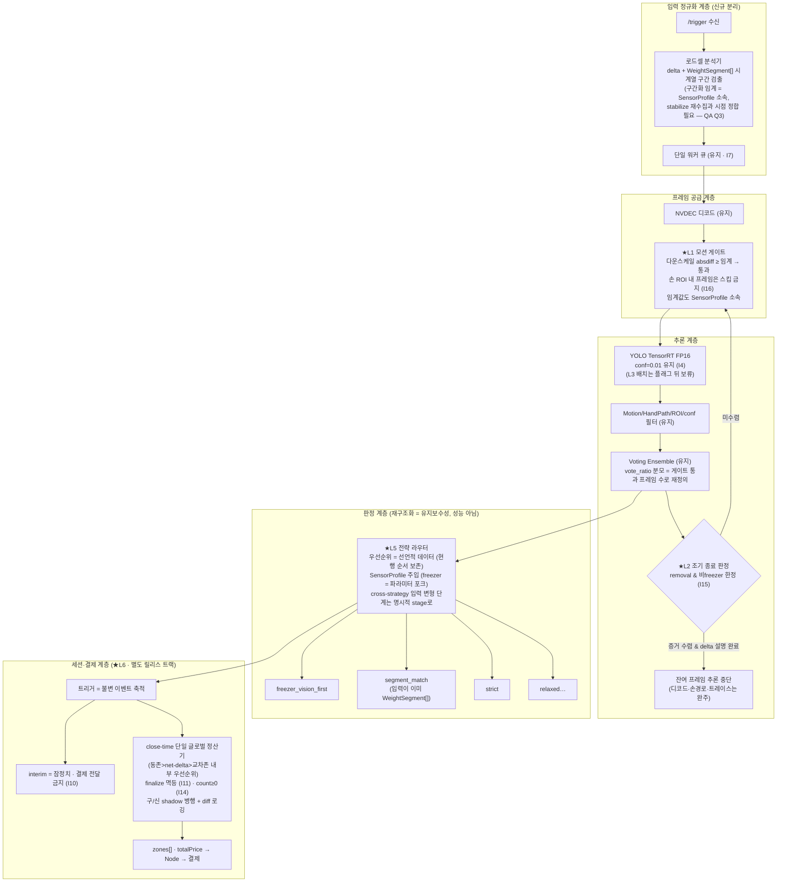

# OPTIMIZED_ARCHITECTURE

# 최적화 지향 재작성 구조 문서 — 속도↑, 정확도 유지 (Rev.2)

> **상태 (2026-07-24):** 2026-07-10 재설계 청사진(historical). L1~L6 레버 승인 이력의 **정본**이나,
> 이후 진화 — cross-zone 페널티, 고스트 원장, 무게 중재 재설계, BOCPD 승격, 트랙릿 — 는 미반영.
> 불변식도 당시 기준 I1~I16 — 현행은 I17까지.

> 목표: 트리거 건당 처리시간을 낮추되(체감 결제 지연의 주범), **정확도 불변식(REDESIGN_RATIONALE_QA.md I1~I16)을 하나도 깨지 않는** 새 구조.
각 레버마다 “현장 테스트 없이 가능한 검증”과 “장치 검증 필요”를 구분.
> 
> 
> 자매 문서: `ARCHITECTURE_DIAGRAMS.md`(현행 로직), `REDESIGN_RATIONALE_QA.md`(설계 의도·불변식).
> 
> **판별 이력**:
> - Rev.1 → AIoT/엣지 전문가 에이전트 리뷰(2026-07-04): blocking 5건 지적 → Rev.2에 전건 반영.
> 레버별 판정: L1·L2 조건부 승인(조건 본문 반영), L3 스코핑 한정 승인, **L4 반려(강등)**,
> L5 조건부 승인, L6 조건부 승인(별도 트랙). 상세는 §8.
> - Rev.2 → 재판별(2026-07-05): **최종 승인 — 잔여 blocking 없음.** 정오 2건(N1: QA Q9 낡은
> 문장, N2: G2.5 데이터 전제)과 권고 1건(N3: I16 래치형 조작적 정의)은 본 리비전에 반영 완료.
> 재판별 결론: “현장 테스트 없이 설계·검증계획 수준에서 도달 가능한 종점에 도달.”
> **구현 크리티컬 패스: L1 착수 전 현장 AVI/세션 YAML 회수(G2·G2.5 전제)가 선행.**
> 롤아웃 순서: L5 → L1 → L2 → (별도 트랙) L6 → (조건 충족 시) L3.
> 

---

## 1. 실측 베이스라인 (레포 내 Jetson 트레이스 3건)

| trace | stride | 처리 프레임 | 총 처리 | YOLO 합계 | YOLO 비중 | 프레임당 |
| --- | --- | --- | --- | --- | --- | --- |
| `115707_zone1` (26-07-03) | 1 | 510 | **18,446ms** | 16,238ms | **88%** | 31.8ms |
| `144525_zone2` (26-07-02) | 2 | 198 | 7,458ms | 5,888ms | 79% | 29.7ms |
| `144556_zone1` (26-07-02) | 2 | 228 | 8,253ms | 6,588ms | 80% | 28.9ms |

보조 실측:
- 판단 엔진: **924케이스 일괄 42.37ms** (`scenario_verification_report.md`) → 건당 사실상 0.
- CLOSE 디바운스: 3.0s/1.0s (이미 단축됨, 구 문서의 20s/5s는 폐기).
- 비 YOLO 비용(디코드+필터+집계): 총 처리의 12~21%.

**⚠️ 베이스라인 한계 (전문가 리뷰 반영)**: 표본 3건, 파워모드(7W/15W) 미기재, 발열 스로틀링
상태 불명. 31.8ms 자체가 조건부 수치이며, **코퍼스 확대(§6 G2 전제)** 전까지 모든 효과
추정은 가설로 취급한다. 또한 프레임당 31ms에는 Ultralytics `predict()` 파이썬 전·후처리와
NMS가 포함되어 있다(§3 L3 참조).

**∴ 결론: 최적화 대상은 오직 하나 — “트리거당 YOLO 호출 횟수 × ~31ms”. 나머지는 전부 2차 효과.**

체감 지연 모델 (문 닫힘 → 결제 확정):

```
결제 확정 시각 ≈ 마지막 트리거 완료 + max(잔여 큐 처리, close 디바운스 3s)
                 └─ 잔여 큐 처리 = 미처리 트리거 수 × 건당 7~18s  ← 지배항
```

---

## 2. 목표 아키텍처



---

## 3. 최적화 레버 (우선순위순)

### L1. 모션 게이트 추론 ★최우선 — 눈먼 stride의 상위호환 [판정: 조건부 승인]

- **내용**: YOLO 호출 직전, 프레임을 예: 120×120 그레이로 다운스케일 → 직전 통과 프레임과
absdiff → 변화 픽셀 비율이 임계 미만이면 YOLO 스킵. CPU 비용 ~1-2ms/frame (YOLO 31ms 대비 6%).
- **왜 stride=2보다 나은가**: stride는 손이 지나가는 프레임도 확률 50%로 버림(recall 위험,
wiki가 명시한 4가지 위험). 모션 게이트는 **증거가 생길 수 없는 프레임만** 버림.
- **승인 조건 (전문가 리뷰, 전건 수용)**:
    1. **효과 선측정**: 스킵률·recall 상한을 코퍼스(§6 G2 전제)에서 측정하기 전까지 효과
    수치는 가설(§4 표의 라벨 참조). 레포 내 트레이스에는 프레임 단위 검출이 없고 AVI도
    없어 **현 시점 오프라인 실측 불가** — 현장 AVI/프레임덤프 회수가 선행 조건
    (장치 반입 불필요, 파일 회수만 필요).
    2. **G2 재정의**: 검증 지표는 “스킵 프레임의 검출 수”가 아니라 **게이트 적용 전체
    파이프라인 재실행 → 최종 판정 diff** (vote_ratio 분모 변화까지 포착, §6).
    3. **freezer 별도 임계**: 게이트 임계값을 SensorProfile에 편입. 냉동고는 김서림·성에·
    AE 스윙으로 스킵률이 0에 수렴할 수 있음(아래 환경 리스크).
    4. **손 ROI 내 스킵 금지** (I16) + 연속 스킵 N프레임 시 강제 1장 추론(keepalive).
    5. **독립 플래그 + 즉시 롤백 env** (`jetson-stride2.env.txt` 관행과 동형).
- **환경 리스크 (fail-safe 방향)**: 냉동고 문 개방 시 김서림/성에/냉기 안개, 조명
자동노출(AE)·AWB 스윙, 컴프레서·팬 진동은 전역 diff를 유발 → 게이트가 스킵을 못 하게 됨.
실패 방향은 **“스킵 안 함 = 정확도 무손실, 속도 이득만 소멸”**로 안전. 단 효과 추정은
존 타입별(freezer/냉장)로 분리 제시해야 하며, freezer는 이득이 크게 낮을 수 있음.
- **트레이스 계약**: 게이트 위치에 따라 `processed_frames/skipped_frames` 의미가 바뀜 →
필드 정의 갱신 + `gate_skipped_frames` 신설 (I8 진단 계약 유지).

### L2. 조기 종료 활성화 — 이미 스텁 존재 [판정: 조건부 승인]

- **내용**: `early_termination_enabled`(현재 False) 구현. 종료 조건 (모두 충족 시):
    1. 누적 투표 수렴 (선두 vote_count ≥ 임계 & 2위와 마진 확보)
    2. 선두 조합이 |delta_weight| 전량 설명 — **판정은 judge()와 동일한 tolerance·
    SensorProfile을 단일 소스로 공유** (승인 조건 ③: 이중 기준 금지)
    3. 손 경로 ROI 밖 퇴장 후 M프레임 경과
- **적용 한정 (I15로 승격)**: **removal(-delta) & 비freezer에서만**. 반품(+delta)과
freezer는 후반 프레임 증거가 중요. 추론만 중단하고 디코드·트레이스는 완주.
- **vote_ratio 분모 정의 (승인 조건 ②)**: 조기 종료 시점의 분모는 “그 시점까지 게이트
통과 프레임 수”로 명시 — L1과 동일 규칙으로 통일해 분모 의미가 레버 조합에 따라
달라지지 않게 함.
- **검증**: 코퍼스 재생으로 “종료 시점 이후 프레임의 투표가 최종 판정을 바꿨는가” 전수
확인 → 바뀐 케이스 0이면 안전 증명. 판정이 바뀐 케이스는 회귀/의도개선 분류 규칙(§6 G2)에 따름.

### L3. TensorRT 마이크로배치 — 유일한 장치 검증 필수 항목 [판정: 설계·플래그 격리 한정 승인]

- **내용**: 엔진을 배치 지원으로 재수출, 게이트 통과 프레임을 ≤4장 모아 일괄 추론.
- **⚠️ 수치 전제 (전문가 리뷰 반영)**: “배치4 = 1.5~2×”는 **순수 커널 레벨** 수치.
현 구조는 raw TRT 바인딩이 아니라 **Ultralytics `model.predict()` 경유**
(`yolo_wrapper.py:517`)로, 파이썬 전·후처리와 NMS(conf=0.01·max_det=20)가 31ms에
포함됨. 배치는 이 오버헤드를 분할 상환하므로 이득 자체는 있으나 end-to-end로는
1.5×를 밑돌 수 있음.
- **설계 대안 병기 (승인 조건)**: dynamic batch(1..4)는 TRT 프로파일 재선택 비용과
torch 할당자 파편화(주기적 `empty_cache()`와 상호작용, `yolo_wrapper.py:538-554`)를
유발할 수 있음 → **고정 배치 4 + 패딩(부족분 더미 프레임, 결과 폐기)**을 1안으로 검토.
- **카메라 순서**: hand-path tracker는 카메라별 프레임 순서 의존 → 배치 수집은
**카메라별 분리 수집**(top 배치/side 배치)으로 설계, 인터리빙 혼합 금지.
- **트레이드오프**: 4GB에서 “디코드 + 배치 활성화 + FastAPI 동시 peak” 조건의 OOM 검증
필요(§6 G4). 엔진 재수출은 배포 절차 변경(convert_engine.sh).
- **판단**: 설계만 확정, `MODEL__VISION__BATCH_SIZE=1` 기본으로 격리. L1+L2 실측 후
목표 미달 시에만 착수.

### L4. 비대칭 카메라 예산 [판정: **반려 → L1 실측 후 재평가로 강등**]

전문가 리뷰 수용: L1 모션 게이트가 이미 카메라별 적응 예산을 제공(정지 side 프레임은
어차피 스킵)하므로 기능 중복. “side raw detection 낮음”은 표본 3건의 일화적 근거이며,
`weighted_confidence`의 `min(top,side)` 보너스 항 결합 리스크만 추가함.
**L1 코퍼스 실측 후 잔여 병목이 side에 있음이 데이터로 확인될 때만 재상정.**

### L5. 판정 계층 전략 라우터화 (성능 무관 · 유지보수) [판정: 조건부 승인]

- 42ms/924케이스이므로 성능 이득 없음. 목적은 10.4k줄 단일 파일 해체:
    - `Strategy` 인터페이스 + 선언적 우선순위 리스트 — **현행 순서 완전 보존** (동작 보존)
    - **주의 (승인 조건 ①)**: `_augment_stage_weight_gate_candidates`처럼 **후속 분기의
    입력을 변형하는 단계**는 Strategy(precondition/solve)로 표현이 안 됨 → 파이프라인
    stage(입력 변환기)와 Strategy(결정자)를 인터페이스에서 구분할 것.
    - `SensorProfile` 주입으로 freezer 코드 포크 제거 (QA Q1) — 게이트·세그먼트 임계 포함.
    - 전략별 히트율 텔레메트리 → 데이터 기반 가지치기.
- **검증**: 924 계약 + 기존 pytest 351개 + **실기기 트레이스 golden replay 병행**
(승인 조건 ②). 성능 레버(L1~L3)와 **별도 PR/릴리스**로 분리(승인 조건 ③).

### L6. 세션·결제: close-time 단일 정산기 [판정: 조건부 승인 · **별도 트랙**]

- 반품 복구 3계층 + freezer close resolver(4층)를 **하나의 글로벌 정산기**로 통합 (QA Q6·Q7).
- **⚠️ 성격 규정 (전문가 리뷰 반영)**: 이것은 리팩토링이 아니라 **결제 금액을 결정하는
로직의 의미론적 재작성**이다. 현행 3계층은 사실상 중복 방어이며, 단일화는 감사 경로를
단순화하는 대신 단일 장애점을 만든다. 따라서:
- **강한 승인 조건 (전건 수용)**:
    1. **G2.5 신설**: `data/sessions/` YAML 세션 아카이브 기반 **세션 레벨 golden replay**
    등가성 게이트 — 924 계약은 judgment 계약일 뿐 교차존 반품 타이밍·트리거 순서 역전·
    로드셀 정착 지연 같은 시간축 케이스를 커버하지 못함.
    2. **shadow 병행 단계**: 구/신 정산기 동시 실행 + diff 로깅 기간을 거친 후 전환.
    3. **finalize 멱등성 (I11)** + **존별 count 음수 금지 (I14)** 불변식 추가.
    4. **interim 의미론 변화의 Node 측 합의**: G3는 스키마만 검증 — “잠정” 의미 변경은
    프로토콜 계약 변경이므로 Node 팀 합의 항목으로 명시.
    5. **L1~L3와 절대 동일 릴리스에 묶지 않음.**
- 결제 관점 이득: 정산 로직 단일화 → 과금 오류 감사 경로 단일화 (조건 충족 시에만).

---

## 4. 예상 효과 종합

**실측 (Jetson 트레이스)**

| 구성 | 트리거당 | 비고 |
| --- | --- | --- |
| 현행 stride=1 | 18.4s | 표본 1건 |
| 현행 stride=2 (recall 위험) | 7.5~8.3s | 표본 2건 |

**미측정 가설 (G2 코퍼스 실측으로 대체 예정 — 실측과 혼동 금지)**

| 단계 | 구성 | 가설 범위 | 검증 위치 | 전제 |
| --- | --- | --- | --- | --- |
| L1 | 모션 게이트 | 6~11s? | 오프라인 재생 (G2) | 현장 AVI 코퍼스 회수, 존별 분리 산출 (freezer는 이득 축소 가능) |
| L1+L2 | +조기 종료 | 4~8s? | 오프라인 재생 (G2) | removal·비freezer 케이스 비중에 의존 |
| L1+L2+L3 | +배치 | 추가 개선? | **장치 필요 (G4)** | Ultralytics 경유로 커널 수치(1.5~2×) 미달 가능 |

→ 설계 논리상 L1+L2는 stride=2보다 빠르면서 동작 구간의 증거 밀도를 stride=1로 유지할
수 있는 유일한 경로다. 단 **수치 주장은 코퍼스 실측 전까지 하지 않는다.**

---

## 5. 재작성 모듈 경계

| 모듈 | 책임 | 상태성 | 현행 대응 |
| --- | --- | --- | --- |
| `ingest/` | 트리거 수신, 멱등성, 로드셀 분석 → `WeightSegment[]` (stabilize 재수집과 시점 정합, freezer 드리프트 대응 — QA Q3) | 무상태 | trigger.py + trigger_service 일부 |
| `frames/` | 디코드, 모션 게이트, (배치 수집) | 무상태 | frame_extractor + L1/L3 |
| `perception/` | YOLO, 필터, 투표, 조기종료 판정 | 트리거 내 상태 | yolo_wrapper, video_processor, voting |
| `judgment/` | stage(입력 변환) + Strategy 라우터 + SensorProfile | 무상태 (순수함수) | decision_engine 해체 |
| `ledger/` | 이벤트 축적, interim, close 정산기 (shadow 지원) | 영속 상태 | session/* 통합 |
| `gateway/` | multi-zone 상태기계, Node 계약 | 상태기계 | multi_zone.py |

각 모듈 경계 = 테스트 경계. `judgment/`는 924 계약을, `ledger/`는 G2.5 세션 replay를 물려받음.

---

## 6. 현장 테스트 없는 검증 계획 (게이트 순서 · Rev.2)

1. **G0 정적**: ruff + 기존 pytest 351개.
2. **G1 판정 등가성**: 924 시나리오 계약 — 재작성 judgment가 현행과 동일 출력
(의도된 수정 제외, 수정은 케이스로 명문화).
3. **G2 게이팅 검증 (재정의)**:
    - **전제**: 현장 AVI/프레임 검출 덤프 코퍼스 회수 — 최소 수십 트리거,
    freezer/냉장 존 **층화** 표집. (장치 반입 불필요, 파일 회수만 필요.
    레포 내 트레이스 3건에는 프레임 단위 검출·AVI가 없어 이 전제 없이는 G2 수행 불가.)
    - **지표**: ~~스킵 프레임의 raw detection 수~~ → **L1/L2 적용 상태로 투표·필터·judge까지
    전체 파이프라인 재실행 후 최종 판정 diff** (vote_ratio 분모 효과·랭킹 역전 포착).
    - **판정 변화 분류 규칙**: diff ≠ 0 케이스는 ① 회귀(과금 오류 방향) → blocking,
    ② 의도된 개선(노이즈 투표 제거로 precision 상승) → 케이스 명문화 후 수용. 목표: 회귀 0.
    - 산출물: 존 타입별 스킵률 실측 → §4 가설 표를 실측으로 대체.
4. **G2.5 세션 정산 등가성 (신설 · L6 전용)**:
    - **전제**: 현장 세션 YAML 아카이브 회수 — `data/sessions/`는 런타임 영속 디렉토리로
    **레포에 존재하지 않음** (G2와 동일하게 파일 회수만 필요, 장치 반입 불필요).
    - 회수된 아카이브 replay로 구/신 정산기 출력 diff = 0 + shadow 병행 diff 로그 검토.
5. **G3 계약 테스트**: Node/Camera 프로토콜 스키마 불변 + **interim 의미론 변화에 대한
Node 측 합의 확인** (스키마 밖 계약).
6. **G4 (장치 필요 · Jetson 반입 시 체크리스트, 이 문서 범위 밖)**:
    - 파워모드(7W/15W) 명시 후 latency 재실측 — **스로틀링 상태 포함**.
    - L1 CPU 여유(absdiff·NEON) 확인, NVDEC와의 경합.
    - L3: “디코드 + 배치 활성화 + FastAPI 동시 peak” 조건 OOM, 고정 vs dynamic 배치 비교.
    - **24h+ soak**: RSS/GPU 메모리(게이트 prev-frame 버퍼, per-trigger 상태 누수), 발열.
    - `[TRIGGER-WORKER][LATENCY]` 실측 비교.

**롤아웃 원칙 (전 레버 공통)**: 레버마다 독립 feature flag + 즉시 롤백 env 템플릿
(`jetson-stride2.env.txt` 관행 준용). 릴리스 순서: L5(동작 보존 리팩토링) → L1 → L2 →
(별도 트랙) L6 → (조건 충족 시) L3. **L6는 어떤 성능 레버와도 동일 릴리스 금지.**

---

## 7. 이관되는 미해결 항목 (재작성 시 필수 처리)

- 2026-03-04 리뷰 #1: YOLO 로드 실패 시 fail-fast 기동 실패 처리 (미해결 확인됨)
- 2026-03-04 리뷰 #3: 처리 에러의 `status="error"` 명시화 + **에러 트리거를 안은 세션의
정산 정책 정의 (I13)** — 폴링 대기 방지만이 아니라 “에러 포함 시 결제 확정 가능 여부”
자체를 계약으로 명시할 것.
- 구 문서(`PRODUCT_DETECTION_FLOW.md` 등)의 낡은 수치(20s/5s, ±3g 단일 tolerance) 일괄 갱신.
- 로드셀 온도 드리프트: 냉동 사이클에 따른 영점 드리프트는 세그먼트 경계 검출에 영향 —
ingest 구간화 설계 시 drift-aware baseline(구간 검출 전 재영점) 검토.

---

## 8. 전문가 판별 반영 대장 (Rev.1 → Rev.2)

| Blocking 항목 | 처리 |
| --- | --- |
| B1. 효과 수치를 실측과 분리 | §4 표를 실측/가설로 분할, 가설 라벨 명시. 오프라인 실측 불가 사실(트레이스에 프레임 단위 데이터 없음) 확인 후 코퍼스 회수를 G2 전제로 명문화 |
| B2. G2를 전체 파이프라인 diff로 재정의 | §6 G2 재정의 + vote_ratio 분모 문제·판정 변화 분류 규칙 반영 |
| B3. L6 세션 replay + shadow + 릴리스 분리 | §3 L6 조건 5건 + §6 G2.5 신설 + 롤아웃 원칙 |
| B4. 불변식 I10~I13 추가 | QA 문서 불변식 표에 I10~I16 반영 (I14~I16 포함) |
| B5. L3 Ultralytics 전제 + 고정 배치 대안 | §3 L3 재작성 |

| Non-blocking 권고 | 처리 |
| --- | --- |
| L4 강등/삭제 | 반려 수용, “L1 실측 후 재평가”로 강등 |
| freezer 게이트·세그먼트 임계의 SensorProfile 편입 | §2·§3 L1·§5 반영 |
| 환경 리스크 절 (김서림/성에/AE/진동) | §3 L1 환경 리스크 + fail-safe 방향 명시 |
| G4 thermal/soak/파워모드/배치 peak 조건 | §6 G4 확장 |
| 트레이스 프레임 통계 필드 의미 갱신 | §3 L1 트레이스 계약 |
| Q3 stabilize 시점 충돌·드리프트 | QA Q3 갱신 + §5 ingest·§7 반영 |
| 배치 카메라 순서 설계 | §3 L3 카메라별 분리 수집 |