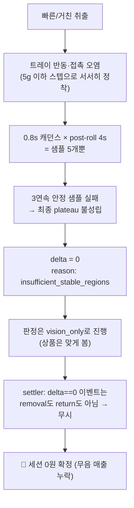
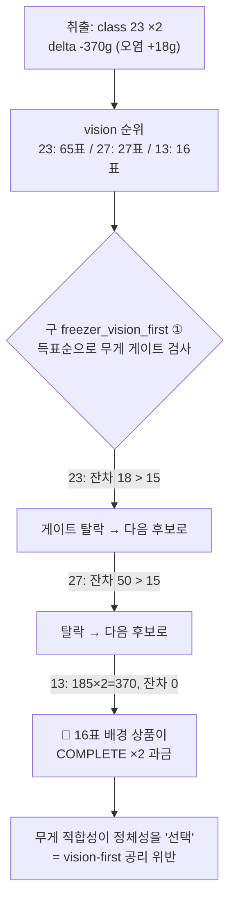
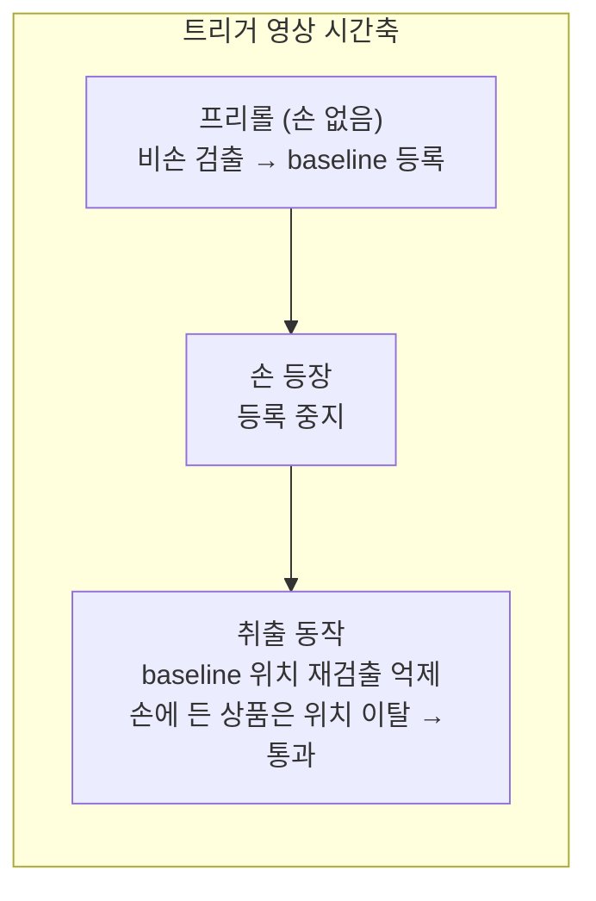
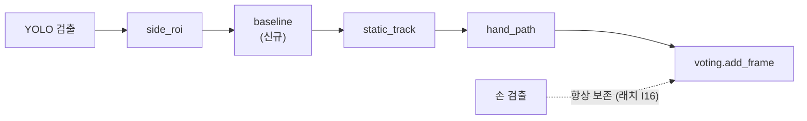
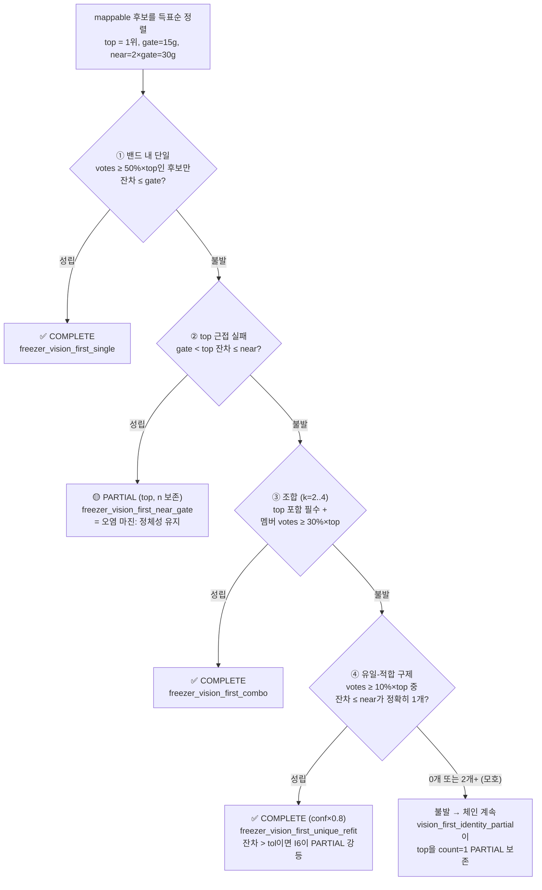
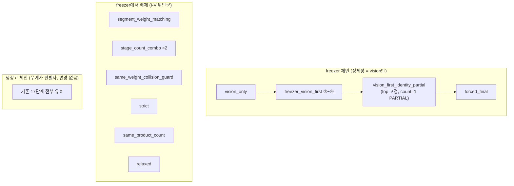
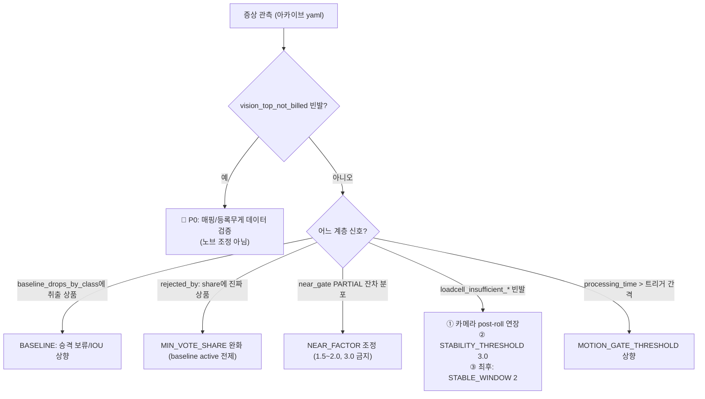

# 프리롤 배경 억제(Baseline)와 판정 불변식 I-V

> **상태 (2026-07-24):** §2의 baseline 필터는 2026-07-24 코드에서 **삭제됨** — 모션 변위 증거가
> 대체(issue #16 실기: top 무력·side 폭주). I-V 판정 원칙과 env 튜닝 다이어그램(§5)은
> 현행 정본으로 유지.

> 2026-07-21~22 작성. 이슈 #14(quick take out)·#15(freezer vision first) 대응으로
> 들어간 세 갈래 변경 — ① perception의 baseline 억제 필터, ② judgment의
> 불변식 I-V(FreezerVisionFirst 재설계 + freezer 체인 차단), ③ env 튜닝 노브 —
> 를 한 문서로 정리한다. 과거 사고(#8, #10, #15) 전수 재검증 결과 포함.
>
> 관련 코드: `perception/filters.py`, `judgment/strategies.py`,
> `judgment/router.py`, `service/pipeline.py`, `service/model_service.py`,
> `core/config.py`

---

## 1. 무엇이 문제였나 — 두 사고의 인과 지도

### 이슈 #14: 빠른 취출인데 delta가 0

1초 이내 빠른 취출 → 로드셀 delta가 안 찍히고 vision_only로 빠짐 →
settler는 delta=0 이벤트를 정산에서 건너뜀 → **판정은 맞았는데 0원 확정**.

대응: 원인 식별을 위해 `trace.reason_codes`에 `loadcell_insufficient_samples` /
`loadcell_insufficient_stable_regions`를 기록하도록 함 (`pipeline.py`).
근본 대응(카메라 post-roll 연장, settler의 delta=0 정책)은 별도 과제.

### 이슈 #15: 정답이 1위인데 3위가 과금됨

class 23(176g 등록) 2개 취출, delta −370(접촉 오염 +18g).
비전은 정답을 **65표 1위**로 뽑았는데, 과금은 **16표 3위 배경 상품**이 됐다.

같은 세션(12:19)에서는 **같은 상품을 5초 간격으로 두 번 집었는데 서로 다른
두 상품이 과금**됐다 — 로드셀 20g 차이가 정체성을 갈랐다는 뜻이고,
이것이 문제의 본질이다: ±15g 창은 여러 상품이 우연히 걸릴 만큼 넓다.

---

## 2. 대응 ① — Perception: Baseline 억제 필터

### 아이디어

static_track은 "연속 24프레임, IoU ≥ 0.85 정지"를 요구해서 **bbox가 출렁이는
고정 물체**(원거리·부분 가림)를 못 잡는다. baseline은 정지의 정의를 시간
경계로 바꾼다: **"손이 등장하기 전부터 그 자리에 있던 것 = 장면 배경"**.

### 필터 체인에서의 위치

### 운영 모드 (`MODEL__VISION__BASELINE_SUPPRESS_MODE`)

| 모드 | 동작 | 용도 |
|---|---|---|
| `off` | 비활성 | |
| `shadow` | 드랍 없이 계수만 | **신규 기기 기본** — 오억제 검증 |
| `active` | 실제 드랍 | shadow 검증 후 승격 |

검증 신호는 아카이브 `vote_summary`의 두 필드:
- `filter_drops_by_stage.baseline` — 카메라별 총 억제 수
- `baseline_drops_by_class` — **클래스별** 억제 수. 여기에 취출 상품 class가
  나타나면 승격 보류, 배경 class만 잡히면 승격.

실증(#15 12:22 세션): active 상태에서 top 카메라의 배경 class 27을 470회,
13을 157회 억제 → 진짜 상품(23)이 65표 1위로 올라옴.

**알려진 사각**: 손이 프레임 1부터 보이는 영상(연속 취출의 두 번째 트리거,
side 카메라)은 등록 창이 0이 되어 무력화된다. 이 경우 static_track이 백스톱.

---

## 3. 대응 ② — Judgment: 불변식 I-V

### 불변식

> **I-V**: freezer(`weight_is_discriminative=False`)에서 청구 **정체성은
> vision 득표 순위에서만** 유도한다. 무게의 권한은 ⑴ 지목된 정체성의 **개수
> 산정·검증**, ⑵ 정체성의 **반증**(잔차가 커서 "이것만으론 설명 불가")뿐.
> 무게 적합성이 정체성을 **선택**하는 경로는 금지한다.
> 유일한 예외: top이 결정적으로 반증됐고 대안 적합이 정확히 하나일 때의
> 유일-적합 구제(④).

층별 책임: 오검출·배경 억제는 perception(§2)의 일, 판정층은 순위를 신뢰한다.

### FreezerVisionFirst 4단계

각 단계의 존재 이유 (사고 → 방어):

| 단계 | 막는 사고 | 원리 |
|---|---|---|
| ① 밴드 50% | #15 (16표가 65표 제침) | vision이 모호하다고 인정한 범위에서만 무게 중재 |
| ② near 30g | #15 (3g 차이 탈락) | 접촉 오염 실측 8~18g — "delta 오염"이 "정체성 오판"보다 우세 |
| ③ top 포함 + 30% | #10 (메로나 79×3 filler) | 최선 증거는 설명에 반드시 참여, 배경은 잔차 filler 금지 |
| ④ 유일성 + 10% | #8 (오검출 1위 구제) / #10 ses-…418 (3표 멜로나) | top 반증 시에도 "vision이 사실상 못 본" 후보는 구제·모호성 판단 대상 아님 |

### freezer 체인 차단 (누수 봉인)

FreezerVisionFirst가 불발하면 strict 등이 **같은 무게 산술로 오식별을
재생산**하던 누수를 precondition으로 막았다.

### 관측성

파이프라인이 전략과 무관하게 공통 기록:

- `vision_top_not_billed:classN` — 과금 목록에 채택된 vision 1위가 없음.
  **이 코드가 자주 찍히면 노브보다 먼저 매핑/등록무게(데이터)를 의심할 것.**
- `loadcell_insufficient_*` — vision_only의 로드셀 사유 (§1).

---

## 4. 과거 사고 전수 재검증 (구 vs 신)

| 사고 | 구 동작 | 신 동작 |
|---|---|---|
| #15 12:22 (23번 65표, 잔차 18) | 배경 만두×2 COMPLETE | ② → **23번×2 PARTIAL → 정산 정답** ✅ |
| #15 12:19① (잔차 =15 경계) | 베이글×1 | 동일 (순위 오염 — baseline의 몫) ➖ |
| #10 멜로나 79×3 (8표, 4%) | share floor 없으면 채택 | ④ 10% 하한이 제외 → **비비고 복원** ✅ |
| #10 멜로나 79×3 (3표, ses-…418) | COMPLETE 채택 | ④ 하한이 차단 → top PARTIAL×1 ✅ |
| #10 교차존 컵 중복 (225표 top) | 컵×2 → cross-zone 페널티 교정 | 동일 (페널티 계층 담당 유지) ➖ |
| #8 세그먼트 멜로나3+비비고3 | 13,500원 오과금 | segment 배제 → 최선 비비고×4 정답 ✅ |
| #8 본문 비비고×2 (잔차 13.6) | COMPLETE 정답 | ① 동일 정답 ➖ |

**악화되는 케이스 없음.** ➖로 남는 건 전부 pre-baseline 시대의 "순위 자체가
오염된" 데이터이며, 현재 스택(baseline + I-V)에서는 순위가 교정된다.

---

## 5. env 노브와 프로덕션 튜닝 기준

### 튜닝 원칙

1. **계층 순서**: perception → judgment → 정산. 아래층 증상의 원인이 위층인
   경우가 많다 (#15의 오과금 원인 절반은 투표층 배경 우세였다).
2. **한 번에 한 계층, 한 노브.** 변경 전후 각 20~30 트리거의 아카이브 비교.
3. **신호 없이 조정 금지** — 각 노브는 대응하는 아카이브 신호가 있다.

### 노브 일람

| 그룹 | env (MODEL__…) | 기본 | 조정 신호 → 방향 |
|---|---|---|---|
| baseline | `VISION__BASELINE_SUPPRESS_MODE` | shadow | 클래스별 계수 검증 후 active |
| | `VISION__BASELINE_SUPPRESS_IOU` | 0.5 | shadow에서 진짜 상품이 잡히면 0.6~0.7 |
| static | `VISION__STATIC_TRACK_MIN_FRAMES / IOU` | 24 / 0.85 | 드랍 0인데 고정물 votes 높으면 IOU 0.7 |
| 투표 | `VISION__MIN_VOTE_SHARE` | 0.1 | share로 죽은 후보가 진품이면 0.05 (baseline active 전제) |
| I-V | `JUDGMENT__SINGLE_SHARE` | 0.5 | 밴드 밖 정당 구제가 막히면 ↓ / 갈아타기 오판이면 ↑ |
| | `JUDGMENT__COMBO_SHARE` | 0.3 | 정당 다품종 불발 ↓ / filler 유입 ↑ |
| | `JUDGMENT__NEAR_FACTOR` | 2.0 | near_gate 잔차 분포 20g 미만이면 1.5 |
| | `JUDGMENT__REFIT_SHARE` | 0.1 | 아슬한 구제 오판이면 0.15~0.2 |
| 게이트 | `VISION__MOTION_GATE_THRESHOLD / KEEPALIVE` | 프로파일 | 처리시간 초과 시에만 ↑ (keepalive가 정확도 상한) |
| ET | `VISION__EARLY_TERMINATION` | 1 | 냉장 검증 A/B용 (freezer는 I15로 항상 off) |
| 로드셀 | `WEIGHT__STABLE_WINDOW` | 3 | 최후 수단 (위 다이어그램 순서) |
| | `WEIGHT__STABILITY_THRESHOLD_GRAMS` | 2.5 | 양자화 토글 2회 허용 = 3.0 |

**env로 열지 않은 것(의도)**: `tolerance_grams`·`count_gate`(15g)·
`min_weight_change`(5g)는 센서 5g 분해능에서 유도된 물리 상수.
`pixel_delta`(15)·`exit_confirm`(3)·ET 세부 파라미터는 조정 수요 미관측.

### 남은 과제

- 카메라 post-roll 4s → 5.6s(7샘플) 연장 검토 (#14 근본 대응, CRK-CAMERA)
- settler의 delta=0 + vision complete 정책 (무음 폐기 → 최소 note 기록)
- 아카이브에 적용 설정 스냅샷 기록 (튜닝 사이클 재구성용)
- 상품 DB 정합 감사: "168G" 명칭 ↔ 185g 등록, 비비고 200g/224g 세션 혼재
